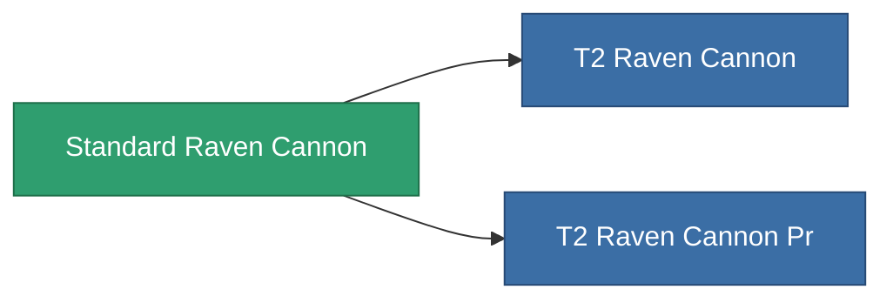

<!-- Generated by tools/generate from the live database (source: entitydefaults definition 1005, aggregatevalues via aggregatefields).
     Do not edit by hand; regenerate instead. -->

# Standard Raven Cannon

|  |  |
|---|---|
| Definition | `def_standard_raven_cannon` |
| Tier | T1 |
| Health | 100 |
| Volume | 1.8 |
| Mass | 1400 |
| Category | Modules / Weapons |
| Tier line | **Standard Raven Cannon** (T1) → [T2 Raven Cannon](/content/items/named1-raven-cannon/) (T2) → [T3 Raven Cannon](/content/items/named2-raven-cannon/) (T3) → [T4 Raven Cannon](/content/items/named3-raven-cannon/) (T4) |

## Stats

| Field | Value |
|---|---|
| accuracy | 46 |
| core_usage | 1.8 |
| cpu_usage | 66.5 |
| cycle_time | 17k |
| damage_modifier | 1.65 |
| falloff | 40 |
| optimal_range | 38 |
| powergrid_usage | 285 |

<!-- production:generated -->
## Production

**Produced from 6 components** — assemble the components to build it (see [Recipes](/content/recipes/) for the full list):

<svg class="prod-card-icon" aria-hidden="true"><use href="#mi-grid"/></svg><a class="prod-card-name" href="/content/items/alligior/">Alligior</a>

required: <b>100</b>

<svg class="prod-card-icon" aria-hidden="true"><use href="#mi-grid"/></svg><a class="prod-card-name" href="/content/items/axicol/">Cryoperine</a>

required: <b>200</b>

<svg class="prod-card-icon" aria-hidden="true"><use href="#mi-grid"/></svg><a class="prod-card-name" href="/content/items/biotichrin/">Biotichrin</a>

required: <b>100</b>

<svg class="prod-card-icon" aria-hidden="true"><use href="#mi-grid"/></svg><a class="prod-card-name" href="/content/items/espitium/">Espitium</a>

required: <b>50</b>

<svg class="prod-card-icon" aria-hidden="true"><use href="#mi-grid"/></svg><a class="prod-card-name" href="/content/items/specimen-sap-item-flux/">Specimen Sap Item Flux</a>

required: <b>10</b>

<svg class="prod-card-icon" aria-hidden="true"><use href="#mi-grid"/></svg><a class="prod-card-name" href="/content/items/titanium/">Titanium</a>

required: <b>100</b>

## Used in production

**Component of 2 items** — everything that uses it in production:

