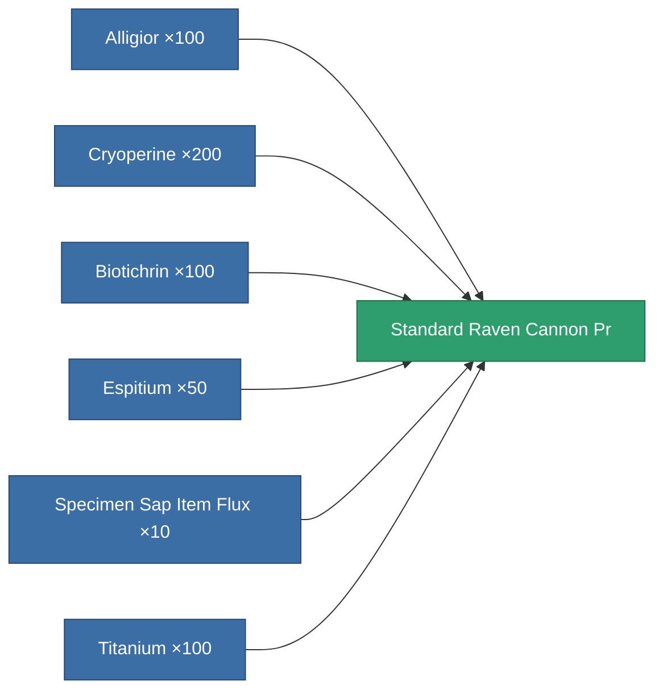

<!-- Generated by tools/generate from the live database (source: entitydefaults definition 8935, aggregatevalues via aggregatefields).
     Do not edit by hand; regenerate instead. -->

# Standard Raven Cannon Pr

|  |  |
|---|---|
| Definition | `def_standard_raven_cannon_pr` |
| Tier | T1 (prototype) |
| Health | 100 |
| Volume | 1.8 |
| Mass | 1330 |
| Category | Modules / Weapons |
| Tier line | [Standard Raven Cannon](/content/items/standard-raven-cannon/) (T1) → **Standard Raven Cannon Pr** (T1) → [Named1 Raven Cannon](/content/items/named1-raven-cannon/) (T2) → [Named2 Raven Cannon](/content/items/named2-raven-cannon/) (T3) → [Named3 Raven Cannon](/content/items/named3-raven-cannon/) (T4) |

_No stats — this item carries no aggregate values._

<!-- production:generated -->
## Production

**Produced from 6 components, research level 5** — assemble the components to build it (see [Recipes](/content/recipes/) for the full list):

[All items](/content/items/)
