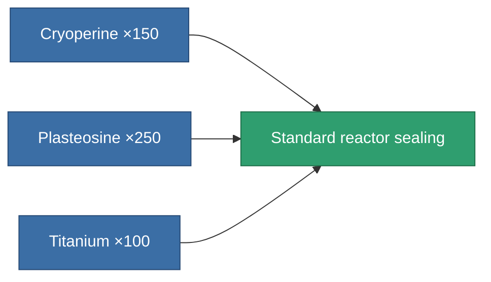
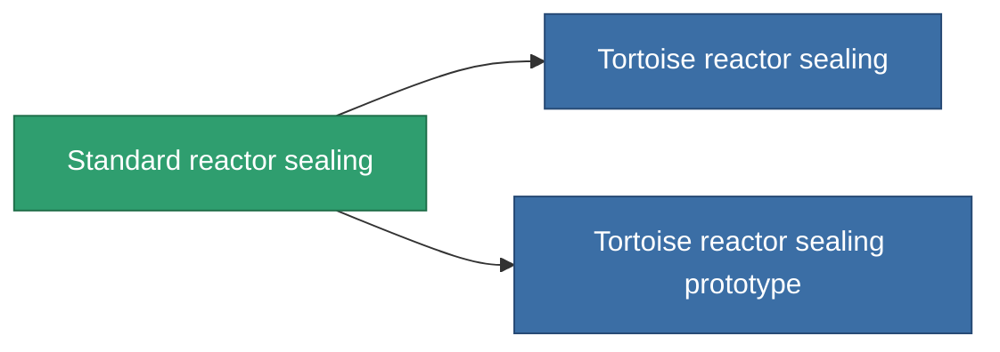

<!-- Generated by tools/generate from the live database (source: entitydefaults definition 4576, aggregatevalues via aggregatefields).
     Do not edit by hand; regenerate instead. -->

# Standard reactor sealing

|  |  |
|---|---|
| Definition | `def_standard_reactor_sealing` |
| Tier | 1 |
| Health | 100 |
| Volume | 1 |
| Mass | 150 |
| Category | Modules / Enhancements |

## Stats

| Field | Value |
|---|---|
| cpu_usage | 15 |
| powergrid_usage | 75 |
| reactor_radiation_modifier | 0.75 |

<!-- production:generated -->
## Production

**Produced from 3 components, research level 3** — assemble the components to build it (see [Recipes](/content/recipes/) for the full list):

## Used in production

**Component of 2 items** — everything that uses it in production:

[All items](/content/items/)
