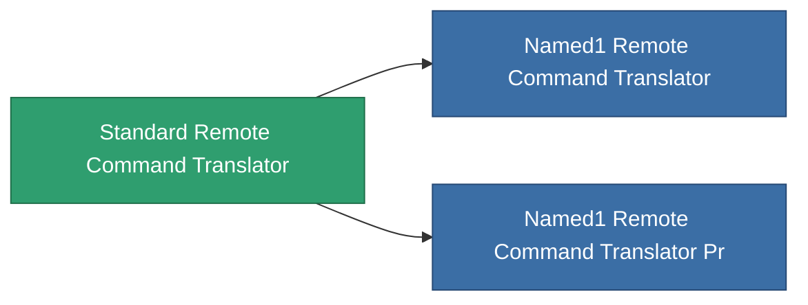

<!-- Generated by tools/generate from the live database (source: entitydefaults definition 8831, aggregatevalues via aggregatefields).
     Do not edit by hand; regenerate instead. -->

# Standard Remote Command Translator

|  |  |
|---|---|
| Definition | `def_standard_remote_command_translator` |
| Tier | 1 |
| Health | 100 |
| Volume | 2.5 |
| Mass | 2000 |
| Category | Modules / Remote control |

## Stats

| Field | Value |
|---|---|
| core_usage | 10 |
| cpu_usage | 125 |
| cycle_time | 10k |
| drone_remote_command_translation_armor_max_modifier | 1.05 |
| drone_remote_command_translation_damage_modifier | 1.025 |
| drone_remote_command_translation_harvesting_amount_modifier | 1.025 |
| drone_remote_command_translation_mining_amount_modifier | 1.025 |
| drone_remote_command_translation_remote_repair_amount_modifier | 1.025 |
| drone_remote_command_translation_retreat | 0 |
| powergrid_usage | 65 |
| remote_control_lifetime_modifier | 60k |
| remote_control_operational_range_modifier | 10 |

<!-- production:generated -->
## Production

**Component of 2 items** — everything that uses it in production:

[All items](/content/items/)
