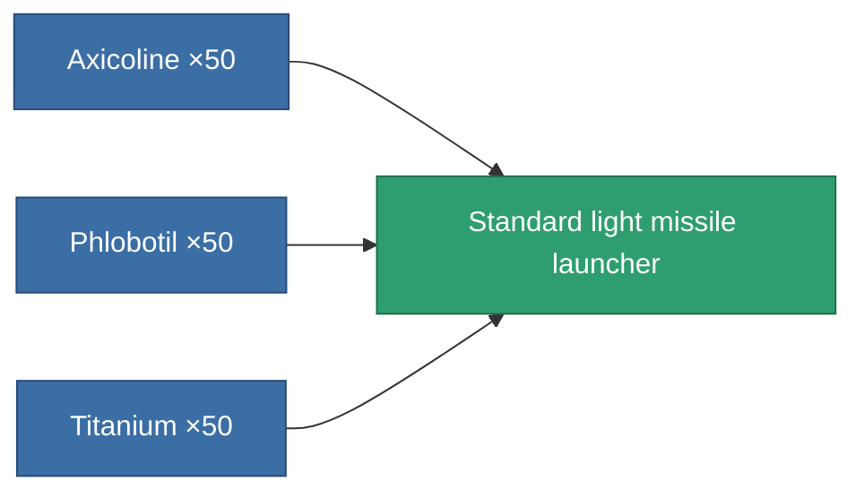
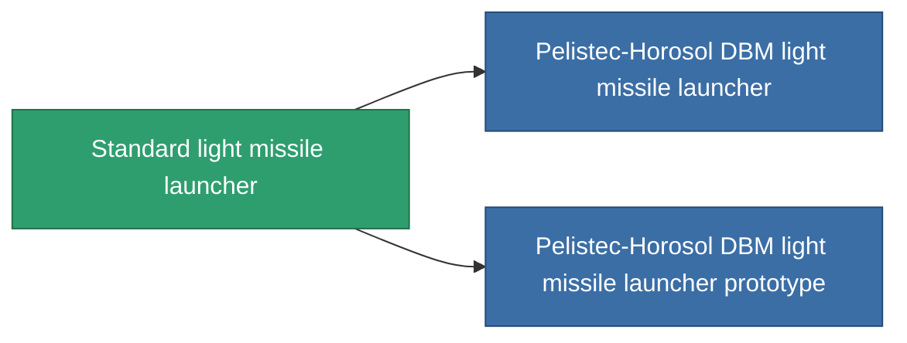

<!-- Generated by tools/generate from the live database (source: entitydefaults definition 63, aggregatevalues via aggregatefields).
     Do not edit by hand; regenerate instead. -->

# Standard light missile launcher

|  |  |
|---|---|
| Definition | `def_standard_rocket_launcher` |
| Tier | T1 |
| Health | 100 |
| Volume | 1 |
| Mass | 250 |
| Category | Modules / Weapons |
| Tier line | **Standard light missile launcher** (T1) → [Pelistec-Horosol DBM light missile launcher](/content/items/named1-rocket-launcher/) (T2) → [Morteq light missile launcher](/content/items/named2-rocket-launcher/) (T3) → [Pelistec-TR110 light missile launcher](/content/items/named3-rocket-launcher/) (T4) |

## Stats

| Field | Value |
|---|---|
| accuracy | 1 |
| core_usage | 1 |
| cpu_usage | 30 |
| cycle_time | 7.5k |
| damage_modifier | 1 |
| powergrid_usage | 25 |

<!-- production:generated -->
## Production

**Produced from 3 components, research level 2** — assemble the components to build it (see [Recipes](/content/recipes/) for the full list):

## Used in production

**Component of 2 items** — everything that uses it in production:

[All items](/content/items/)
