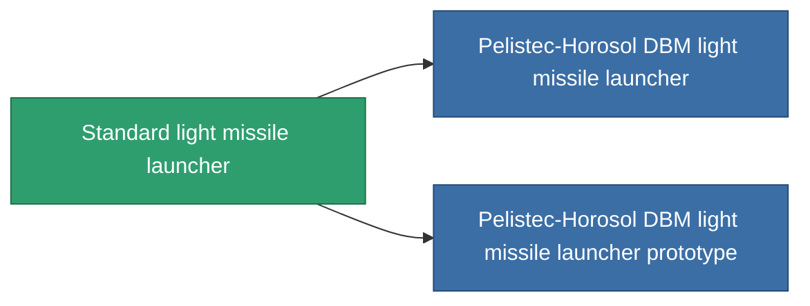

<!-- Generated by tools/generate from the live database (source: entitydefaults definition 63, aggregatevalues via aggregatefields).
     Do not edit by hand; regenerate instead. -->

# Standard light missile launcher

|  |  |
|---|---|
| Definition | `def_standard_rocket_launcher` |
| Tier | 1 |
| Health | 100 |
| Volume | 1 |
| Mass | 250 |
| Category | Modules / Weapons |

## Stats

| Field | Value |
|---|---|
| accuracy | 1 |
| core_usage | 1 |
| cpu_usage | 30 |
| cycle_time | 7.5k |
| damage_modifier | 1 |
| powergrid_usage | 25 |

<!-- production:generated -->
## Production

**Component of 2 items** — everything that uses it in production:

[All items](/content/items/)
