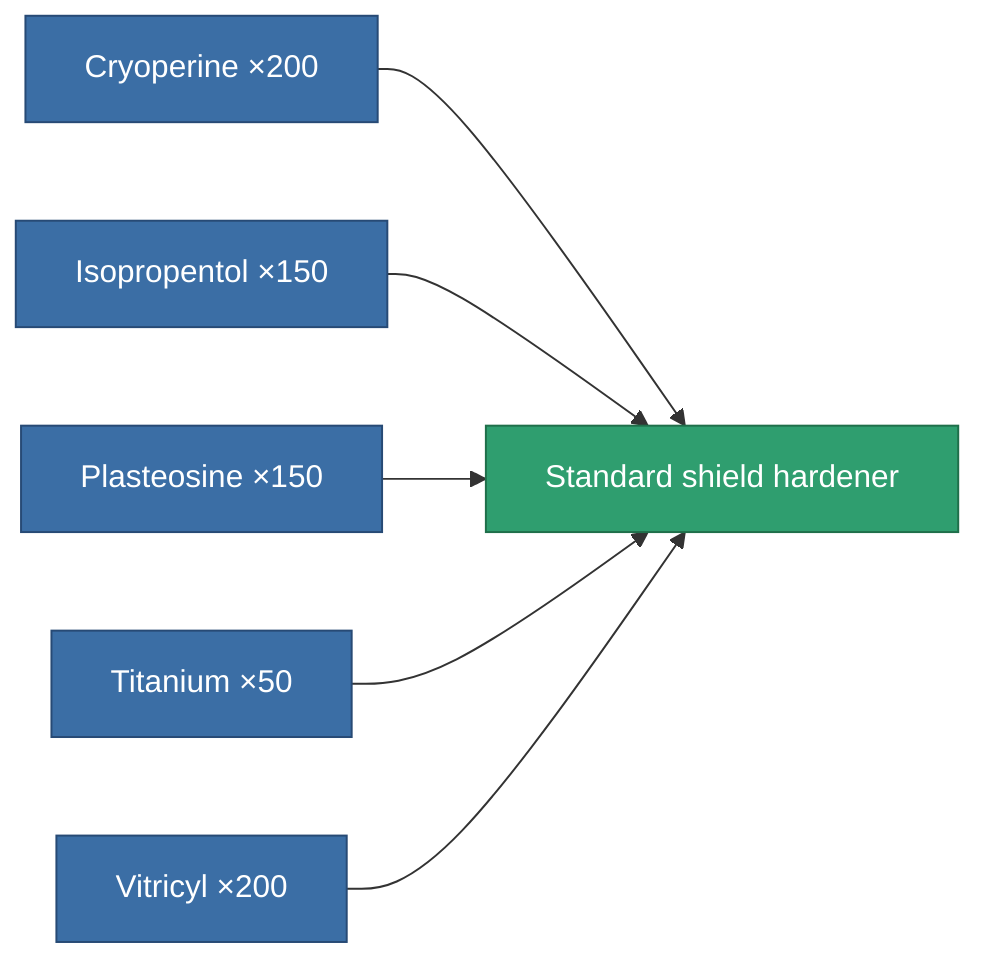
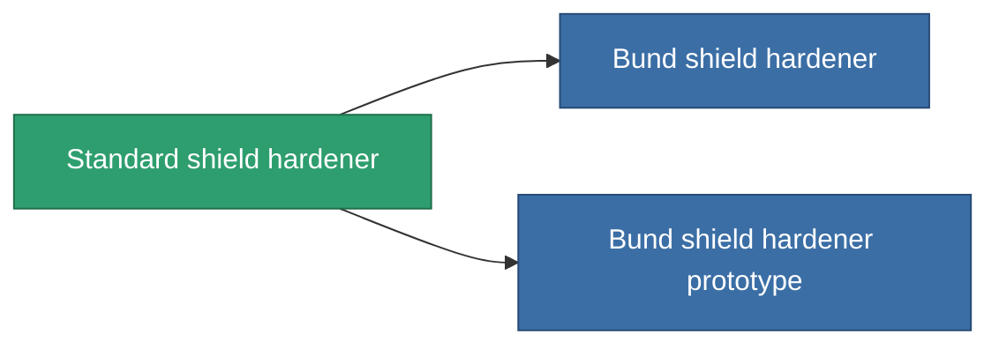

<!-- Generated by tools/generate from the live database (source: entitydefaults definition 31, aggregatevalues via aggregatefields).
     Do not edit by hand; regenerate instead. -->

# Standard shield hardener

|  |  |
|---|---|
| Definition | `def_standard_shield_hardener` |
| Tier | T1 |
| Health | 100 |
| Volume | 0.5 |
| Mass | 300 |
| Category | Modules / Shield |
| Tier line | **Standard shield hardener** (T1) → [Bund shield hardener](/content/items/named1-shield-hardener/) (T2) → [Patronus shield hardener](/content/items/named2-shield-hardener/) (T3) → [Guardian shield hardener](/content/items/named3-shield-hardener/) (T4) |
| Note | ettol a modultol tud jobban mudkodni a pajzs = kevesebb lesz a core csokkenes 5%kal |

## Stats

| Field | Value |
|---|---|
| cpu_usage | 50 |
| powergrid_usage | 20 |
| shield_absorbtion_modifier | 1.2 |

<!-- production:generated -->
## Production

**Produced from 5 components, research level 3** — assemble the components to build it (see [Recipes](/content/recipes/) for the full list):

## Used in production

**Component of 2 items** — everything that uses it in production:

[All items](/content/items/)
