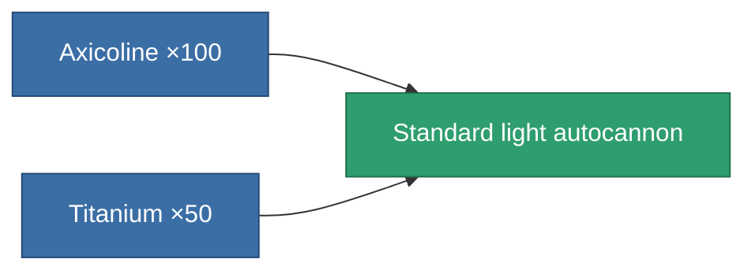
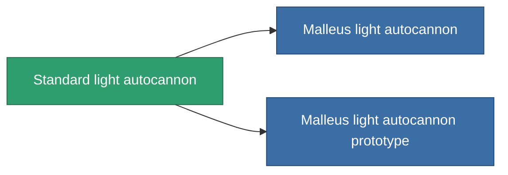

<!-- Generated by tools/generate from the live database (source: entitydefaults definition 60, aggregatevalues via aggregatefields).
     Do not edit by hand; regenerate instead. -->

# Standard light autocannon

|  |  |
|---|---|
| Definition | `def_standard_small_autocannon` |
| Tier | T1 |
| Health | 100 |
| Volume | 0.6 |
| Mass | 250 |
| Category | Modules / Weapons |
| Tier line | **Standard light autocannon** (T1) → [Malleus light autocannon](/content/items/named1-small-autocannon/) (T2) → [Senner Carbine light autocannon](/content/items/named2-small-autocannon/) (T3) → [Astoc M45 light autocannon](/content/items/named3-small-autocannon/) (T4) |

## Stats

| Field | Value |
|---|---|
| accuracy | 6 |
| core_usage | 1 |
| cpu_usage | 5 |
| cycle_time | 3.2k |
| damage_modifier | 1.2 |
| falloff | 12.5 |
| least_optimal | 2 |
| optimal_range | 7.5 |
| powergrid_usage | 15 |

<!-- production:generated -->
## Production

**Produced from 2 components, research level 1** — assemble the components to build it (see [Recipes](/content/recipes/) for the full list):

## Used in production

**Component of 2 items** — everything that uses it in production:

[All items](/content/items/)
