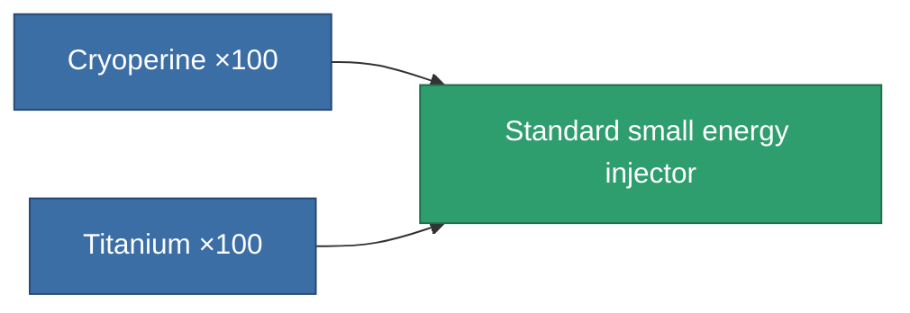
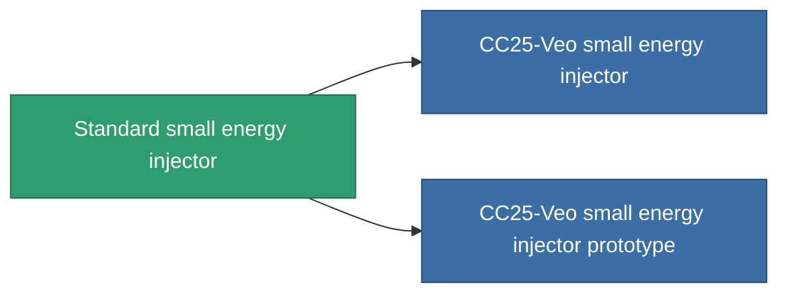

<!-- Generated by tools/generate from the live database (source: entitydefaults definition 648, aggregatevalues via aggregatefields).
     Do not edit by hand; regenerate instead. -->

# Standard small energy injector

|  |  |
|---|---|
| Definition | `def_standard_small_core_booster` |
| Tier | 1 |
| Health | 100 |
| Volume | 0.5 |
| Mass | 100 |
| Category | Modules / Enhancements |

## Stats

| Field | Value |
|---|---|
| core_usage | 0 |
| cpu_usage | 20 |
| cycle_time | 20k |
| powergrid_usage | 50 |

<!-- production:generated -->
## Production

**Produced from 2 components, research level 2** — assemble the components to build it (see [Recipes](/content/recipes/) for the full list):

## Used in production

**Component of 2 items** — everything that uses it in production:

[All items](/content/items/)
