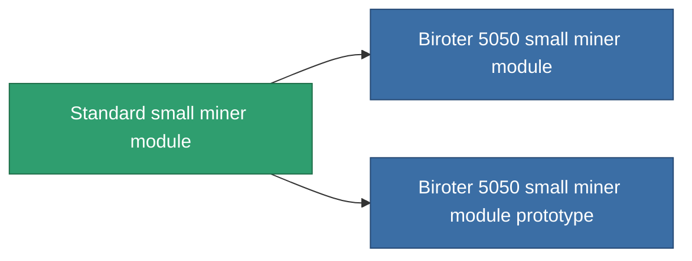

<!-- Generated by tools/generate from the live database (source: entitydefaults definition 53, aggregatevalues via aggregatefields).
     Do not edit by hand; regenerate instead. -->

# Standard small miner module

|  |  |
|---|---|
| Definition | `def_standard_small_driller` |
| Tier | T1 |
| Health | 100 |
| Volume | 1 |
| Mass | 400 |
| Category | Modules / Enhancements |
| Tier line | **Standard small miner module** (T1) → [Biroter 5050 small miner module](/content/items/named1-small-driller/) (T2) → [Sublimator Low-D small miner module](/content/items/named2-small-driller/) (T3) → [Scraper-990 small miner module](/content/items/named3-small-driller/) (T4) |

## Stats

| Field | Value |
|---|---|
| core_usage | 17 |
| cpu_usage | 40 |
| cycle_time | 15.5k |
| optimal_range | 3 |
| powergrid_usage | 30 |

<!-- production:generated -->
## Production

**Produced from 2 components, research level 1** — assemble the components to build it (see [Recipes](/content/recipes/) for the full list):

<svg class="prod-card-icon" aria-hidden="true"><use href="#mi-grid"/></svg><a class="prod-card-name" href="/content/items/axicol/">Cryoperine</a>

required: <b>50</b>

<svg class="prod-card-icon" aria-hidden="true"><use href="#mi-grid"/></svg><a class="prod-card-name" href="/content/items/titanium/">Titanium</a>

required: <b>150</b>

## Used in production

**Component of 2 items** — everything that uses it in production:

