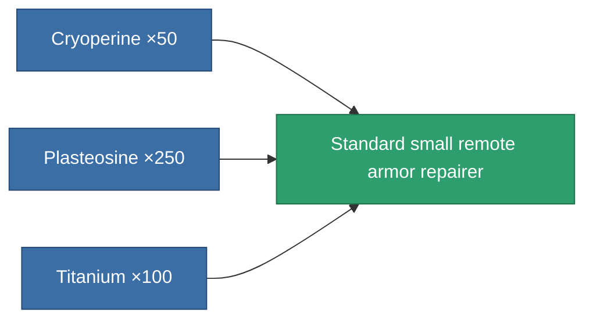
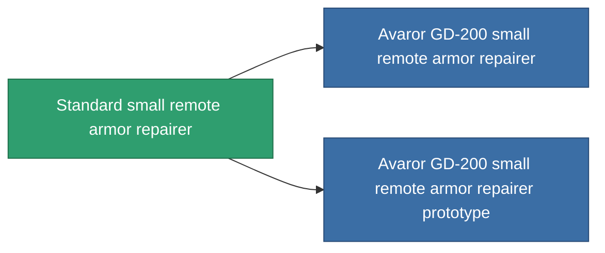

<!-- Generated by tools/generate from the live database (source: entitydefaults definition 21, aggregatevalues via aggregatefields).
     Do not edit by hand; regenerate instead. -->

# Standard small remote armor repairer

|  |  |
|---|---|
| Definition | `def_standard_small_remote_armor_repairer` |
| Tier | T1 |
| Health | 100 |
| Volume | 1 |
| Mass | 250 |
| Category | Modules / Repair |
| Tier line | **Standard small remote armor repairer** (T1) → [Avaror GD-200 small remote armor repairer](/content/items/named1-small-remote-armor-repairer/) (T2) → [Iuviar small remote armor repairer](/content/items/named2-small-remote-armor-repairer/) (T3) → [PPDT-Apadisiator small remote armor repairer](/content/items/named3-small-remote-armor-repairer/) (T4) |
| Note | armor_hp += repair_amount * armor_repair_amount_modifier  rof = cycle_time * armor_repair_cycle_time_modifier    pont ugy mint az armor repair systemnel. -> sajat magamat is jobban gyogyitom, es remote armor systemmel is jobb vagyok.    range = optimal_range * armor_repair_optimal_range_modifier   |

## Stats

| Field | Value |
|---|---|
| armor_repair_amount | 60 |
| core_usage | 70 |
| cpu_usage | 45 |
| cycle_time | 20k |
| falloff | 0 |
| optimal_range | 10 |
| powergrid_usage | 25 |

<!-- production:generated -->
## Production

**Produced from 3 components, research level 2** — assemble the components to build it (see [Recipes](/content/recipes/) for the full list):

## Used in production

**Component of 2 items** — everything that uses it in production:

[All items](/content/items/)
