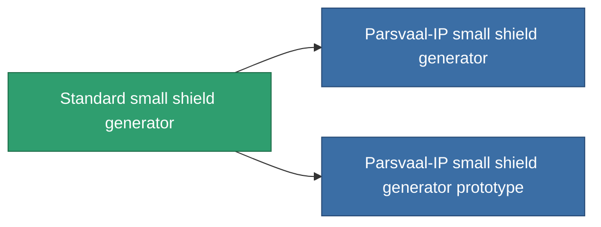

<!-- Generated by tools/generate from the live database (source: entitydefaults definition 28, aggregatevalues via aggregatefields).
     Do not edit by hand; regenerate instead. -->

# Standard small shield generator

|  |  |
|---|---|
| Definition | `def_standard_small_shield_generator` |
| Tier | T1 |
| Health | 100 |
| Volume | 0.3 |
| Mass | 200 |
| Category | Modules / Shield |
| Tier line | **Standard small shield generator** (T1) → [Parsvaal-IP small shield generator](/content/items/named1-small-shield-generator/) (T2) → [Ovostec-Yellowray small shield generator](/content/items/named2-small-shield-generator/) (T3) → [SBA-200 Forebrace small shield generator](/content/items/named3-small-shield-generator/) (T4) |
| Note | damage to core = shield_absorbtion * shield_absorbtion_modifier  amig ez a modul fut addig nincs damage, csak a core-bol von le.  |

## Stats

| Field | Value |
|---|---|
| core_usage | 1 |
| cpu_usage | 45 |
| cycle_time | 2.75k |
| powergrid_usage | 50 |
| shield_absorbtion | 2 |
| shield_radius | 4.5 |

<!-- production:generated -->
## Production

**Produced from 5 components, research level 2** — assemble the components to build it (see [Recipes](/content/recipes/) for the full list):

<svg class="prod-card-icon" aria-hidden="true"><use href="#mi-grid"/></svg><a class="prod-card-name" href="/content/items/axicol/">Cryoperine</a>

required: <b>100</b>

<svg class="prod-card-icon" aria-hidden="true"><use href="#mi-grid"/></svg><a class="prod-card-name" href="/content/items/isopropentol/">Isopropentol</a>

required: <b>200</b>

<svg class="prod-card-icon" aria-hidden="true"><use href="#mi-grid"/></svg><a class="prod-card-name" href="/content/items/plasteosine/">Plasteosine</a>

required: <b>200</b>

<svg class="prod-card-icon" aria-hidden="true"><use href="#mi-grid"/></svg><a class="prod-card-name" href="/content/items/titanium/">Titanium</a>

required: <b>100</b>

<svg class="prod-card-icon" aria-hidden="true"><use href="#mi-grid"/></svg><a class="prod-card-name" href="/content/items/vitricyl/">Vitricyl</a>

required: <b>100</b>

## Used in production

**Component of 2 items** — everything that uses it in production:

