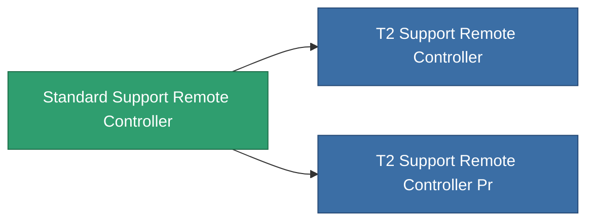

<!-- Generated by tools/generate from the live database (source: entitydefaults definition 8582, aggregatevalues via aggregatefields).
     Do not edit by hand; regenerate instead. -->

# Standard Support Remote Controller

|  |  |
|---|---|
| Definition | `def_standard_support_remote_controller` |
| Tier | T1 |
| Health | 100 |
| Volume | 1 |
| Mass | 1 |
| Category | Modules / Remote control |
| Tier line | **Standard Support Remote Controller** (T1) → [T2 Support Remote Controller](/content/items/named1-support-remote-controller/) (T2) → [T3 Support Remote Controller](/content/items/named2-support-remote-controller/) (T3) → [T4 Support Remote Controller](/content/items/named3-support-remote-controller/) (T4) |

## Stats

| Field | Value |
|---|---|
| core_usage | 150 |
| cpu_usage | 63 |
| cycle_time | 10k |
| drone_amplification_armor_max_modifier | 1 |
| drone_amplification_core_max_modifier | 1 |
| drone_amplification_core_recharge_time_modifier | 1 |
| drone_amplification_locking_time_modifier | 1 |
| drone_amplification_reactor_radiation_modifier | 1 |
| drone_amplification_remote_repair_amount_modifier | 1 |
| drone_amplification_remote_repair_cycle_time_modifier | 1 |
| drone_amplification_speed_max_modifier | 1 |
| powergrid_usage | 65 |
| remote_control_bandwidth_max | 0 |
| remote_control_lifetime | 180k |
| remote_control_operational_range | 20 |

<!-- production:generated -->
## Production

**Produced from 4 components, research level 5** — assemble the components to build it (see [Recipes](/content/recipes/) for the full list):

<svg class="prod-card-icon" aria-hidden="true"><use href="#mi-grid"/></svg><a class="prod-card-name" href="/content/items/axicol/">Cryoperine</a>

required: <b>250</b>

<svg class="prod-card-icon" aria-hidden="true"><use href="#mi-grid"/></svg><a class="prod-card-name" href="/content/items/axicoline/">Axicoline</a>

required: <b>100</b>

<svg class="prod-card-icon" aria-hidden="true"><use href="#mi-grid"/></svg><a class="prod-card-name" href="/content/items/espitium/">Espitium</a>

required: <b>50</b>

<svg class="prod-card-icon" aria-hidden="true"><use href="#mi-grid"/></svg><a class="prod-card-name" href="/content/items/titanium/">Titanium</a>

required: <b>50</b>

## Used in production

**Component of 2 items** — everything that uses it in production:

