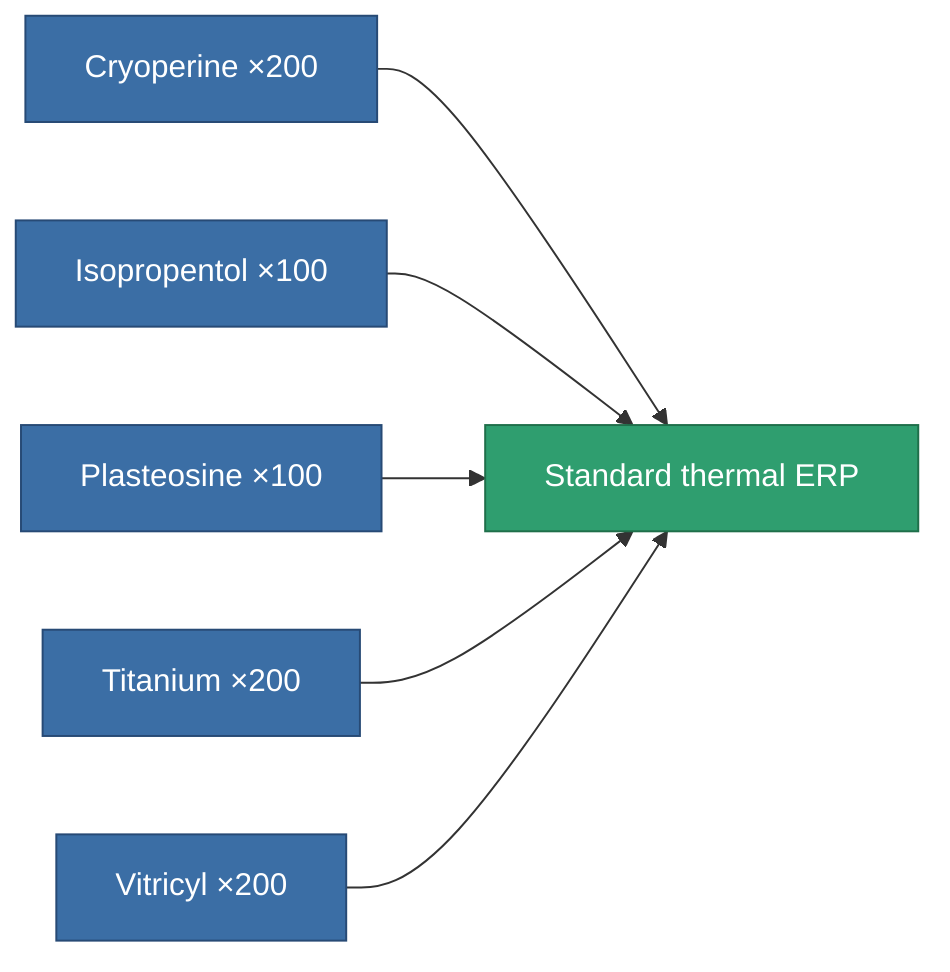
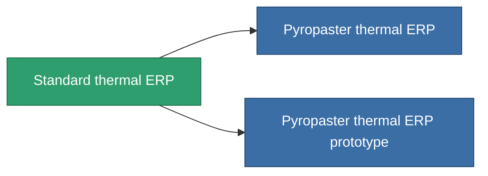

<!-- Generated by tools/generate from the live database (source: entitydefaults definition 3297, aggregatevalues via aggregatefields).
     Do not edit by hand; regenerate instead. -->

# Standard thermal ERP

|  |  |
|---|---|
| Definition | `def_standard_thermal_kers` |
| Tier | T1 |
| Health | 100 |
| Volume | 1 |
| Mass | 500 |
| Category | Modules / Enhancements |
| Tier line | **Standard thermal ERP** (T1) → [Pyropaster thermal ERP](/content/items/named1-thermal-kers/) (T2) → [DE-melt thermal ERP](/content/items/named2-thermal-kers/) (T3) → [Dyoriva thermal ERP](/content/items/named3-thermal-kers/) (T4) |

## Stats

| Field | Value |
|---|---|
| chemical_damage_to_core_modifier | 0.2 |
| cpu_usage | 50 |
| explosive_damage_to_core_modifier | 0.1 |
| kinetic_damage_to_core_modifier | 0.1 |
| powergrid_usage | 15 |
| thermal_damage_to_core_modifier | 0.5 |

<!-- production:generated -->
## Production

**Produced from 5 components, research level 5** — assemble the components to build it (see [Recipes](/content/recipes/) for the full list):

## Used in production

**Component of 2 items** — everything that uses it in production:

[All items](/content/items/)
