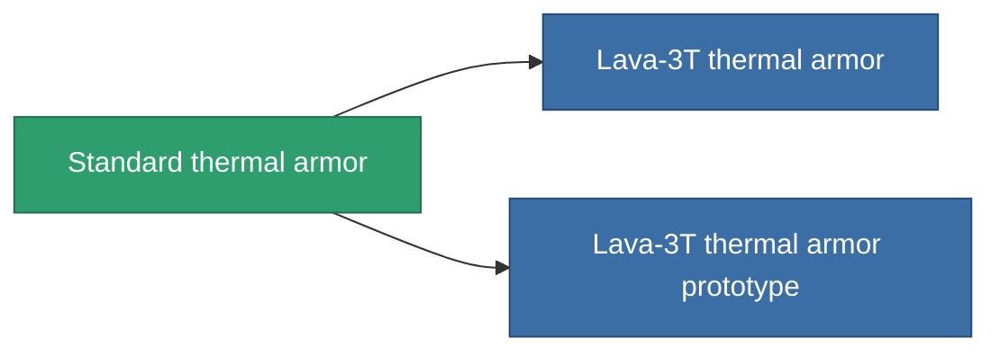

<!-- Generated by tools/generate from the live database (source: entitydefaults definition 24, aggregatevalues via aggregatefields).
     Do not edit by hand; regenerate instead. -->

# Standard thermal armor

|  |  |
|---|---|
| Definition | `def_standard_thrm_armor_hardener` |
| Tier | 1 |
| Health | 100 |
| Volume | 1 |
| Mass | 100 |
| Category | Modules / Armor |

## Stats

| Field | Value |
|---|---|
| core_usage | 13 |
| cpu_usage | 25 |
| cycle_time | 10k |
| effect_resist_thermal | 100 |
| powergrid_usage | 5 |
| resist_thermal | 25 |

<!-- production:generated -->
## Production

**Component of 2 items** — everything that uses it in production:

[All items](/content/items/)
