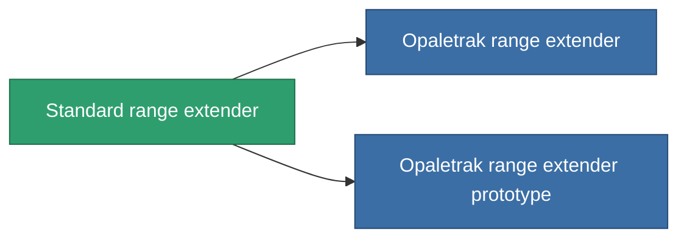

<!-- Generated by tools/generate from the live database (source: entitydefaults definition 913, aggregatevalues via aggregatefields).
     Do not edit by hand; regenerate instead. -->

# Standard range extender

|  |  |
|---|---|
| Definition | `def_standard_tracking_upgrade` |
| Tier | T1 |
| Health | 100 |
| Volume | 0.1 |
| Mass | 50 |
| Category | Modules / Enhancements |
| Tier line | **Standard range extender** (T1) → [Opaletrak range extender](/content/items/named1-tracking-upgrade/) (T2) → [Unotron 60s-'Crack shot' range extender](/content/items/named2-tracking-upgrade/) (T3) → [ATCS-gh50 range extender](/content/items/named3-tracking-upgrade/) (T4) |

## Stats

| Field | Value |
|---|---|
| cpu_usage | 35 |
| optimal_range_modifier | 1.1 |
| powergrid_usage | 100 |

<!-- production:generated -->
## Production

**Produced from 3 components, research level 3** — assemble the components to build it (see [Recipes](/content/recipes/) for the full list):

<svg class="prod-card-icon" aria-hidden="true"><use href="#mi-grid"/></svg><a class="prod-card-name" href="/content/items/axicol/">Cryoperine</a>

required: <b>300</b>

<svg class="prod-card-icon" aria-hidden="true"><use href="#mi-grid"/></svg><a class="prod-card-name" href="/content/items/axicoline/">Axicoline</a>

required: <b>150</b>

<svg class="prod-card-icon" aria-hidden="true"><use href="#mi-grid"/></svg><a class="prod-card-name" href="/content/items/titanium/">Titanium</a>

required: <b>100</b>

## Used in production

**Component of 2 items** — everything that uses it in production:

