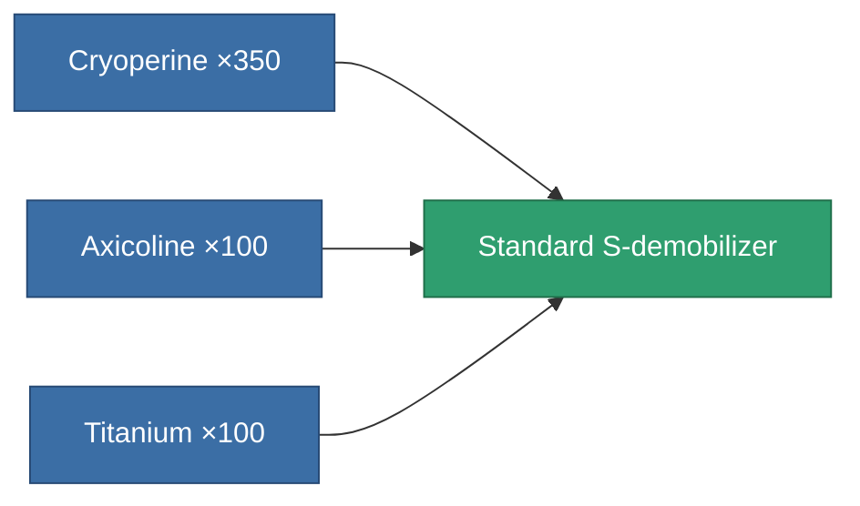
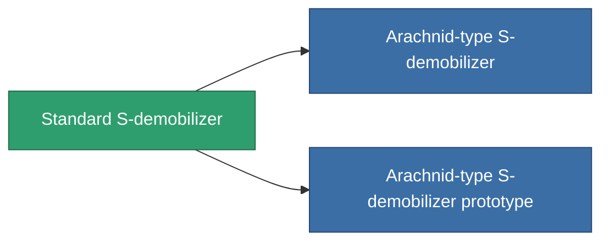

<!-- Generated by tools/generate from the live database (source: entitydefaults definition 49, aggregatevalues via aggregatefields).
     Do not edit by hand; regenerate instead. -->

# Standard S-demobilizer

|  |  |
|---|---|
| Definition | `def_standard_webber` |
| Tier | T1 |
| Health | 100 |
| Volume | 0.5 |
| Mass | 100 |
| Category | Modules / Enhancements |
| Tier line | **Standard S-demobilizer** (T1) → [Arachnid-type S-demobilizer](/content/items/named1-webber/) (T2) → [NNt. IX S-demobilizer](/content/items/named2-webber/) (T3) → [NNt. IY S-demobilizer](/content/items/named3-webber/) (T4) |

## Stats

| Field | Value |
|---|---|
| core_usage | 16 |
| cpu_usage | 45 |
| cycle_time | 5k |
| effect_massivness_speed_max_modifier | 0.65 |
| falloff | 0 |
| optimal_range | 12 |
| powergrid_usage | 15 |

<!-- production:generated -->
## Production

**Produced from 3 components, research level 3** — assemble the components to build it (see [Recipes](/content/recipes/) for the full list):

## Used in production

**Component of 2 items** — everything that uses it in production:

[All items](/content/items/)
