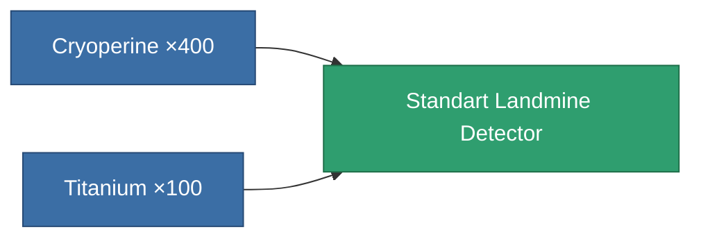
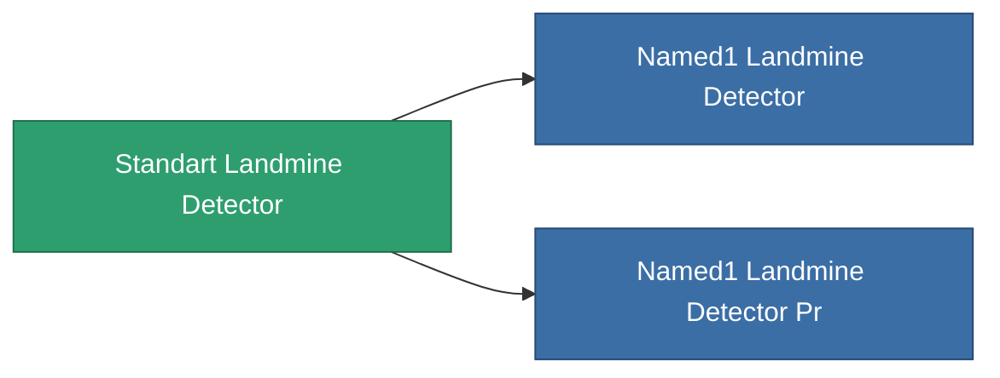

<!-- Generated by tools/generate from the live database (source: entitydefaults definition 8313, aggregatevalues via aggregatefields).
     Do not edit by hand; regenerate instead. -->

# Standart Landmine Detector

|  |  |
|---|---|
| Definition | `def_standart_landmine_detector` |
| Tier | 1 |
| Health | 100 |
| Volume | 0.5 |
| Mass | 1000 |
| Category | Modules / Enhancements |

## Stats

| Field | Value |
|---|---|
| core_usage | 14 |
| cpu_usage | 20 |
| cycle_time | 10k |
| effect_mine_detection_range_modifier | 1.3 |
| powergrid_usage | 7 |

<!-- production:generated -->
## Production

**Produced from 2 components, research level 6** — assemble the components to build it (see [Recipes](/content/recipes/) for the full list):

## Used in production

**Component of 2 items** — everything that uses it in production:

[All items](/content/items/)
