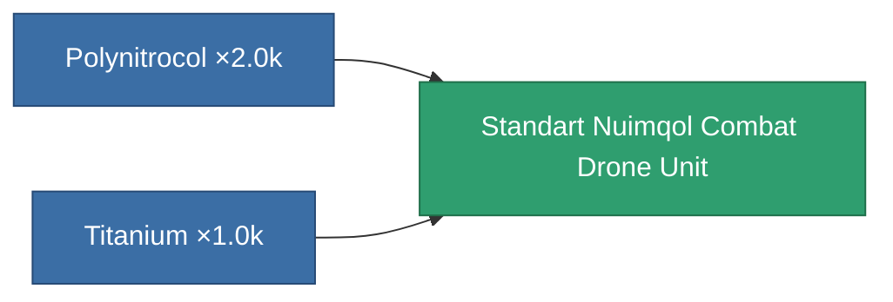

<!-- Generated by tools/generate from the live database (source: entitydefaults definition 8401, aggregatevalues via aggregatefields).
     Do not edit by hand; regenerate instead. -->

# Standart Nuimqol Combat Drone Unit

|  |  |
|---|---|
| Definition | `def_standart_nuimqol_combat_drone_unit` |
| Tier | T1 |
| Health | 100 |
| Volume | 20 |
| Mass | 1 |
| Category | Special & other / Miscellaneous |

## Stats

| Field | Value |
|---|---|
| accuracy | 9.45 |
| armor_max | 1.156k |
| cycle_time | 5.148k |
| damage_kinetic | 67.76016 |
| remote_control_bandwidth_usage | 5 |
| remote_control_lifetime | 300k |
| resist_chemical | 30 |
| resist_explosive | 150 |
| resist_kinetic | 45 |
| resist_thermal | 10 |
| signature_radius | 4 |

<!-- production:generated -->
## Production

**Produced from 2 components, research level 3** — assemble the components to build it (see [Recipes](/content/recipes/) for the full list):

[All items](/content/items/)
