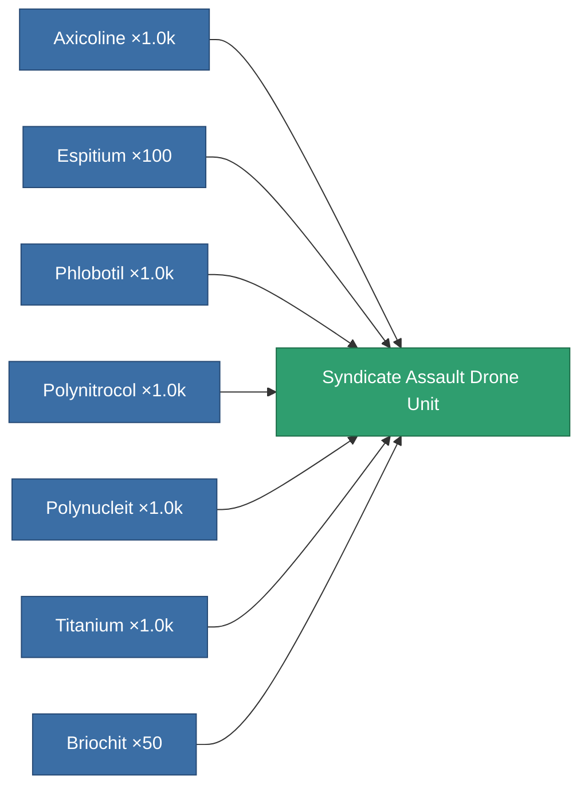

<!-- Generated by tools/generate from the live database (source: entitydefaults definition 8598, aggregatevalues via aggregatefields).
     Do not edit by hand; regenerate instead. -->

# Syndicate Assault Drone Unit

|  |  |
|---|---|
| Definition | `def_syndicate_assault_drone_unit` |
| Tier | – |
| Health | 100 |
| Volume | 2.5 |
| Mass | 1 |
| Category | Special & other / Miscellaneous |

## Stats

| Field | Value |
|---|---|
| accuracy | 18 |
| armor_max | 4.4k |
| cycle_time | 8k |
| damage_chemical | 6 |
| damage_explosive | 12 |
| damage_kinetic | 12 |
| damage_thermal | 12 |
| damage_toxic | 6 |
| falloff | 28 |
| optimal_range | 22 |
| remote_control_bandwidth_usage | 5 |
| remote_control_lifetime | 300k |
| resist_chemical | 45 |
| resist_explosive | 45 |
| resist_kinetic | 45 |
| resist_thermal | 45 |

<!-- production:generated -->
## Production

**Produced from 7 components, research level 5** — assemble the components to build it (see [Recipes](/content/recipes/) for the full list):

[All items](/content/items/)
