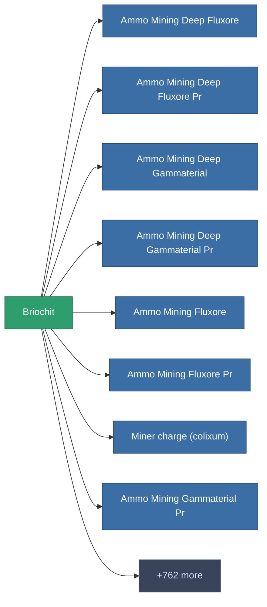

<!-- Generated by tools/generate from the live database (source: entitydefaults definition 2910, aggregatevalues via aggregatefields).
     Do not edit by hand; regenerate instead. -->

# Briochit

|  |  |
|---|---|
| Definition | `def_unimetal` |
| Tier | – |
| Health | 100 |
| Volume | 0 |
| Mass | 0.3 |
| Category | Materials |

_No stats — this item carries no aggregate values._

<!-- production:generated -->
## Production

**Produced from 3 components** — assemble the components to build it (see [Recipes](/content/recipes/) for the full list):

<svg class="prod-card-icon" aria-hidden="true"><use href="#mi-grid"/></svg><a class="prod-card-name" href="/content/items/electroplant-fruit/">Noralgis</a>

required: <b>50</b>

<svg class="prod-card-icon" aria-hidden="true"><use href="#mi-grid"/></svg><a class="prod-card-name" href="/content/items/epriton/">Epriton</a>

required: <b>50</b>

<svg class="prod-card-icon" aria-hidden="true"><use href="#mi-grid"/></svg><a class="prod-card-name" href="/content/ores/titan/">Titan</a>

required: <b>75</b>

## Used in production

**Component of 770 items** — a sample of what can be produced with it (the full list is in [Recipes](/content/recipes/)).

