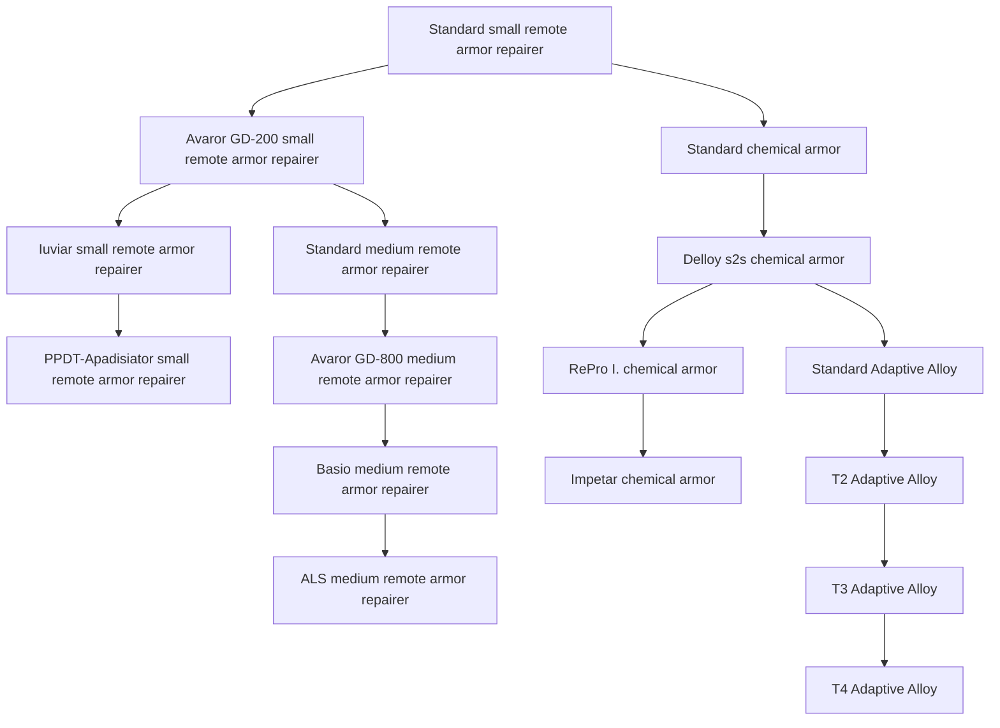
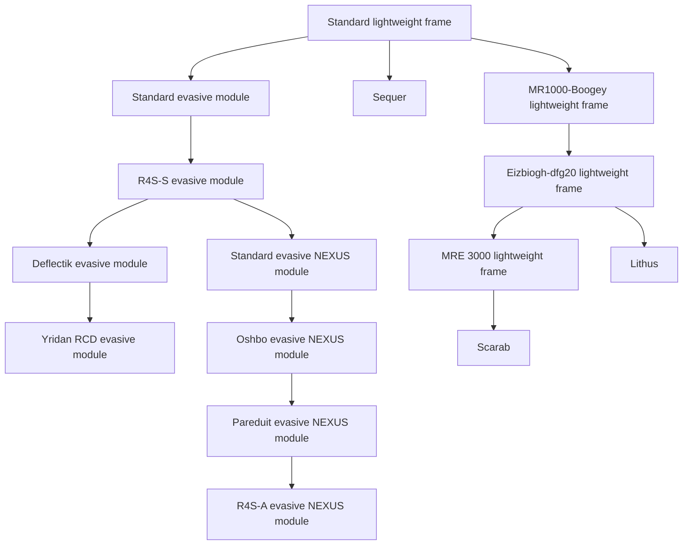

<!-- Generated by tools/generate from the live database (source: techtree + techtreenodeprices (group 6)).
     Do not edit by hand; regenerate instead. -->

# Common (first set)

The first set of standard (non-faction) modules available to every player.

[Tech tree](/content/techtree/) → Common (first set). The category is split into its **research lines** — one per top-level item (the chips above jump to each line's graph). Every node in a graph links to its detail page (prerequisites, what it unlocks next, point prices).

<a href="#line-21">Small remote armor repairer</a>&ensp;
<a href="#line-60">Light autocannon</a>&ensp;
<a href="#line-298">Lightweight frame</a>&ensp;
<a href="#line-8888">Ares</a>&ensp;

## Standard small remote armor repairer

**16 nodes** — everything that descends from [Standard small remote armor repairer](/content/techtree/nodes/standard-small-remote-armor-repairer/).

## Standard light autocannon

**46 nodes** — everything that descends from [Standard light autocannon](/content/techtree/nodes/standard-small-autocannon/).

```mermaid
graph TD
    n60["Standard light autocannon"]
    n61["Standard medium machine gun"]
    n62["Standard Hell Cannon"]
    n259["Small armor-piercing bullet"]
    n260["Small metal-ceramic bullet"]
    n261["Small composite bullet"]
    n262["Small chemoactive bullet"]
    n263["Medium armor-piercing bullet"]
    n264["Medium metal-ceramic bullet"]
    n265["Medium composite bullet"]
    n266["Medium chemoactive bullet"]
    n267["Ammo Hell Cannon A"]
    n268["Ammo Hell Cannon B"]
    n269["Ammo Hell Cannon C"]
    n270["Ammo Hell Cannon D"]
    n840["Malleus light autocannon"]
    n841["Senner Carbine light autocannon"]
    n842["Astoc M45 light autocannon"]
    n843["Grenber 28d medium machine gun"]
    n844[".5s Hastex medium machine gun"]
    n845["Torrex-G17 medium machine gun"]
    n846["T2 Hell Cannon"]
    n847["T3 Hell Cannon"]
    n848["T4 Hell Cannon"]
    n912["Standard firearm tuning"]
    n933["Diathel-Subperis firearm tuning"]
    n934["Plasmidwad-9000 firearm tuning"]
    n935["DVT-800g firearm tuning"]
    n1004["Standard medium autocannon"]
    n1005["Standard Raven Cannon"]
    n1030["GTRB medium autocannon"]
    n1031["Astoc M75 medium autocannon"]
    n1032["Znatvoy-Berjiar-IA medium autocannon"]
    n1033["T2 Raven Cannon"]
    n1034["T3 Raven Cannon"]
    n1035["T4 Raven Cannon"]
    n3257["Standard weapon stabilizer"]
    n3382["Kobel 450-TZ weapon stabilizer"]
    n3383["Sharpsy weapon stabilizer"]
    n3384["Kobel 300-XZ weapon stabilizer"]
    n8893["Ammo Raven Cannon A"]
    n8894["Ammo Raven Cannon B"]
    n8895["Ammo Raven Cannon C"]
    n8896["Ammo Raven Cannon D"]
    n8928["Ammo Hell Cannon T"]
    n8931["Ammo Raven Cannon T"]
    n840 --> n61
    n844 --> n62
    n60 --> n259
    n259 --> n260
    n259 --> n261
    n259 --> n262
    n61 --> n263
    n263 --> n264
    n263 --> n265
    n263 --> n266
    n62 --> n267
    n267 --> n268
    n267 --> n269
    n267 --> n270
    n60 --> n840
    n840 --> n841
    n841 --> n842
    n61 --> n843
    n843 --> n844
    n844 --> n845
    n62 --> n846
    n846 --> n847
    n847 --> n848
    n60 --> n912
    n912 --> n933
    n933 --> n934
    n934 --> n935
    n843 --> n1004
    n1004 --> n1005
    n1004 --> n1030
    n1030 --> n1031
    n1031 --> n1032
    n1005 --> n1033
    n1033 --> n1034
    n1034 --> n1035
    n60 --> n3257
    n3257 --> n3382
    n3382 --> n3383
    n3383 --> n3384
    n1005 --> n8893
    n8893 --> n8894
    n8893 --> n8895
    n8893 --> n8896
    n270 --> n8928
    n8896 --> n8931
    click n60 "/content/techtree/nodes/standard-small-autocannon/" "Standard light autocannon"
    click n61 "/content/techtree/nodes/standard-medium-autocannon/" "Standard medium machine gun"
    click n62 "/content/techtree/nodes/standard-hell-cannon/" "Standard Hell Cannon"
    click n259 "/content/techtree/nodes/ammo-small-projectile-a/" "Small armor-piercing bullet"
    click n260 "/content/techtree/nodes/ammo-small-projectile-b/" "Small metal-ceramic bullet"
    click n261 "/content/techtree/nodes/ammo-small-projectile-c/" "Small composite bullet"
    click n262 "/content/techtree/nodes/ammo-small-projectile-d/" "Small chemoactive bullet"
    click n263 "/content/techtree/nodes/ammo-medium-projectile-a/" "Medium armor-piercing bullet"
    click n264 "/content/techtree/nodes/ammo-medium-projectile-b/" "Medium metal-ceramic bullet"
    click n265 "/content/techtree/nodes/ammo-medium-projectile-c/" "Medium composite bullet"
    click n266 "/content/techtree/nodes/ammo-medium-projectile-d/" "Medium chemoactive bullet"
    click n267 "/content/techtree/nodes/ammo-hell-cannon-a/" "Ammo Hell Cannon A"
    click n268 "/content/techtree/nodes/ammo-hell-cannon-b/" "Ammo Hell Cannon B"
    click n269 "/content/techtree/nodes/ammo-hell-cannon-c/" "Ammo Hell Cannon C"
    click n270 "/content/techtree/nodes/ammo-hell-cannon-d/" "Ammo Hell Cannon D"
    click n840 "/content/techtree/nodes/named1-small-autocannon/" "Malleus light autocannon"
    click n841 "/content/techtree/nodes/named2-small-autocannon/" "Senner Carbine light autocannon"
    click n842 "/content/techtree/nodes/named3-small-autocannon/" "Astoc M45 light autocannon"
    click n843 "/content/techtree/nodes/named1-medium-autocannon/" "Grenber 28d medium machine gun"
    click n844 "/content/techtree/nodes/named2-medium-autocannon/" ".5s Hastex medium machine gun"
    click n845 "/content/techtree/nodes/named3-medium-autocannon/" "Torrex-G17 medium machine gun"
    click n846 "/content/techtree/nodes/named1-hell-cannon/" "T2 Hell Cannon"
    click n847 "/content/techtree/nodes/named2-hell-cannon/" "T3 Hell Cannon"
    click n848 "/content/techtree/nodes/named3-hell-cannon/" "T4 Hell Cannon"
    click n912 "/content/techtree/nodes/standard-damage-mod-projectile/" "Standard firearm tuning"
    click n933 "/content/techtree/nodes/named1-damage-mod-projectile/" "Diathel-Subperis firearm tuning"
    click n934 "/content/techtree/nodes/named2-damage-mod-projectile/" "Plasmidwad-9000 firearm tuning"
    click n935 "/content/techtree/nodes/named3-damage-mod-projectile/" "DVT-800g firearm tuning"
    click n1004 "/content/techtree/nodes/longrange-standard-medium-autocannon/" "Standard medium autocannon"
    click n1005 "/content/techtree/nodes/standard-raven-cannon/" "Standard Raven Cannon"
    click n1030 "/content/techtree/nodes/named1-longrange-medium-autocannon/" "GTRB medium autocannon"
    click n1031 "/content/techtree/nodes/named2-longrange-medium-autocannon/" "Astoc M75 medium autocannon"
    click n1032 "/content/techtree/nodes/named3-longrange-medium-autocannon/" "Znatvoy-Berjiar-IA medium autocannon"
    click n1033 "/content/techtree/nodes/named1-raven-cannon/" "T2 Raven Cannon"
    click n1034 "/content/techtree/nodes/named2-raven-cannon/" "T3 Raven Cannon"
    click n1035 "/content/techtree/nodes/named3-raven-cannon/" "T4 Raven Cannon"
    click n3257 "/content/techtree/nodes/standard-weapon-stabilizer/" "Standard weapon stabilizer"
    click n3382 "/content/techtree/nodes/named1-weapon-stabilizer/" "Kobel 450-TZ weapon stabilizer"
    click n3383 "/content/techtree/nodes/named2-weapon-stabilizer/" "Sharpsy weapon stabilizer"
    click n3384 "/content/techtree/nodes/named3-weapon-stabilizer/" "Kobel 300-XZ weapon stabilizer"
    click n8893 "/content/techtree/nodes/ammo-raven-cannon-a/" "Ammo Raven Cannon A"
    click n8894 "/content/techtree/nodes/ammo-raven-cannon-b/" "Ammo Raven Cannon B"
    click n8895 "/content/techtree/nodes/ammo-raven-cannon-c/" "Ammo Raven Cannon C"
    click n8896 "/content/techtree/nodes/ammo-raven-cannon-d/" "Ammo Raven Cannon D"
    click n8928 "/content/techtree/nodes/ammo-hell-cannon-t/" "Ammo Hell Cannon T"
    click n8931 "/content/techtree/nodes/ammo-raven-cannon-t/" "Ammo Raven Cannon T"
```

## Standard lightweight frame

**15 nodes** — everything that descends from [Standard lightweight frame](/content/techtree/nodes/standard-mass-reductor/).

## Ares

**1 node** — everything that descends from [Ares](/content/techtree/nodes/ares/).

## Nodes (all)

| Unlocks item | Parent node | Enabler extension | Point prices |
|---|---|---|---|
| [Standard small remote armor repairer](/content/techtree/nodes/standard-small-remote-armor-repairer/) | – (root) | – | common=200 |
| [Standard light autocannon](/content/techtree/nodes/standard-small-autocannon/) | – (root) | – | common=200 |
| [Standard lightweight frame](/content/techtree/nodes/standard-mass-reductor/) | – (root) | – | common=1.6k |
| [Ares](/content/techtree/nodes/ares/) | – (root) | – | common=500k; hitech=350k |
| [Standard chemical armor](/content/techtree/nodes/standard-chm-armor-hardener/) | [Standard small remote armor repairer](/content/techtree/nodes/standard-small-remote-armor-repairer/) | – | common=5.4k |
| [Avaror GD-200 small remote armor repairer](/content/techtree/nodes/named1-small-remote-armor-repairer/) | [Standard small remote armor repairer](/content/techtree/nodes/standard-small-remote-armor-repairer/) | – | common=1.6k |
| [Avaror GD-800 medium remote armor repairer](/content/techtree/nodes/named1-medium-remote-armor-repairer/) | [Standard medium remote armor repairer](/content/techtree/nodes/standard-medium-remote-armor-repairer/) | – | common=12.8k |
| [Delloy s2s chemical armor](/content/techtree/nodes/named1-chm-armor-hardener/) | [Standard chemical armor](/content/techtree/nodes/standard-chm-armor-hardener/) | – | common=12.8k |
| [Small armor-piercing bullet](/content/techtree/nodes/ammo-small-projectile-a/) | [Standard light autocannon](/content/techtree/nodes/standard-small-autocannon/) | – | common=1.6k |
| [Malleus light autocannon](/content/techtree/nodes/named1-small-autocannon/) | [Standard light autocannon](/content/techtree/nodes/standard-small-autocannon/) | – | common=1.6k |
| [Standard firearm tuning](/content/techtree/nodes/standard-damage-mod-projectile/) | [Standard light autocannon](/content/techtree/nodes/standard-small-autocannon/) | – | common=1.6k |
| [Standard weapon stabilizer](/content/techtree/nodes/standard-weapon-stabilizer/) | [Standard light autocannon](/content/techtree/nodes/standard-small-autocannon/) | – | common=1.6k |
| [Medium armor-piercing bullet](/content/techtree/nodes/ammo-medium-projectile-a/) | [Standard medium machine gun](/content/techtree/nodes/standard-medium-autocannon/) | – | common=25k |
| [Grenber 28d medium machine gun](/content/techtree/nodes/named1-medium-autocannon/) | [Standard medium machine gun](/content/techtree/nodes/standard-medium-autocannon/) | – | common=25k |
| [Ammo Hell Cannon A](/content/techtree/nodes/ammo-hell-cannon-a/) | [Standard Hell Cannon](/content/techtree/nodes/standard-hell-cannon/) | – | common=68.6k |
| [T2 Hell Cannon](/content/techtree/nodes/named1-hell-cannon/) | [Standard Hell Cannon](/content/techtree/nodes/standard-hell-cannon/) | – | common=102.4k |
| [Small metal-ceramic bullet](/content/techtree/nodes/ammo-small-projectile-b/) | [Small armor-piercing bullet](/content/techtree/nodes/ammo-small-projectile-a/) | – | common=5.4k |
| [Small composite bullet](/content/techtree/nodes/ammo-small-projectile-c/) | [Small armor-piercing bullet](/content/techtree/nodes/ammo-small-projectile-a/) | – | common=5.4k |
| [Small chemoactive bullet](/content/techtree/nodes/ammo-small-projectile-d/) | [Small armor-piercing bullet](/content/techtree/nodes/ammo-small-projectile-a/) | – | common=5.4k |
| [Medium metal-ceramic bullet](/content/techtree/nodes/ammo-medium-projectile-b/) | [Medium armor-piercing bullet](/content/techtree/nodes/ammo-medium-projectile-a/) | – | common=43.2k |
| [Medium composite bullet](/content/techtree/nodes/ammo-medium-projectile-c/) | [Medium armor-piercing bullet](/content/techtree/nodes/ammo-medium-projectile-a/) | – | common=43.2k |
| [Medium chemoactive bullet](/content/techtree/nodes/ammo-medium-projectile-d/) | [Medium armor-piercing bullet](/content/techtree/nodes/ammo-medium-projectile-a/) | – | common=43.2k |
| [Ammo Hell Cannon B](/content/techtree/nodes/ammo-hell-cannon-b/) | [Ammo Hell Cannon A](/content/techtree/nodes/ammo-hell-cannon-a/) | – | common=102.4k |
| [Ammo Hell Cannon C](/content/techtree/nodes/ammo-hell-cannon-c/) | [Ammo Hell Cannon A](/content/techtree/nodes/ammo-hell-cannon-a/) | – | common=102.4k |
| [Ammo Hell Cannon D](/content/techtree/nodes/ammo-hell-cannon-d/) | [Ammo Hell Cannon A](/content/techtree/nodes/ammo-hell-cannon-a/) | – | common=102.4k |
| [Ammo Hell Cannon T](/content/techtree/nodes/ammo-hell-cannon-t/) | [Ammo Hell Cannon D](/content/techtree/nodes/ammo-hell-cannon-d/) | – | common=145.8k |
| [MR1000-Boogey lightweight frame](/content/techtree/nodes/named1-mass-reductor/) | [Standard lightweight frame](/content/techtree/nodes/standard-mass-reductor/) | – | common=12.8k |
| [Sequer](/content/techtree/nodes/sequer/) | [Standard lightweight frame](/content/techtree/nodes/standard-mass-reductor/) | – | common=27k |
| [Standard evasive module](/content/techtree/nodes/standard-maneuvering-upgrade/) | [Standard lightweight frame](/content/techtree/nodes/standard-mass-reductor/) | – | common=5.4k |
| [Standard medium remote armor repairer](/content/techtree/nodes/standard-medium-remote-armor-repairer/) | [Avaror GD-200 small remote armor repairer](/content/techtree/nodes/named1-small-remote-armor-repairer/) | – | common=5.4k |
| [Iuviar small remote armor repairer](/content/techtree/nodes/named2-small-remote-armor-repairer/) | [Avaror GD-200 small remote armor repairer](/content/techtree/nodes/named1-small-remote-armor-repairer/) | – | common=5.4k |
| [PPDT-Apadisiator small remote armor repairer](/content/techtree/nodes/named3-small-remote-armor-repairer/) | [Iuviar small remote armor repairer](/content/techtree/nodes/named2-small-remote-armor-repairer/) | – | common=6.4k; hitech=3.2k |
| [Basio medium remote armor repairer](/content/techtree/nodes/named2-medium-remote-armor-repairer/) | [Avaror GD-800 medium remote armor repairer](/content/techtree/nodes/named1-medium-remote-armor-repairer/) | – | common=25k |
| [ALS medium remote armor repairer](/content/techtree/nodes/named3-medium-remote-armor-repairer/) | [Basio medium remote armor repairer](/content/techtree/nodes/named2-medium-remote-armor-repairer/) | – | common=21.6k; hitech=10.8k |
| [RePro I. chemical armor](/content/techtree/nodes/named2-chm-armor-hardener/) | [Delloy s2s chemical armor](/content/techtree/nodes/named1-chm-armor-hardener/) | – | common=25k |
| [Standard Adaptive Alloy](/content/techtree/nodes/standard-adaptive-alloy/) | [Delloy s2s chemical armor](/content/techtree/nodes/named1-chm-armor-hardener/) | – | common=75k |
| [Impetar chemical armor](/content/techtree/nodes/named3-chm-armor-hardener/) | [RePro I. chemical armor](/content/techtree/nodes/named2-chm-armor-hardener/) | – | common=21.6k; hitech=10.8k |
| [Standard medium machine gun](/content/techtree/nodes/standard-medium-autocannon/) | [Malleus light autocannon](/content/techtree/nodes/named1-small-autocannon/) | – | common=12.8k |
| [Senner Carbine light autocannon](/content/techtree/nodes/named2-small-autocannon/) | [Malleus light autocannon](/content/techtree/nodes/named1-small-autocannon/) | – | common=5.4k |
| [Astoc M45 light autocannon](/content/techtree/nodes/named3-small-autocannon/) | [Senner Carbine light autocannon](/content/techtree/nodes/named2-small-autocannon/) | – | common=6.4k; hitech=3.2k |
| [.5s Hastex medium machine gun](/content/techtree/nodes/named2-medium-autocannon/) | [Grenber 28d medium machine gun](/content/techtree/nodes/named1-medium-autocannon/) | – | common=43.2k |
| [Standard medium autocannon](/content/techtree/nodes/longrange-standard-medium-autocannon/) | [Grenber 28d medium machine gun](/content/techtree/nodes/named1-medium-autocannon/) | – | common=43.2k |
| [Standard Hell Cannon](/content/techtree/nodes/standard-hell-cannon/) | [.5s Hastex medium machine gun](/content/techtree/nodes/named2-medium-autocannon/) | – | common=68.6k |
| [Torrex-G17 medium machine gun](/content/techtree/nodes/named3-medium-autocannon/) | [.5s Hastex medium machine gun](/content/techtree/nodes/named2-medium-autocannon/) | – | common=34.3k; hitech=17.15k |
| [T3 Hell Cannon](/content/techtree/nodes/named2-hell-cannon/) | [T2 Hell Cannon](/content/techtree/nodes/named1-hell-cannon/) | – | common=145.8k |
| [T4 Hell Cannon](/content/techtree/nodes/named3-hell-cannon/) | [T3 Hell Cannon](/content/techtree/nodes/named2-hell-cannon/) | – | common=100k; hitech=50k |
| [Diathel-Subperis firearm tuning](/content/techtree/nodes/named1-damage-mod-projectile/) | [Standard firearm tuning](/content/techtree/nodes/standard-damage-mod-projectile/) | – | common=12.8k |
| [Plasmidwad-9000 firearm tuning](/content/techtree/nodes/named2-damage-mod-projectile/) | [Diathel-Subperis firearm tuning](/content/techtree/nodes/named1-damage-mod-projectile/) | – | common=43.2k |
| [DVT-800g firearm tuning](/content/techtree/nodes/named3-damage-mod-projectile/) | [Plasmidwad-9000 firearm tuning](/content/techtree/nodes/named2-damage-mod-projectile/) | – | common=51.2k; hitech=25.6k |
| [Standard Raven Cannon](/content/techtree/nodes/standard-raven-cannon/) | [Standard medium autocannon](/content/techtree/nodes/longrange-standard-medium-autocannon/) | – | common=68.6k |
| [GTRB medium autocannon](/content/techtree/nodes/named1-longrange-medium-autocannon/) | [Standard medium autocannon](/content/techtree/nodes/longrange-standard-medium-autocannon/) | – | common=68.6k |
| [T2 Raven Cannon](/content/techtree/nodes/named1-raven-cannon/) | [Standard Raven Cannon](/content/techtree/nodes/standard-raven-cannon/) | – | common=102.4k |
| [Ammo Raven Cannon A](/content/techtree/nodes/ammo-raven-cannon-a/) | [Standard Raven Cannon](/content/techtree/nodes/standard-raven-cannon/) | – | common=68.6k |
| [Astoc M75 medium autocannon](/content/techtree/nodes/named2-longrange-medium-autocannon/) | [GTRB medium autocannon](/content/techtree/nodes/named1-longrange-medium-autocannon/) | – | common=102.4k |
| [Znatvoy-Berjiar-IA medium autocannon](/content/techtree/nodes/named3-longrange-medium-autocannon/) | [Astoc M75 medium autocannon](/content/techtree/nodes/named2-longrange-medium-autocannon/) | – | common=72.9k; hitech=36.45k |
| [T3 Raven Cannon](/content/techtree/nodes/named2-raven-cannon/) | [T2 Raven Cannon](/content/techtree/nodes/named1-raven-cannon/) | – | common=145.8k |
| [T4 Raven Cannon](/content/techtree/nodes/named3-raven-cannon/) | [T3 Raven Cannon](/content/techtree/nodes/named2-raven-cannon/) | – | common=100k; hitech=50k |
| [Eizbiogh-dfg20 lightweight frame](/content/techtree/nodes/named2-mass-reductor/) | [MR1000-Boogey lightweight frame](/content/techtree/nodes/named1-mass-reductor/) | – | common=43.2k |
| [MRE 3000 lightweight frame](/content/techtree/nodes/named3-mass-reductor/) | [Eizbiogh-dfg20 lightweight frame](/content/techtree/nodes/named2-mass-reductor/) | – | common=51.2k; hitech=25.6k |
| [Lithus](/content/techtree/nodes/lithus/) | [Eizbiogh-dfg20 lightweight frame](/content/techtree/nodes/named2-mass-reductor/) | – | common=343k |
| [Scarab](/content/techtree/nodes/scarab/) | [MRE 3000 lightweight frame](/content/techtree/nodes/named3-mass-reductor/) | – | common=364.5k; hitech=182.25k |
| [R4S-S evasive module](/content/techtree/nodes/named1-maneuvering-upgrade/) | [Standard evasive module](/content/techtree/nodes/standard-maneuvering-upgrade/) | – | common=12.8k |
| [Oshbo evasive NEXUS module](/content/techtree/nodes/named1-gang-assist-coordinated-maneuvering-module/) | [Standard evasive NEXUS module](/content/techtree/nodes/standard-gang-assist-coordinated-maneuvering-module/) | – | common=43.2k |
| [Standard evasive NEXUS module](/content/techtree/nodes/standard-gang-assist-coordinated-maneuvering-module/) | [R4S-S evasive module](/content/techtree/nodes/named1-maneuvering-upgrade/) | – | common=25k |
| [Deflectik evasive module](/content/techtree/nodes/named2-maneuvering-upgrade/) | [R4S-S evasive module](/content/techtree/nodes/named1-maneuvering-upgrade/) | – | common=25k |
| [Yridan RCD evasive module](/content/techtree/nodes/named3-maneuvering-upgrade/) | [Deflectik evasive module](/content/techtree/nodes/named2-maneuvering-upgrade/) | – | common=21.6k; hitech=10.8k |
| [Pareduit evasive NEXUS module](/content/techtree/nodes/named2-gang-assist-coordinated-maneuvering-module/) | [Oshbo evasive NEXUS module](/content/techtree/nodes/named1-gang-assist-coordinated-maneuvering-module/) | – | common=68.6k |
| [R4S-A evasive NEXUS module](/content/techtree/nodes/named3-gang-assist-coordinated-maneuvering-module/) | [Pareduit evasive NEXUS module](/content/techtree/nodes/named2-gang-assist-coordinated-maneuvering-module/) | – | common=51.2k; hitech=25.6k |
| [Kobel 450-TZ weapon stabilizer](/content/techtree/nodes/named1-weapon-stabilizer/) | [Standard weapon stabilizer](/content/techtree/nodes/standard-weapon-stabilizer/) | – | common=12.8k |
| [Sharpsy weapon stabilizer](/content/techtree/nodes/named2-weapon-stabilizer/) | [Kobel 450-TZ weapon stabilizer](/content/techtree/nodes/named1-weapon-stabilizer/) | – | common=43.2k |
| [Kobel 300-XZ weapon stabilizer](/content/techtree/nodes/named3-weapon-stabilizer/) | [Sharpsy weapon stabilizer](/content/techtree/nodes/named2-weapon-stabilizer/) | – | common=51.2k; hitech=25.6k |
| [T2 Adaptive Alloy](/content/techtree/nodes/named1-adaptive-alloy/) | [Standard Adaptive Alloy](/content/techtree/nodes/standard-adaptive-alloy/) | – | common=129.6k |
| [T3 Adaptive Alloy](/content/techtree/nodes/named2-adaptive-alloy/) | [T2 Adaptive Alloy](/content/techtree/nodes/named1-adaptive-alloy/) | – | common=205.8k |
| [T4 Adaptive Alloy](/content/techtree/nodes/named3-adaptive-alloy/) | [T3 Adaptive Alloy](/content/techtree/nodes/named2-adaptive-alloy/) | – | common=76.8k; hitech=153.6k |
| [Ammo Raven Cannon B](/content/techtree/nodes/ammo-raven-cannon-b/) | [Ammo Raven Cannon A](/content/techtree/nodes/ammo-raven-cannon-a/) | – | common=102.4k |
| [Ammo Raven Cannon C](/content/techtree/nodes/ammo-raven-cannon-c/) | [Ammo Raven Cannon A](/content/techtree/nodes/ammo-raven-cannon-a/) | – | common=102.4k |
| [Ammo Raven Cannon D](/content/techtree/nodes/ammo-raven-cannon-d/) | [Ammo Raven Cannon A](/content/techtree/nodes/ammo-raven-cannon-a/) | – | common=102.4k |
| [Ammo Raven Cannon T](/content/techtree/nodes/ammo-raven-cannon-t/) | [Ammo Raven Cannon D](/content/techtree/nodes/ammo-raven-cannon-d/) | – | common=145.8k |

