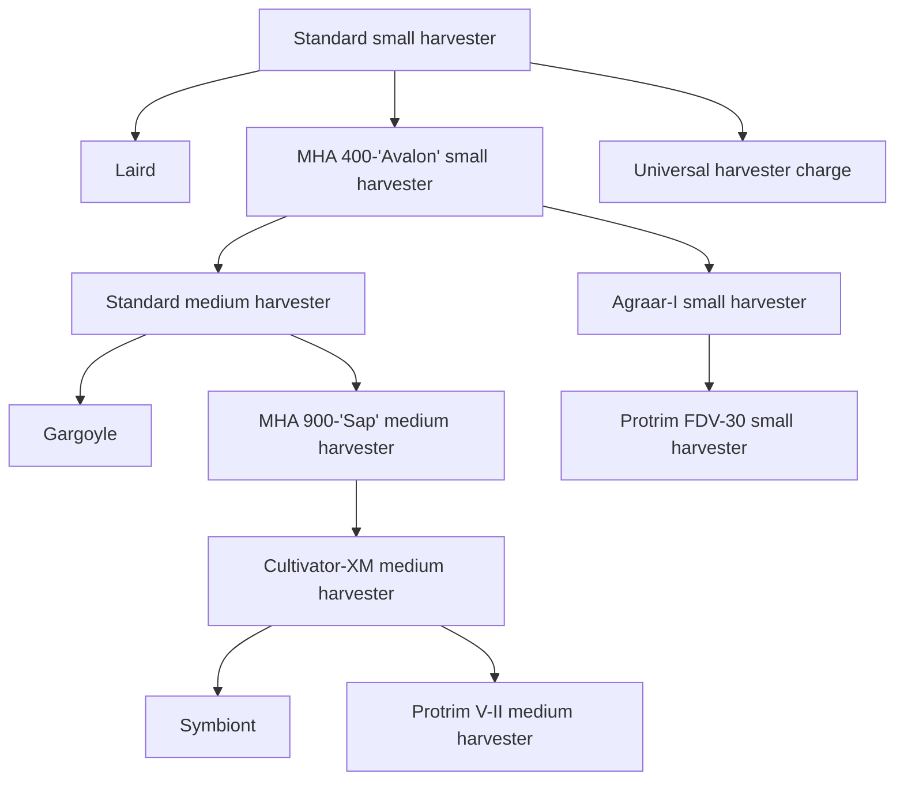
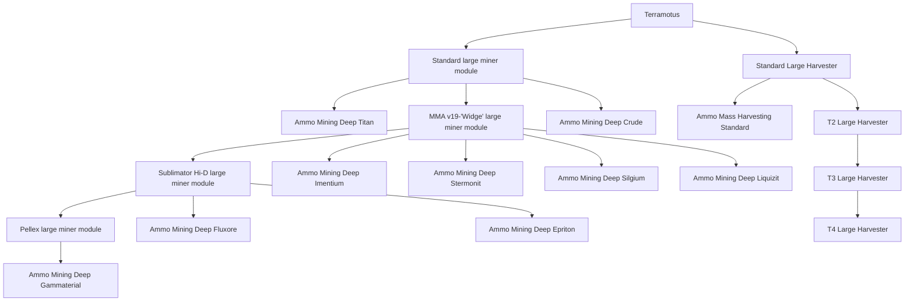

<!-- Generated by tools/generate from the live database (source: techtree + techtreenodeprices (group 8)).
     Do not edit by hand; regenerate instead. -->

# Industrial

Industrial research: reactor boosters and the modules that keep production lines moving.

[Tech tree](/content/techtree/) → Industrial. The category is split into its **research lines** — one per top-level item (the chips above jump to each line's graph). Every node in a graph links to its detail page (prerequisites, what it unlocks next, point prices).

<a href="#line-53">Small miner module</a>&ensp;
<a href="#line-639">Small harvester</a>&ensp;
<a href="#line-8693">Terramotus</a>&ensp;

## Standard small miner module

**36 nodes** — everything that descends from [Standard small miner module](/content/techtree/nodes/standard-small-driller/).

```mermaid
graph TD
    n53["Standard small miner module"]
    n54["Standard medium miner module"]
    n56["Standard industrial tuning"]
    n197["Argano"]
    n209["Termis"]
    n217["Riveler"]
    n228["Standard geoscanner"]
    n780["Ovostec-Chisomel geoscanner"]
    n781["Syverz geoscanner"]
    n782["Eksplor-q3000 geoscanner"]
    n798["Biroter 5050 small miner module"]
    n799["Sublimator Low-D small miner module"]
    n800["Scraper-990 small miner module"]
    n801["MMA v12-'Alkhemir' medium miner module"]
    n802["Sublimator Mid-D medium miner module"]
    n803["Ovostec-Edger medium miner module"]
    n804["Piog Forgekit AI industrial tuning"]
    n805["Fraktura SCV industrial tuning"]
    n806["Piog Forgekit BW1 industrial tuning"]
    n875["Standard industrial NEXUS module"]
    n888["Miner charge (titan ore)"]
    n903["Miner charge (HDT)"]
    n904["Miner charge (liquizit)"]
    n905["Miner charge (imentium)"]
    n906["Miner charge (stermonit)"]
    n907["Miner charge (epriton)"]
    n2558["Standard fast extractor NEXUS module"]
    n2574["Thobys industrial NEXUS module"]
    n2575["EE-D220 industrial NEXUS module"]
    n2576["Rypoa industrial NEXUS module"]
    n2604["AE-D250 fast extractor NEXUS module"]
    n2605["Matriot-II fast extractor NEXUS module"]
    n2606["Matriot-IV fast extractor NEXUS module"]
    n4804["Miner charge (silgium)"]
    n4805["Miner charge (colixum)"]
    n5846["Ammo Mining Fluxore"]
    n798 --> n54
    n801 --> n56
    n53 --> n197
    n54 --> n209
    n802 --> n217
    n53 --> n228
    n228 --> n780
    n780 --> n781
    n781 --> n782
    n53 --> n798
    n798 --> n799
    n799 --> n800
    n54 --> n801
    n801 --> n802
    n802 --> n803
    n56 --> n804
    n804 --> n805
    n805 --> n806
    n801 --> n875
    n53 --> n888
    n888 --> n903
    n888 --> n904
    n903 --> n905
    n903 --> n906
    n904 --> n907
    n875 --> n2558
    n875 --> n2574
    n2574 --> n2575
    n2575 --> n2576
    n2558 --> n2604
    n2604 --> n2605
    n2605 --> n2606
    n903 --> n4804
    n907 --> n4805
    n904 --> n5846
    click n53 "/content/techtree/nodes/standard-small-driller/" "Standard small miner module"
    click n54 "/content/techtree/nodes/standard-medium-driller/" "Standard medium miner module"
    click n56 "/content/techtree/nodes/standard-mining-upgrade/" "Standard industrial tuning"
    click n197 "/content/techtree/nodes/argano/" "Argano"
    click n209 "/content/techtree/nodes/termis/" "Termis"
    click n217 "/content/techtree/nodes/riveler/" "Riveler"
    click n228 "/content/techtree/nodes/standard-mining-probe-module/" "Standard geoscanner"
    click n780 "/content/techtree/nodes/named1-mining-probe-module/" "Ovostec-Chisomel geoscanner"
    click n781 "/content/techtree/nodes/named2-mining-probe-module/" "Syverz geoscanner"
    click n782 "/content/techtree/nodes/named3-mining-probe-module/" "Eksplor-q3000 geoscanner"
    click n798 "/content/techtree/nodes/named1-small-driller/" "Biroter 5050 small miner module"
    click n799 "/content/techtree/nodes/named2-small-driller/" "Sublimator Low-D small miner module"
    click n800 "/content/techtree/nodes/named3-small-driller/" "Scraper-990 small miner module"
    click n801 "/content/techtree/nodes/named1-medium-driller/" "MMA v12-'Alkhemir' medium miner module"
    click n802 "/content/techtree/nodes/named2-medium-driller/" "Sublimator Mid-D medium miner module"
    click n803 "/content/techtree/nodes/named3-medium-driller/" "Ovostec-Edger medium miner module"
    click n804 "/content/techtree/nodes/named1-mining-upgrade/" "Piog Forgekit AI industrial tuning"
    click n805 "/content/techtree/nodes/named2-mining-upgrade/" "Fraktura SCV industrial tuning"
    click n806 "/content/techtree/nodes/named3-mining-upgrade/" "Piog Forgekit BW1 industrial tuning"
    click n875 "/content/techtree/nodes/standard-gang-assist-industry-module/" "Standard industrial NEXUS module"
    click n888 "/content/techtree/nodes/ammo-mining-titan/" "Miner charge (titan ore)"
    click n903 "/content/techtree/nodes/ammo-mining-crude/" "Miner charge (HDT)"
    click n904 "/content/techtree/nodes/ammo-mining-liquizit/" "Miner charge (liquizit)"
    click n905 "/content/techtree/nodes/ammo-mining-imentium/" "Miner charge (imentium)"
    click n906 "/content/techtree/nodes/ammo-mining-stermonit/" "Miner charge (stermonit)"
    click n907 "/content/techtree/nodes/ammo-mining-epriton/" "Miner charge (epriton)"
    click n2558 "/content/techtree/nodes/standard-gang-assist-fast-extraction-module/" "Standard fast extractor NEXUS module"
    click n2574 "/content/techtree/nodes/named1-gang-assist-industry-module/" "Thobys industrial NEXUS module"
    click n2575 "/content/techtree/nodes/named2-gang-assist-industry-module/" "EE-D220 industrial NEXUS module"
    click n2576 "/content/techtree/nodes/named3-gang-assist-industry-module/" "Rypoa industrial NEXUS module"
    click n2604 "/content/techtree/nodes/named1-gang-assist-fast-extraction-module/" "AE-D250 fast extractor NEXUS module"
    click n2605 "/content/techtree/nodes/named2-gang-assist-fast-extraction-module/" "Matriot-II fast extractor NEXUS module"
    click n2606 "/content/techtree/nodes/named3-gang-assist-fast-extraction-module/" "Matriot-IV fast extractor NEXUS module"
    click n4804 "/content/techtree/nodes/ammo-mining-silgium/" "Miner charge (silgium)"
    click n4805 "/content/techtree/nodes/ammo-mining-gammaterial/" "Miner charge (colixum)"
    click n5846 "/content/techtree/nodes/ammo-mining-fluxore/" "Ammo Mining Fluxore"
```

## Standard small harvester

**12 nodes** — everything that descends from [Standard small harvester](/content/techtree/nodes/standard-small-harvester/).

## Terramotus

**19 nodes** — everything that descends from [Terramotus](/content/techtree/nodes/terramotus/).

## Nodes (all)

| Unlocks item | Parent node | Enabler extension | Point prices |
|---|---|---|---|
| [Standard small miner module](/content/techtree/nodes/standard-small-driller/) | – (root) | – | common=100; industrial=100 |
| [Standard small harvester](/content/techtree/nodes/standard-small-harvester/) | – (root) | – | common=100; industrial=100 |
| [Terramotus](/content/techtree/nodes/terramotus/) | – (root) | – | common=108k; industrial=108k |
| [Argano](/content/techtree/nodes/argano/) | [Standard small miner module](/content/techtree/nodes/standard-small-driller/) | – | common=4k; industrial=4k |
| [Standard geoscanner](/content/techtree/nodes/standard-mining-probe-module/) | [Standard small miner module](/content/techtree/nodes/standard-small-driller/) | – | common=800; industrial=800 |
| [Biroter 5050 small miner module](/content/techtree/nodes/named1-small-driller/) | [Standard small miner module](/content/techtree/nodes/standard-small-driller/) | – | common=800; industrial=800 |
| [Miner charge (titan ore)](/content/techtree/nodes/ammo-mining-titan/) | [Standard small miner module](/content/techtree/nodes/standard-small-driller/) | – | common=100; industrial=100 |
| [Termis](/content/techtree/nodes/termis/) | [Standard medium miner module](/content/techtree/nodes/standard-medium-driller/) | – | common=62.5k; industrial=62.5k |
| [MMA v12-'Alkhemir' medium miner module](/content/techtree/nodes/named1-medium-driller/) | [Standard medium miner module](/content/techtree/nodes/standard-medium-driller/) | – | common=12.5k; industrial=12.5k |
| [Piog Forgekit AI industrial tuning](/content/techtree/nodes/named1-mining-upgrade/) | [Standard industrial tuning](/content/techtree/nodes/standard-mining-upgrade/) | – | common=34.3k; industrial=34.3k |
| [Ovostec-Chisomel geoscanner](/content/techtree/nodes/named1-mining-probe-module/) | [Standard geoscanner](/content/techtree/nodes/standard-mining-probe-module/) | – | common=2.7k; industrial=2.7k |
| [Laird](/content/techtree/nodes/laird/) | [Standard small harvester](/content/techtree/nodes/standard-small-harvester/) | – | common=4k; industrial=4k |
| [MHA 400-'Avalon' small harvester](/content/techtree/nodes/named1-small-harvester/) | [Standard small harvester](/content/techtree/nodes/standard-small-harvester/) | – | common=800; industrial=800 |
| [Universal harvester charge](/content/techtree/nodes/ammo-harvesting-standard/) | [Standard small harvester](/content/techtree/nodes/standard-small-harvester/) | – | common=100; industrial=100 |
| [Gargoyle](/content/techtree/nodes/gargoyle/) | [Standard medium harvester](/content/techtree/nodes/standard-medium-harvester/) | – | common=62.5k; industrial=62.5k |
| [MHA 900-'Sap' medium harvester](/content/techtree/nodes/named1-medium-harvester/) | [Standard medium harvester](/content/techtree/nodes/standard-medium-harvester/) | – | common=12.5k; industrial=12.5k |
| [Syverz geoscanner](/content/techtree/nodes/named2-mining-probe-module/) | [Ovostec-Chisomel geoscanner](/content/techtree/nodes/named1-mining-probe-module/) | – | common=6.4k; industrial=6.4k |
| [Eksplor-q3000 geoscanner](/content/techtree/nodes/named3-mining-probe-module/) | [Syverz geoscanner](/content/techtree/nodes/named2-mining-probe-module/) | – | hitech=6.25k; industrial=12.5k |
| [Standard medium miner module](/content/techtree/nodes/standard-medium-driller/) | [Biroter 5050 small miner module](/content/techtree/nodes/named1-small-driller/) | – | common=6.4k; industrial=6.4k |
| [Sublimator Low-D small miner module](/content/techtree/nodes/named2-small-driller/) | [Biroter 5050 small miner module](/content/techtree/nodes/named1-small-driller/) | – | common=2.7k; industrial=2.7k |
| [Scraper-990 small miner module](/content/techtree/nodes/named3-small-driller/) | [Sublimator Low-D small miner module](/content/techtree/nodes/named2-small-driller/) | – | hitech=3.2k; industrial=6.4k |
| [Standard industrial tuning](/content/techtree/nodes/standard-mining-upgrade/) | [MMA v12-'Alkhemir' medium miner module](/content/techtree/nodes/named1-medium-driller/) | – | common=21.6k; industrial=21.6k |
| [Sublimator Mid-D medium miner module](/content/techtree/nodes/named2-medium-driller/) | [MMA v12-'Alkhemir' medium miner module](/content/techtree/nodes/named1-medium-driller/) | – | common=21.6k; industrial=21.6k |
| [Standard industrial NEXUS module](/content/techtree/nodes/standard-gang-assist-industry-module/) | [MMA v12-'Alkhemir' medium miner module](/content/techtree/nodes/named1-medium-driller/) | – | common=21.6k; industrial=21.6k |
| [Riveler](/content/techtree/nodes/riveler/) | [Sublimator Mid-D medium miner module](/content/techtree/nodes/named2-medium-driller/) | – | common=256k; industrial=256k |
| [Ovostec-Edger medium miner module](/content/techtree/nodes/named3-medium-driller/) | [Sublimator Mid-D medium miner module](/content/techtree/nodes/named2-medium-driller/) | – | hitech=17.15k; industrial=34.3k |
| [Fraktura SCV industrial tuning](/content/techtree/nodes/named2-mining-upgrade/) | [Piog Forgekit AI industrial tuning](/content/techtree/nodes/named1-mining-upgrade/) | – | common=51.2k; industrial=51.2k |
| [Piog Forgekit BW1 industrial tuning](/content/techtree/nodes/named3-mining-upgrade/) | [Fraktura SCV industrial tuning](/content/techtree/nodes/named2-mining-upgrade/) | – | hitech=36.45k; industrial=72.9k |
| [Standard medium harvester](/content/techtree/nodes/standard-medium-harvester/) | [MHA 400-'Avalon' small harvester](/content/techtree/nodes/named1-small-harvester/) | – | common=6.4k; industrial=6.4k |
| [Agraar-I small harvester](/content/techtree/nodes/named2-small-harvester/) | [MHA 400-'Avalon' small harvester](/content/techtree/nodes/named1-small-harvester/) | – | common=2.7k; industrial=2.7k |
| [Protrim FDV-30 small harvester](/content/techtree/nodes/named3-small-harvester/) | [Agraar-I small harvester](/content/techtree/nodes/named2-small-harvester/) | – | hitech=3.2k; industrial=6.4k |
| [Cultivator-XM medium harvester](/content/techtree/nodes/named2-medium-harvester/) | [MHA 900-'Sap' medium harvester](/content/techtree/nodes/named1-medium-harvester/) | – | common=21.6k; industrial=21.6k |
| [Symbiont](/content/techtree/nodes/symbiont/) | [Cultivator-XM medium harvester](/content/techtree/nodes/named2-medium-harvester/) | – | common=256k; industrial=256k |
| [Protrim V-II medium harvester](/content/techtree/nodes/named3-medium-harvester/) | [Cultivator-XM medium harvester](/content/techtree/nodes/named2-medium-harvester/) | – | hitech=17.15k; industrial=34.3k |
| [Standard fast extractor NEXUS module](/content/techtree/nodes/standard-gang-assist-fast-extraction-module/) | [Standard industrial NEXUS module](/content/techtree/nodes/standard-gang-assist-industry-module/) | – | common=34.3k; industrial=34.3k |
| [Thobys industrial NEXUS module](/content/techtree/nodes/named1-gang-assist-industry-module/) | [Standard industrial NEXUS module](/content/techtree/nodes/standard-gang-assist-industry-module/) | – | common=34.3k; industrial=34.3k |
| [Miner charge (HDT)](/content/techtree/nodes/ammo-mining-crude/) | [Miner charge (titan ore)](/content/techtree/nodes/ammo-mining-titan/) | – | common=800; industrial=800 |
| [Miner charge (liquizit)](/content/techtree/nodes/ammo-mining-liquizit/) | [Miner charge (titan ore)](/content/techtree/nodes/ammo-mining-titan/) | – | common=2.7k; industrial=2.7k |
| [Miner charge (imentium)](/content/techtree/nodes/ammo-mining-imentium/) | [Miner charge (HDT)](/content/techtree/nodes/ammo-mining-crude/) | – | common=2.7k; industrial=2.7k |
| [Miner charge (stermonit)](/content/techtree/nodes/ammo-mining-stermonit/) | [Miner charge (HDT)](/content/techtree/nodes/ammo-mining-crude/) | – | common=2.7k; industrial=2.7k |
| [Miner charge (silgium)](/content/techtree/nodes/ammo-mining-silgium/) | [Miner charge (HDT)](/content/techtree/nodes/ammo-mining-crude/) | – | common=2.7k; industrial=2.7k |
| [Miner charge (epriton)](/content/techtree/nodes/ammo-mining-epriton/) | [Miner charge (liquizit)](/content/techtree/nodes/ammo-mining-liquizit/) | – | hitech=6.25k; industrial=12.5k |
| [Ammo Mining Fluxore](/content/techtree/nodes/ammo-mining-fluxore/) | [Miner charge (liquizit)](/content/techtree/nodes/ammo-mining-liquizit/) | – | hitech=6.25k; industrial=12.5k |
| [Miner charge (colixum)](/content/techtree/nodes/ammo-mining-gammaterial/) | [Miner charge (epriton)](/content/techtree/nodes/ammo-mining-epriton/) | – | hitech=17.15k; industrial=34.3k |
| [AE-D250 fast extractor NEXUS module](/content/techtree/nodes/named1-gang-assist-fast-extraction-module/) | [Standard fast extractor NEXUS module](/content/techtree/nodes/standard-gang-assist-fast-extraction-module/) | – | common=51.2k; industrial=51.2k |
| [EE-D220 industrial NEXUS module](/content/techtree/nodes/named2-gang-assist-industry-module/) | [Thobys industrial NEXUS module](/content/techtree/nodes/named1-gang-assist-industry-module/) | – | common=51.2k; industrial=51.2k |
| [Rypoa industrial NEXUS module](/content/techtree/nodes/named3-gang-assist-industry-module/) | [EE-D220 industrial NEXUS module](/content/techtree/nodes/named2-gang-assist-industry-module/) | – | hitech=36.45k; industrial=72.9k |
| [Matriot-II fast extractor NEXUS module](/content/techtree/nodes/named2-gang-assist-fast-extraction-module/) | [AE-D250 fast extractor NEXUS module](/content/techtree/nodes/named1-gang-assist-fast-extraction-module/) | – | common=72.9k; industrial=72.9k |
| [Matriot-IV fast extractor NEXUS module](/content/techtree/nodes/named3-gang-assist-fast-extraction-module/) | [Matriot-II fast extractor NEXUS module](/content/techtree/nodes/named2-gang-assist-fast-extraction-module/) | – | hitech=50k; industrial=100k |
| [Ammo Mining Deep Titan](/content/techtree/nodes/ammo-mining-deep-titan/) | [Standard large miner module](/content/techtree/nodes/standard-large-driller/) | – | hitech=51.45k; industrial=102.9k |
| [MMA v19-'Widge' large miner module](/content/techtree/nodes/named1-large-driller/) | [Standard large miner module](/content/techtree/nodes/standard-large-driller/) | – | common=51.2k; industrial=51.2k |
| [Ammo Mining Deep Crude](/content/techtree/nodes/ammo-mining-deep-crude/) | [Standard large miner module](/content/techtree/nodes/standard-large-driller/) | – | hitech=51.45k; industrial=102.9k |
| [Sublimator Hi-D large miner module](/content/techtree/nodes/named2-large-driller/) | [MMA v19-'Widge' large miner module](/content/techtree/nodes/named1-large-driller/) | – | common=72.9k; industrial=72.9k |
| [Ammo Mining Deep Imentium](/content/techtree/nodes/ammo-mining-deep-imentium/) | [MMA v19-'Widge' large miner module](/content/techtree/nodes/named1-large-driller/) | – | hitech=76.8k; industrial=153.6k |
| [Ammo Mining Deep Stermonit](/content/techtree/nodes/ammo-mining-deep-stermonit/) | [MMA v19-'Widge' large miner module](/content/techtree/nodes/named1-large-driller/) | – | hitech=76.8k; industrial=153.6k |
| [Ammo Mining Deep Silgium](/content/techtree/nodes/ammo-mining-deep-silgium/) | [MMA v19-'Widge' large miner module](/content/techtree/nodes/named1-large-driller/) | – | hitech=76.8k; industrial=153.6k |
| [Ammo Mining Deep Liquizit](/content/techtree/nodes/ammo-mining-deep-liquizit/) | [MMA v19-'Widge' large miner module](/content/techtree/nodes/named1-large-driller/) | – | hitech=76.8k; industrial=153.6k |
| [Pellex large miner module](/content/techtree/nodes/named3-large-driller/) | [Sublimator Hi-D large miner module](/content/techtree/nodes/named2-large-driller/) | – | hitech=50k; industrial=100k |
| [Ammo Mining Deep Fluxore](/content/techtree/nodes/ammo-mining-deep-fluxore/) | [Sublimator Hi-D large miner module](/content/techtree/nodes/named2-large-driller/) | – | hitech=109.35k; industrial=218.7k |
| [Ammo Mining Deep Epriton](/content/techtree/nodes/ammo-mining-deep-epriton/) | [Sublimator Hi-D large miner module](/content/techtree/nodes/named2-large-driller/) | – | hitech=109.35k; industrial=218.7k |
| [Ammo Mining Deep Gammaterial](/content/techtree/nodes/ammo-mining-deep-gammaterial/) | [Pellex large miner module](/content/techtree/nodes/named3-large-driller/) | – | hitech=150k; industrial=300k |
| [Standard large miner module](/content/techtree/nodes/standard-large-driller/) | [Terramotus](/content/techtree/nodes/terramotus/) | – | common=34.3k; industrial=34.3k |
| [Standard Large Harvester](/content/techtree/nodes/standard-large-harvester/) | [Terramotus](/content/techtree/nodes/terramotus/) | – | common=34.3k; industrial=34.3k |
| [Ammo Mass Harvesting Standard](/content/techtree/nodes/ammo-mass-harvesting-standard/) | [Standard Large Harvester](/content/techtree/nodes/standard-large-harvester/) | – | hitech=51.45k; industrial=102.9k |
| [T2 Large Harvester](/content/techtree/nodes/named1-large-harvester/) | [Standard Large Harvester](/content/techtree/nodes/standard-large-harvester/) | – | common=51.2k; industrial=51.2k |
| [T3 Large Harvester](/content/techtree/nodes/named2-large-harvester/) | [T2 Large Harvester](/content/techtree/nodes/named1-large-harvester/) | – | common=72.9k; industrial=72.9k |
| [T4 Large Harvester](/content/techtree/nodes/named3-large-harvester/) | [T3 Large Harvester](/content/techtree/nodes/named2-large-harvester/) | – | hitech=50k; industrial=100k |

