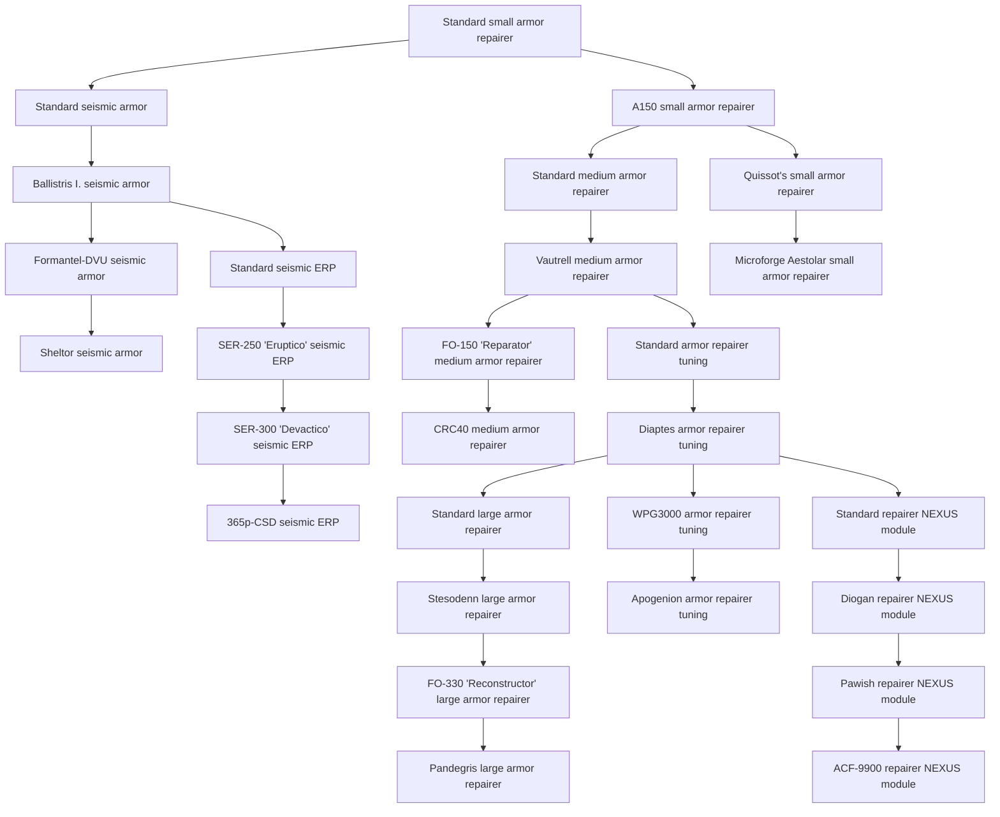
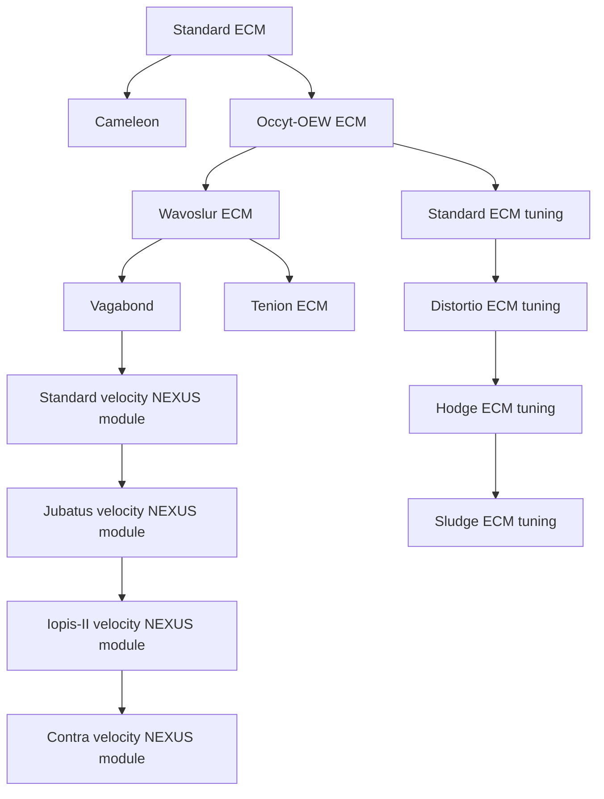

<!-- Generated by tools/generate from the live database (source: techtree + techtreenodeprices (group 3)).
     Do not edit by hand; regenerate instead. -->

# Nuimqol (faction)

Research for the Nuimqol rebel faction: its named weapons and the modules that fight alongside them.

[Tech tree](/content/techtree/) → Nuimqol (faction). The category is split into its **research lines** — one per top-level item (the chips above jump to each line's graph). Every node in a graph links to its detail page (prerequisites, what it unlocks next, point prices).

<a href="#line-18">Small armor repairer</a>&ensp;
<a href="#line-50">ECM</a>&ensp;
<a href="#line-66">Light EM-gun</a>&ensp;

## Standard small armor repairer

**28 nodes** — everything that descends from [Standard small armor repairer](/content/techtree/nodes/standard-small-armor-repairer/).

## Standard ECM

**14 nodes** — everything that descends from [Standard ECM](/content/techtree/nodes/standard-sensor-jammer/).

## Standard light EM-gun

**45 nodes** — everything that descends from [Standard light EM-gun](/content/techtree/nodes/standard-small-railgun/).

```mermaid
graph TD
    n66["Standard light EM-gun"]
    n67["Standard medium Gauss gun"]
    n68["Standard heavy Gauss gun"]
    n193["Yagel"]
    n201["Arbalest"]
    n205["Kain"]
    n213["Mesmer"]
    n247["Small incendiary slug"]
    n248["Small chemoactive slug"]
    n249["Small liquidcore slug"]
    n250["Small compositecore slug"]
    n251["Medium incendiary slug"]
    n252["Medium chemoactive slug"]
    n253["Medium liquidcore slug"]
    n254["Medium compositecore slug"]
    n255["Large incendiary slug"]
    n256["Large chemoactive slug"]
    n257["Large liquidcore slug"]
    n258["Large compositecore slug"]
    n858["Nuimtec-ROWO light EM-gun"]
    n859["Proto-Gard II. light EM-gun"]
    n860["Nuimtec-Inkandesk light EM-gun"]
    n861["Iskio-Magnetor medium Gauss gun"]
    n862["Nuimtec-Midion AMS medium Gauss gun"]
    n863["Prompt medium Gauss gun"]
    n864["Iskio-Magnetor II. heavy Gauss gun"]
    n865["Nuimtec-Gaule heavy Gauss gun"]
    n866["Pentack-Nailer dd550 heavy Gauss gun"]
    n876["Standard assault NEXUS module"]
    n909["Standard magnetic weapon tuning"]
    n924["Nuimtec-Spilster magnetic weapon tuning"]
    n925["RSU-Magnitcore magnetic weapon tuning"]
    n926["Nuimtec-Magniscope XM80 magnetic weapon tuning"]
    n1000["Standard medium EM-gun"]
    n1001["Longrange Standard Large Railgun"]
    n1018["Condor-SPP medium EM-gun"]
    n1019["Nuimtec-Accolon LRS medium EM-gun"]
    n1020["5.5-Glipler medium EM-gun"]
    n1021["T2 Longrange Large Railgun"]
    n1022["T3 Longrange Large Railgun"]
    n1023["T4 Longrange Large Railgun"]
    n2577["Myrmidon assault NEXUS module"]
    n2578["Mobba assault NEXUS module"]
    n2579["'Scorch' assault NEXUS module"]
    n6008["Felos"]
    n859 --> n67
    n862 --> n68
    n66 --> n193
    n858 --> n201
    n67 --> n205
    n1018 --> n213
    n250 --> n247
    n250 --> n248
    n250 --> n249
    n66 --> n250
    n254 --> n251
    n254 --> n252
    n254 --> n253
    n67 --> n254
    n258 --> n255
    n258 --> n256
    n258 --> n257
    n1001 --> n258
    n66 --> n858
    n858 --> n859
    n859 --> n860
    n67 --> n861
    n861 --> n862
    n862 --> n863
    n68 --> n864
    n864 --> n865
    n865 --> n866
    n925 --> n876
    n66 --> n909
    n909 --> n924
    n924 --> n925
    n925 --> n926
    n861 --> n1000
    n1000 --> n1001
    n1000 --> n1018
    n1018 --> n1019
    n1019 --> n1020
    n1001 --> n1021
    n1021 --> n1022
    n1022 --> n1023
    n876 --> n2577
    n2577 --> n2578
    n2578 --> n2579
    n213 --> n6008
    click n66 "/content/techtree/nodes/standard-small-railgun/" "Standard light EM-gun"
    click n67 "/content/techtree/nodes/standard-medium-railgun/" "Standard medium Gauss gun"
    click n68 "/content/techtree/nodes/standard-large-railgun/" "Standard heavy Gauss gun"
    click n193 "/content/techtree/nodes/yagel/" "Yagel"
    click n201 "/content/techtree/nodes/arbalest/" "Arbalest"
    click n205 "/content/techtree/nodes/kain/" "Kain"
    click n213 "/content/techtree/nodes/mesmer/" "Mesmer"
    click n247 "/content/techtree/nodes/ammo-small-railgun-a/" "Small incendiary slug"
    click n248 "/content/techtree/nodes/ammo-small-railgun-b/" "Small chemoactive slug"
    click n249 "/content/techtree/nodes/ammo-small-railgun-c/" "Small liquidcore slug"
    click n250 "/content/techtree/nodes/ammo-small-railgun-d/" "Small compositecore slug"
    click n251 "/content/techtree/nodes/ammo-medium-railgun-a/" "Medium incendiary slug"
    click n252 "/content/techtree/nodes/ammo-medium-railgun-b/" "Medium chemoactive slug"
    click n253 "/content/techtree/nodes/ammo-medium-railgun-c/" "Medium liquidcore slug"
    click n254 "/content/techtree/nodes/ammo-medium-railgun-d/" "Medium compositecore slug"
    click n255 "/content/techtree/nodes/ammo-large-railgun-a/" "Large incendiary slug"
    click n256 "/content/techtree/nodes/ammo-large-railgun-b/" "Large chemoactive slug"
    click n257 "/content/techtree/nodes/ammo-large-railgun-c/" "Large liquidcore slug"
    click n258 "/content/techtree/nodes/ammo-large-railgun-d/" "Large compositecore slug"
    click n858 "/content/techtree/nodes/named1-small-railgun/" "Nuimtec-ROWO light EM-gun"
    click n859 "/content/techtree/nodes/named2-small-railgun/" "Proto-Gard II. light EM-gun"
    click n860 "/content/techtree/nodes/named3-small-railgun/" "Nuimtec-Inkandesk light EM-gun"
    click n861 "/content/techtree/nodes/named1-medium-railgun/" "Iskio-Magnetor medium Gauss gun"
    click n862 "/content/techtree/nodes/named2-medium-railgun/" "Nuimtec-Midion AMS medium Gauss gun"
    click n863 "/content/techtree/nodes/named3-medium-railgun/" "Prompt medium Gauss gun"
    click n864 "/content/techtree/nodes/named1-large-railgun/" "Iskio-Magnetor II. heavy Gauss gun"
    click n865 "/content/techtree/nodes/named2-large-railgun/" "Nuimtec-Gaule heavy Gauss gun"
    click n866 "/content/techtree/nodes/named3-large-railgun/" "Pentack-Nailer dd550 heavy Gauss gun"
    click n876 "/content/techtree/nodes/standard-gang-assist-siege-module/" "Standard assault NEXUS module"
    click n909 "/content/techtree/nodes/standard-damage-mod-railgun/" "Standard magnetic weapon tuning"
    click n924 "/content/techtree/nodes/named1-damage-mod-railgun/" "Nuimtec-Spilster magnetic weapon tuning"
    click n925 "/content/techtree/nodes/named2-damage-mod-railgun/" "RSU-Magnitcore magnetic weapon tuning"
    click n926 "/content/techtree/nodes/named3-damage-mod-railgun/" "Nuimtec-Magniscope XM80 magnetic weapon tuning"
    click n1000 "/content/techtree/nodes/longrange-standard-medium-railgun/" "Standard medium EM-gun"
    click n1001 "/content/techtree/nodes/longrange-standard-large-railgun/" "Longrange Standard Large Railgun"
    click n1018 "/content/techtree/nodes/named1-longrange-medium-railgun/" "Condor-SPP medium EM-gun"
    click n1019 "/content/techtree/nodes/named2-longrange-medium-railgun/" "Nuimtec-Accolon LRS medium EM-gun"
    click n1020 "/content/techtree/nodes/named3-longrange-medium-railgun/" "5.5-Glipler medium EM-gun"
    click n1021 "/content/techtree/nodes/named1-longrange-large-railgun/" "T2 Longrange Large Railgun"
    click n1022 "/content/techtree/nodes/named2-longrange-large-railgun/" "T3 Longrange Large Railgun"
    click n1023 "/content/techtree/nodes/named3-longrange-large-railgun/" "T4 Longrange Large Railgun"
    click n2577 "/content/techtree/nodes/named1-gang-assist-siege-module/" "Myrmidon assault NEXUS module"
    click n2578 "/content/techtree/nodes/named2-gang-assist-siege-module/" "Mobba assault NEXUS module"
    click n2579 "/content/techtree/nodes/named3-gang-assist-siege-module/" "'Scorch' assault NEXUS module"
    click n6008 "/content/techtree/nodes/felos/" "Felos"
```

## Nodes (all)

| Unlocks item | Parent node | Enabler extension | Point prices |
|---|---|---|---|
| [Standard small armor repairer](/content/techtree/nodes/standard-small-armor-repairer/) | – (root) | [ext_research_nuimqol](/content/extensions/) | common=100; nuimqol=100 |
| [Standard ECM](/content/techtree/nodes/standard-sensor-jammer/) | – (root) | [ext_research_nuimqol](/content/extensions/) | common=2.7k; nuimqol=2.7k |
| [Standard light EM-gun](/content/techtree/nodes/standard-small-railgun/) | – (root) | [ext_research_nuimqol](/content/extensions/) | common=100; nuimqol=100 |
| [Standard seismic armor](/content/techtree/nodes/standard-exp-armor-hardener/) | [Standard small armor repairer](/content/techtree/nodes/standard-small-armor-repairer/) | [ext_research_nuimqol](/content/extensions/) | common=2.7k; nuimqol=2.7k |
| [A150 small armor repairer](/content/techtree/nodes/named1-small-armor-repairer/) | [Standard small armor repairer](/content/techtree/nodes/standard-small-armor-repairer/) | [ext_research_nuimqol](/content/extensions/) | common=800; nuimqol=800 |
| [Vautrell medium armor repairer](/content/techtree/nodes/named1-medium-armor-repairer/) | [Standard medium armor repairer](/content/techtree/nodes/standard-medium-armor-repairer/) | [ext_research_nuimqol](/content/extensions/) | common=6.4k; nuimqol=6.4k |
| [Stesodenn large armor repairer](/content/techtree/nodes/named1-large-armor-repairer/) | [Standard large armor repairer](/content/techtree/nodes/standard-large-armor-repairer/) | – | hitech=25.6k; nuimqol=51.2k |
| [Ballistris I. seismic armor](/content/techtree/nodes/named1-exp-armor-hardener/) | [Standard seismic armor](/content/techtree/nodes/standard-exp-armor-hardener/) | [ext_research_nuimqol](/content/extensions/) | common=6.4k; nuimqol=6.4k |
| [Cameleon](/content/techtree/nodes/cameleon/) | [Standard ECM](/content/techtree/nodes/standard-sensor-jammer/) | [ext_research_nuimqol](/content/extensions/) | common=32k; nuimqol=32k |
| [Occyt-OEW ECM](/content/techtree/nodes/named1-sensor-jammer/) | [Standard ECM](/content/techtree/nodes/standard-sensor-jammer/) | [ext_research_nuimqol](/content/extensions/) | common=6.4k; nuimqol=6.4k |
| [Yagel](/content/techtree/nodes/yagel/) | [Standard light EM-gun](/content/techtree/nodes/standard-small-railgun/) | [ext_research_nuimqol](/content/extensions/) | common=4k; nuimqol=4k |
| [Small compositecore slug](/content/techtree/nodes/ammo-small-railgun-d/) | [Standard light EM-gun](/content/techtree/nodes/standard-small-railgun/) | – | common=800; nuimqol=800 |
| [Nuimtec-ROWO light EM-gun](/content/techtree/nodes/named1-small-railgun/) | [Standard light EM-gun](/content/techtree/nodes/standard-small-railgun/) | [ext_research_nuimqol](/content/extensions/) | common=800; nuimqol=800 |
| [Standard magnetic weapon tuning](/content/techtree/nodes/standard-damage-mod-railgun/) | [Standard light EM-gun](/content/techtree/nodes/standard-small-railgun/) | [ext_research_nuimqol](/content/extensions/) | common=800; nuimqol=800 |
| [Kain](/content/techtree/nodes/kain/) | [Standard medium Gauss gun](/content/techtree/nodes/standard-medium-railgun/) | [ext_research_nuimqol](/content/extensions/) | common=62.5k; nuimqol=62.5k |
| [Medium compositecore slug](/content/techtree/nodes/ammo-medium-railgun-d/) | [Standard medium Gauss gun](/content/techtree/nodes/standard-medium-railgun/) | – | common=12.5k; nuimqol=12.5k |
| [Iskio-Magnetor medium Gauss gun](/content/techtree/nodes/named1-medium-railgun/) | [Standard medium Gauss gun](/content/techtree/nodes/standard-medium-railgun/) | [ext_research_nuimqol](/content/extensions/) | common=12.5k; nuimqol=12.5k |
| [Iskio-Magnetor II. heavy Gauss gun](/content/techtree/nodes/named1-large-railgun/) | [Standard heavy Gauss gun](/content/techtree/nodes/standard-large-railgun/) | – | hitech=25.6k; nuimqol=51.2k |
| [Standard velocity NEXUS module](/content/techtree/nodes/standard-gang-assist-speed-module/) | [Vagabond](/content/techtree/nodes/vagabond/) | [ext_research_nuimqol](/content/extensions/) | common=34.3k; nuimqol=34.3k |
| [Felos](/content/techtree/nodes/felos/) | [Mesmer](/content/techtree/nodes/mesmer/) | – | hitech=250k; nuimqol=500k |
| [Small incendiary slug](/content/techtree/nodes/ammo-small-railgun-a/) | [Small compositecore slug](/content/techtree/nodes/ammo-small-railgun-d/) | – | common=2.7k; nuimqol=2.7k |
| [Small chemoactive slug](/content/techtree/nodes/ammo-small-railgun-b/) | [Small compositecore slug](/content/techtree/nodes/ammo-small-railgun-d/) | – | common=2.7k; nuimqol=2.7k |
| [Small liquidcore slug](/content/techtree/nodes/ammo-small-railgun-c/) | [Small compositecore slug](/content/techtree/nodes/ammo-small-railgun-d/) | – | common=2.7k; nuimqol=2.7k |
| [Medium incendiary slug](/content/techtree/nodes/ammo-medium-railgun-a/) | [Medium compositecore slug](/content/techtree/nodes/ammo-medium-railgun-d/) | – | common=21.6k; nuimqol=21.6k |
| [Medium chemoactive slug](/content/techtree/nodes/ammo-medium-railgun-b/) | [Medium compositecore slug](/content/techtree/nodes/ammo-medium-railgun-d/) | – | common=21.6k; nuimqol=21.6k |
| [Medium liquidcore slug](/content/techtree/nodes/ammo-medium-railgun-c/) | [Medium compositecore slug](/content/techtree/nodes/ammo-medium-railgun-d/) | – | common=21.6k; nuimqol=21.6k |
| [Large incendiary slug](/content/techtree/nodes/ammo-large-railgun-a/) | [Large compositecore slug](/content/techtree/nodes/ammo-large-railgun-d/) | – | hitech=25.6k; nuimqol=51.2k |
| [Large chemoactive slug](/content/techtree/nodes/ammo-large-railgun-b/) | [Large compositecore slug](/content/techtree/nodes/ammo-large-railgun-d/) | – | hitech=25.6k; nuimqol=51.2k |
| [Large liquidcore slug](/content/techtree/nodes/ammo-large-railgun-c/) | [Large compositecore slug](/content/techtree/nodes/ammo-large-railgun-d/) | – | hitech=25.6k; nuimqol=51.2k |
| [Standard medium armor repairer](/content/techtree/nodes/standard-medium-armor-repairer/) | [A150 small armor repairer](/content/techtree/nodes/named1-small-armor-repairer/) | [ext_research_nuimqol](/content/extensions/) | common=2.7k; nuimqol=2.7k |
| [Quissot's small armor repairer](/content/techtree/nodes/named2-small-armor-repairer/) | [A150 small armor repairer](/content/techtree/nodes/named1-small-armor-repairer/) | [ext_research_nuimqol](/content/extensions/) | common=2.7k; nuimqol=2.7k |
| [Microforge Aestolar small armor repairer](/content/techtree/nodes/named3-small-armor-repairer/) | [Quissot's small armor repairer](/content/techtree/nodes/named2-small-armor-repairer/) | [ext_research_nuimqol](/content/extensions/) | hitech=3.2k; nuimqol=6.4k |
| [FO-150 'Reparator' medium armor repairer](/content/techtree/nodes/named2-medium-armor-repairer/) | [Vautrell medium armor repairer](/content/techtree/nodes/named1-medium-armor-repairer/) | [ext_research_nuimqol](/content/extensions/) | common=12.5k; nuimqol=12.5k |
| [Standard armor repairer tuning](/content/techtree/nodes/standard-armor-repairer-upgrade/) | [Vautrell medium armor repairer](/content/techtree/nodes/named1-medium-armor-repairer/) | [ext_research_nuimqol](/content/extensions/) | common=12.5k; nuimqol=12.5k |
| [CRC40 medium armor repairer](/content/techtree/nodes/named3-medium-armor-repairer/) | [FO-150 'Reparator' medium armor repairer](/content/techtree/nodes/named2-medium-armor-repairer/) | [ext_research_nuimqol](/content/extensions/) | hitech=10.8k; nuimqol=21.6k |
| [FO-330 'Reconstructor' large armor repairer](/content/techtree/nodes/named2-large-armor-repairer/) | [Stesodenn large armor repairer](/content/techtree/nodes/named1-large-armor-repairer/) | – | hitech=36.45k; nuimqol=72.9k |
| [Pandegris large armor repairer](/content/techtree/nodes/named3-large-armor-repairer/) | [FO-330 'Reconstructor' large armor repairer](/content/techtree/nodes/named2-large-armor-repairer/) | – | hitech=50k; nuimqol=100k |
| [Formantel-DVU seismic armor](/content/techtree/nodes/named2-exp-armor-hardener/) | [Ballistris I. seismic armor](/content/techtree/nodes/named1-exp-armor-hardener/) | [ext_research_nuimqol](/content/extensions/) | common=12.5k; nuimqol=12.5k |
| [Standard seismic ERP](/content/techtree/nodes/standard-explosive-kers/) | [Ballistris I. seismic armor](/content/techtree/nodes/named1-exp-armor-hardener/) | [ext_research_nuimqol](/content/extensions/) | common=12.5k; nuimqol=12.5k |
| [Sheltor seismic armor](/content/techtree/nodes/named3-exp-armor-hardener/) | [Formantel-DVU seismic armor](/content/techtree/nodes/named2-exp-armor-hardener/) | [ext_research_nuimqol](/content/extensions/) | hitech=10.8k; nuimqol=21.6k |
| [Wavoslur ECM](/content/techtree/nodes/named2-sensor-jammer/) | [Occyt-OEW ECM](/content/techtree/nodes/named1-sensor-jammer/) | [ext_research_nuimqol](/content/extensions/) | common=12.5k; nuimqol=12.5k |
| [Standard ECM tuning](/content/techtree/nodes/standard-ecm-booster/) | [Occyt-OEW ECM](/content/techtree/nodes/named1-sensor-jammer/) | [ext_research_nuimqol](/content/extensions/) | common=12.5k; nuimqol=12.5k |
| [Vagabond](/content/techtree/nodes/vagabond/) | [Wavoslur ECM](/content/techtree/nodes/named2-sensor-jammer/) | [ext_research_nuimqol](/content/extensions/) | common=108k; nuimqol=108k |
| [Tenion ECM](/content/techtree/nodes/named3-sensor-jammer/) | [Wavoslur ECM](/content/techtree/nodes/named2-sensor-jammer/) | [ext_research_nuimqol](/content/extensions/) | hitech=10.8k; nuimqol=21.6k |
| [Arbalest](/content/techtree/nodes/arbalest/) | [Nuimtec-ROWO light EM-gun](/content/techtree/nodes/named1-small-railgun/) | [ext_research_nuimqol](/content/extensions/) | common=13.5k; nuimqol=13.5k |
| [Proto-Gard II. light EM-gun](/content/techtree/nodes/named2-small-railgun/) | [Nuimtec-ROWO light EM-gun](/content/techtree/nodes/named1-small-railgun/) | [ext_research_nuimqol](/content/extensions/) | common=2.7k; nuimqol=2.7k |
| [Standard medium Gauss gun](/content/techtree/nodes/standard-medium-railgun/) | [Proto-Gard II. light EM-gun](/content/techtree/nodes/named2-small-railgun/) | [ext_research_nuimqol](/content/extensions/) | common=6.4k; nuimqol=6.4k |
| [Nuimtec-Inkandesk light EM-gun](/content/techtree/nodes/named3-small-railgun/) | [Proto-Gard II. light EM-gun](/content/techtree/nodes/named2-small-railgun/) | [ext_research_nuimqol](/content/extensions/) | hitech=3.2k; nuimqol=6.4k |
| [Nuimtec-Midion AMS medium Gauss gun](/content/techtree/nodes/named2-medium-railgun/) | [Iskio-Magnetor medium Gauss gun](/content/techtree/nodes/named1-medium-railgun/) | [ext_research_nuimqol](/content/extensions/) | common=21.6k; nuimqol=21.6k |
| [Standard medium EM-gun](/content/techtree/nodes/longrange-standard-medium-railgun/) | [Iskio-Magnetor medium Gauss gun](/content/techtree/nodes/named1-medium-railgun/) | [ext_research_nuimqol](/content/extensions/) | common=21.6k; nuimqol=21.6k |
| [Standard heavy Gauss gun](/content/techtree/nodes/standard-large-railgun/) | [Nuimtec-Midion AMS medium Gauss gun](/content/techtree/nodes/named2-medium-railgun/) | – | hitech=17.15k; nuimqol=34.3k |
| [Prompt medium Gauss gun](/content/techtree/nodes/named3-medium-railgun/) | [Nuimtec-Midion AMS medium Gauss gun](/content/techtree/nodes/named2-medium-railgun/) | [ext_research_nuimqol](/content/extensions/) | hitech=17.15k; nuimqol=34.3k |
| [Nuimtec-Gaule heavy Gauss gun](/content/techtree/nodes/named2-large-railgun/) | [Iskio-Magnetor II. heavy Gauss gun](/content/techtree/nodes/named1-large-railgun/) | – | hitech=36.45k; nuimqol=72.9k |
| [Pentack-Nailer dd550 heavy Gauss gun](/content/techtree/nodes/named3-large-railgun/) | [Nuimtec-Gaule heavy Gauss gun](/content/techtree/nodes/named2-large-railgun/) | – | hitech=50k; nuimqol=100k |
| [Jubatus velocity NEXUS module](/content/techtree/nodes/named1-gang-assist-speed-module/) | [Standard velocity NEXUS module](/content/techtree/nodes/standard-gang-assist-speed-module/) | [ext_research_nuimqol](/content/extensions/) | common=51.2k; nuimqol=51.2k |
| [Myrmidon assault NEXUS module](/content/techtree/nodes/named1-gang-assist-siege-module/) | [Standard assault NEXUS module](/content/techtree/nodes/standard-gang-assist-siege-module/) | [ext_research_nuimqol](/content/extensions/) | common=51.2k; nuimqol=51.2k |
| [Nuimtec-Spilster magnetic weapon tuning](/content/techtree/nodes/named1-damage-mod-railgun/) | [Standard magnetic weapon tuning](/content/techtree/nodes/standard-damage-mod-railgun/) | [ext_research_nuimqol](/content/extensions/) | common=6.4k; nuimqol=6.4k |
| [RSU-Magnitcore magnetic weapon tuning](/content/techtree/nodes/named2-damage-mod-railgun/) | [Nuimtec-Spilster magnetic weapon tuning](/content/techtree/nodes/named1-damage-mod-railgun/) | [ext_research_nuimqol](/content/extensions/) | common=21.6k; nuimqol=21.6k |
| [Standard assault NEXUS module](/content/techtree/nodes/standard-gang-assist-siege-module/) | [RSU-Magnitcore magnetic weapon tuning](/content/techtree/nodes/named2-damage-mod-railgun/) | [ext_research_nuimqol](/content/extensions/) | common=34.3k; nuimqol=34.3k |
| [Nuimtec-Magniscope XM80 magnetic weapon tuning](/content/techtree/nodes/named3-damage-mod-railgun/) | [RSU-Magnitcore magnetic weapon tuning](/content/techtree/nodes/named2-damage-mod-railgun/) | [ext_research_nuimqol](/content/extensions/) | hitech=25.6k; nuimqol=51.2k |
| [Longrange Standard Large Railgun](/content/techtree/nodes/longrange-standard-large-railgun/) | [Standard medium EM-gun](/content/techtree/nodes/longrange-standard-medium-railgun/) | – | hitech=17.15k; nuimqol=34.3k |
| [Condor-SPP medium EM-gun](/content/techtree/nodes/named1-longrange-medium-railgun/) | [Standard medium EM-gun](/content/techtree/nodes/longrange-standard-medium-railgun/) | [ext_research_nuimqol](/content/extensions/) | common=34.3k; nuimqol=34.3k |
| [Large compositecore slug](/content/techtree/nodes/ammo-large-railgun-d/) | [Longrange Standard Large Railgun](/content/techtree/nodes/longrange-standard-large-railgun/) | – | hitech=17.15k; nuimqol=34.3k |
| [T2 Longrange Large Railgun](/content/techtree/nodes/named1-longrange-large-railgun/) | [Longrange Standard Large Railgun](/content/techtree/nodes/longrange-standard-large-railgun/) | – | hitech=25.6k; nuimqol=51.2k |
| [Mesmer](/content/techtree/nodes/mesmer/) | [Condor-SPP medium EM-gun](/content/techtree/nodes/named1-longrange-medium-railgun/) | [ext_research_nuimqol](/content/extensions/) | common=256k; nuimqol=256k |
| [Nuimtec-Accolon LRS medium EM-gun](/content/techtree/nodes/named2-longrange-medium-railgun/) | [Condor-SPP medium EM-gun](/content/techtree/nodes/named1-longrange-medium-railgun/) | [ext_research_nuimqol](/content/extensions/) | common=51.2k; nuimqol=51.2k |
| [5.5-Glipler medium EM-gun](/content/techtree/nodes/named3-longrange-medium-railgun/) | [Nuimtec-Accolon LRS medium EM-gun](/content/techtree/nodes/named2-longrange-medium-railgun/) | [ext_research_nuimqol](/content/extensions/) | hitech=36.45k; nuimqol=72.9k |
| [T3 Longrange Large Railgun](/content/techtree/nodes/named2-longrange-large-railgun/) | [T2 Longrange Large Railgun](/content/techtree/nodes/named1-longrange-large-railgun/) | – | hitech=36.45k; nuimqol=72.9k |
| [T4 Longrange Large Railgun](/content/techtree/nodes/named3-longrange-large-railgun/) | [T3 Longrange Large Railgun](/content/techtree/nodes/named2-longrange-large-railgun/) | – | hitech=50k; nuimqol=100k |
| [Diaptes armor repairer tuning](/content/techtree/nodes/named1-armor-repairer-upgrade/) | [Standard armor repairer tuning](/content/techtree/nodes/standard-armor-repairer-upgrade/) | [ext_research_nuimqol](/content/extensions/) | common=21.6k; nuimqol=21.6k |
| [Standard large armor repairer](/content/techtree/nodes/standard-large-armor-repairer/) | [Diaptes armor repairer tuning](/content/techtree/nodes/named1-armor-repairer-upgrade/) | – | hitech=17.15k; nuimqol=34.3k |
| [WPG3000 armor repairer tuning](/content/techtree/nodes/named2-armor-repairer-upgrade/) | [Diaptes armor repairer tuning](/content/techtree/nodes/named1-armor-repairer-upgrade/) | [ext_research_nuimqol](/content/extensions/) | common=34.3k; nuimqol=34.3k |
| [Standard repairer NEXUS module](/content/techtree/nodes/standard-gang-assist-maintance-module/) | [Diaptes armor repairer tuning](/content/techtree/nodes/named1-armor-repairer-upgrade/) | [ext_research_nuimqol](/content/extensions/) | common=34.3k; nuimqol=34.3k |
| [Apogenion armor repairer tuning](/content/techtree/nodes/named3-armor-repairer-upgrade/) | [WPG3000 armor repairer tuning](/content/techtree/nodes/named2-armor-repairer-upgrade/) | [ext_research_nuimqol](/content/extensions/) | hitech=25.6k; nuimqol=51.2k |
| [Diogan repairer NEXUS module](/content/techtree/nodes/named1-gang-assist-maintance-module/) | [Standard repairer NEXUS module](/content/techtree/nodes/standard-gang-assist-maintance-module/) | [ext_research_nuimqol](/content/extensions/) | common=51.2k; nuimqol=51.2k |
| [Iopis-II velocity NEXUS module](/content/techtree/nodes/named2-gang-assist-speed-module/) | [Jubatus velocity NEXUS module](/content/techtree/nodes/named1-gang-assist-speed-module/) | [ext_research_nuimqol](/content/extensions/) | common=72.9k; nuimqol=72.9k |
| [Contra velocity NEXUS module](/content/techtree/nodes/named3-gang-assist-speed-module/) | [Iopis-II velocity NEXUS module](/content/techtree/nodes/named2-gang-assist-speed-module/) | [ext_research_nuimqol](/content/extensions/) | hitech=50k; nuimqol=100k |
| [Mobba assault NEXUS module](/content/techtree/nodes/named2-gang-assist-siege-module/) | [Myrmidon assault NEXUS module](/content/techtree/nodes/named1-gang-assist-siege-module/) | [ext_research_nuimqol](/content/extensions/) | common=72.9k; nuimqol=72.9k |
| ['Scorch' assault NEXUS module](/content/techtree/nodes/named3-gang-assist-siege-module/) | [Mobba assault NEXUS module](/content/techtree/nodes/named2-gang-assist-siege-module/) | [ext_research_nuimqol](/content/extensions/) | hitech=50k; nuimqol=100k |
| [Pawish repairer NEXUS module](/content/techtree/nodes/named2-gang-assist-maintance-module/) | [Diogan repairer NEXUS module](/content/techtree/nodes/named1-gang-assist-maintance-module/) | [ext_research_nuimqol](/content/extensions/) | common=72.9k; nuimqol=72.9k |
| [ACF-9900 repairer NEXUS module](/content/techtree/nodes/named3-gang-assist-maintance-module/) | [Pawish repairer NEXUS module](/content/techtree/nodes/named2-gang-assist-maintance-module/) | [ext_research_nuimqol](/content/extensions/) | hitech=50k; nuimqol=100k |
| [SER-250 'Eruptico' seismic ERP](/content/techtree/nodes/named1-explosive-kers/) | [Standard seismic ERP](/content/techtree/nodes/standard-explosive-kers/) | [ext_research_nuimqol](/content/extensions/) | common=21.6k; nuimqol=21.6k |
| [SER-300 'Devactico' seismic ERP](/content/techtree/nodes/named2-explosive-kers/) | [SER-250 'Eruptico' seismic ERP](/content/techtree/nodes/named1-explosive-kers/) | [ext_research_nuimqol](/content/extensions/) | common=34.3k; nuimqol=34.3k |
| [365p-CSD seismic ERP](/content/techtree/nodes/named3-explosive-kers/) | [SER-300 'Devactico' seismic ERP](/content/techtree/nodes/named2-explosive-kers/) | [ext_research_nuimqol](/content/extensions/) | hitech=25.6k; nuimqol=51.2k |
| [Distortio ECM tuning](/content/techtree/nodes/named1-ecm-booster/) | [Standard ECM tuning](/content/techtree/nodes/standard-ecm-booster/) | [ext_research_nuimqol](/content/extensions/) | common=21.6k; nuimqol=21.6k |
| [Hodge ECM tuning](/content/techtree/nodes/named2-ecm-booster/) | [Distortio ECM tuning](/content/techtree/nodes/named1-ecm-booster/) | [ext_research_nuimqol](/content/extensions/) | common=34.3k; nuimqol=34.3k |
| [Sludge ECM tuning](/content/techtree/nodes/named3-ecm-booster/) | [Hodge ECM tuning](/content/techtree/nodes/named2-ecm-booster/) | [ext_research_nuimqol](/content/extensions/) | hitech=25.6k; nuimqol=51.2k |

