<!-- Generated by tools/generate from the live database (source: techtree + techtreenodeprices (group 7)).
     Do not edit by hand; regenerate instead. -->

# PBS structures

Power base station capsules and construction modules — the buildings of open-world corporate play.

[Tech tree](/content/techtree/) → PBS structures. Every node in the diagram links to its detail page (prerequisites, what it unlocks next, point prices).

```mermaid
graph TD
    n4616["Standard reactor foundation"]
    n4623["Standard energy transmitter node foundation"]
    n4635["Standard main terminal foundation"]
    n4638["Advanced main terminal foundation"]
    n4650["Standard reverse engineering foundation"]
    n4666["Hi-tech main terminal foundation"]
    n4668["Advanced reactor foundation"]
    n4671["Hi-tech reactor foundation"]
    n4676["Advanced energy transmitter node foundation"]
    n4679["Hi-tech energy transmitter node foundation"]
    n4680["Standard energy backbone node foundation"]
    n4683["Advanced energy backbone node foundation"]
    n4686["Hi-tech energy backbone node foundation"]
    n4691["Standard mining outpost foundation"]
    n4693["Standard repair node foundation"]
    n4697["Standard facility upgrade foundation"]
    n4700["Standard command relay foundation"]
    n4703["Advanced reverse engineering foundation"]
    n4706["Hi-tech reverse engineering foundation"]
    n4709["Standard refinery foundation"]
    n4712["Advanced facility upgrade foundation"]
    n4715["Hi-tech facility upgrade foundation"]
    n4718["Advanced repair node foundation"]
    n4721["Hi-tech repair node foundation"]
    n4724["Advanced refinery foundation"]
    n4727["Hi-tech refinery foundation"]
    n4735["Advanced mining outpost foundation"]
    n4738["Hi-tech mining outpost foundation"]
    n4741["Advanced command relay foundation"]
    n4744["Hi-tech command relay foundation"]
    n4750["Standard masker foundation"]
    n4753["Advanced masker foundation"]
    n4756["Hi-tech masker foundation"]
    n4759["Standard prototype facility foundation"]
    n4762["Advanced prototype facility foundation"]
    n4765["Hi-tech prototype facility foundation"]
    n4768["Standard repair shop foundation"]
    n4771["Advanced repair shop foundation"]
    n4774["Hi-tech repair shop foundation"]
    n4777["Standard recycling plant foundation"]
    n4780["Advanced recycling plant foundation"]
    n4783["Hi-tech recycling plant foundation"]
    n4786["Standard calibration lab foundation"]
    n4789["Advanced calibration lab foundation"]
    n4792["Hi-tech calibration lab foundation"]
    n4795["Standard decoder lab foundation"]
    n4798["Advanced decoder lab foundation"]
    n4801["Hi-tech decoder lab foundation"]
    n4806["Energy storage cell"]
    n4808["Standard EM-turret foundation"]
    n4811["Advanced EM-turret foundation"]
    n4814["Hi-tech EM-turret foundation"]
    n4817["Standard laser turret foundation"]
    n4820["Advanced laser turret foundation"]
    n4823["Hi-tech laser turret foundation"]
    n4826["Standard missile turret foundation"]
    n4829["Advanced missile turret foundation"]
    n4832["Hi-tech missile turret foundation"]
    n4835["Standard factory foundation"]
    n4838["Advanced factory foundation"]
    n4841["Hi-tech factory foundation"]
    n4844["Standard booster node foundation"]
    n4847["Advanced booster node foundation"]
    n4850["Hi-tech booster node foundation"]
    n5124["Standard energy battery foundation"]
    n5127["Advanced energy battery foundation"]
    n5130["Hi-tech energy battery foundation"]
    n5164["Standard EW turret foundation"]
    n5167["Advanced EW turret foundation"]
    n5170["Hi-tech EW turret foundation"]
    n5192["Standard Aura emitter foundation"]
    n5193["Advanced Aura emitter foundation"]
    n5196["Hi-tech Aura emitter foundation"]
    n5355["Standard energy well foundation"]
    n5356["Advanced energy well foundation"]
    n5357["Hi-tech energy well foundation"]
    n5367["Standard accelerator strip foundation"]
    n5368["Advanced accelerator strip foundation"]
    n5369["Hi-tech accelerator strip foundation"]
    n6110["Reactor Booster B"]
    n6111["Reactor Booster C"]
    n6625["Construction Module Ammo T1"]
    n6626["Construction Module Ammo T2"]
    n6627["Construction Module Ammo T3"]
    n4635 --> n4616
    n4616 --> n4623
    n6625 --> n4635
    n4635 --> n4638
    n4759 --> n4650
    n4638 --> n4666
    n4616 --> n4668
    n4668 --> n4671
    n4623 --> n4676
    n4676 --> n4679
    n4623 --> n4680
    n4680 --> n4683
    n4683 --> n4686
    n4700 --> n4691
    n4768 --> n4693
    n4835 --> n4697
    n4635 --> n4700
    n4650 --> n4703
    n4703 --> n4706
    n4635 --> n4709
    n4697 --> n4712
    n4712 --> n4715
    n4693 --> n4718
    n4718 --> n4721
    n4709 --> n4724
    n4724 --> n4727
    n4691 --> n4735
    n4735 --> n4738
    n4700 --> n4741
    n4741 --> n4744
    n4693 --> n4750
    n4750 --> n4753
    n4753 --> n4756
    n4835 --> n4759
    n4759 --> n4762
    n4762 --> n4765
    n4635 --> n4768
    n4768 --> n4771
    n4771 --> n4774
    n4709 --> n4777
    n4777 --> n4780
    n4780 --> n4783
    n4650 --> n4786
    n4786 --> n4789
    n4789 --> n4792
    n4650 --> n4795
    n4795 --> n4798
    n4798 --> n4801
    n4616 --> n4806
    n4700 --> n4808
    n4808 --> n4811
    n4811 --> n4814
    n4700 --> n4817
    n4817 --> n4820
    n4820 --> n4823
    n4700 --> n4826
    n4826 --> n4829
    n4829 --> n4832
    n4709 --> n4835
    n4835 --> n4838
    n4838 --> n4841
    n4750 --> n4844
    n4844 --> n4847
    n4847 --> n4850
    n4680 --> n5124
    n5124 --> n5127
    n5127 --> n5130
    n4700 --> n5164
    n5164 --> n5167
    n5167 --> n5170
    n4844 --> n5192
    n5192 --> n5193
    n5193 --> n5196
    n4616 --> n5355
    n5355 --> n5356
    n5356 --> n5357
    n4700 --> n5367
    n5367 --> n5368
    n5368 --> n5369
    n4806 --> n6110
    n6110 --> n6111
    n6625 --> n6626
    n6626 --> n6627
    click n4616 "/content/techtree/nodes/pbs-reactor-small-capsule/" "Standard reactor foundation"
    click n4623 "/content/techtree/nodes/pbs-core-transmitter-small-capsule/" "Standard energy transmitter node foundation"
    click n4635 "/content/techtree/nodes/pbs-docking-base-small-capsule/" "Standard main terminal foundation"
    click n4638 "/content/techtree/nodes/pbs-docking-base-medium-capsule/" "Advanced main terminal foundation"
    click n4650 "/content/techtree/nodes/pbs-research-lab-small-capsule/" "Standard reverse engineering foundation"
    click n4666 "/content/techtree/nodes/pbs-docking-base-large-capsule/" "Hi-tech main terminal foundation"
    click n4668 "/content/techtree/nodes/pbs-reactor-medium-capsule/" "Advanced reactor foundation"
    click n4671 "/content/techtree/nodes/pbs-reactor-large-capsule/" "Hi-tech reactor foundation"
    click n4676 "/content/techtree/nodes/pbs-core-transmitter-medium-capsule/" "Advanced energy transmitter node foundation"
    click n4679 "/content/techtree/nodes/pbs-core-transmitter-large-capsule/" "Hi-tech energy transmitter node foundation"
    click n4680 "/content/techtree/nodes/pbs-xl-core-transmitter-small-capsule/" "Standard energy backbone node foundation"
    click n4683 "/content/techtree/nodes/pbs-xl-core-transmitter-medium-capsule/" "Advanced energy backbone node foundation"
    click n4686 "/content/techtree/nodes/pbs-xl-core-transmitter-large-capsule/" "Hi-tech energy backbone node foundation"
    click n4691 "/content/techtree/nodes/pbs-mining-tower-small-capsule/" "Standard mining outpost foundation"
    click n4693 "/content/techtree/nodes/pbs-armor-repairer-small-capsule/" "Standard repair node foundation"
    click n4697 "/content/techtree/nodes/pbs-production-upgrade-small-capsule/" "Standard facility upgrade foundation"
    click n4700 "/content/techtree/nodes/pbs-control-tower-small-capsule/" "Standard command relay foundation"
    click n4703 "/content/techtree/nodes/pbs-research-lab-medium-capsule/" "Advanced reverse engineering foundation"
    click n4706 "/content/techtree/nodes/pbs-research-lab-large-capsule/" "Hi-tech reverse engineering foundation"
    click n4709 "/content/techtree/nodes/pbs-refinery-small-capsule/" "Standard refinery foundation"
    click n4712 "/content/techtree/nodes/pbs-production-upgrade-medium-capsule/" "Advanced facility upgrade foundation"
    click n4715 "/content/techtree/nodes/pbs-production-upgrade-large-capsule/" "Hi-tech facility upgrade foundation"
    click n4718 "/content/techtree/nodes/pbs-armor-repairer-medium-capsule/" "Advanced repair node foundation"
    click n4721 "/content/techtree/nodes/pbs-armor-repairer-large-capsule/" "Hi-tech repair node foundation"
    click n4724 "/content/techtree/nodes/pbs-refinery-medium-capsule/" "Advanced refinery foundation"
    click n4727 "/content/techtree/nodes/pbs-refinery-large-capsule/" "Hi-tech refinery foundation"
    click n4735 "/content/techtree/nodes/pbs-mining-tower-medium-capsule/" "Advanced mining outpost foundation"
    click n4738 "/content/techtree/nodes/pbs-mining-tower-large-capsule/" "Hi-tech mining outpost foundation"
    click n4741 "/content/techtree/nodes/pbs-control-tower-medium-capsule/" "Advanced command relay foundation"
    click n4744 "/content/techtree/nodes/pbs-control-tower-large-capsule/" "Hi-tech command relay foundation"
    click n4750 "/content/techtree/nodes/pbs-maskertower-small-capsule/" "Standard masker foundation"
    click n4753 "/content/techtree/nodes/pbs-maskertower-medium-capsule/" "Advanced masker foundation"
    click n4756 "/content/techtree/nodes/pbs-maskertower-large-capsule/" "Hi-tech masker foundation"
    click n4759 "/content/techtree/nodes/pbs-prototyper-small-capsule/" "Standard prototype facility foundation"
    click n4762 "/content/techtree/nodes/pbs-prototyper-medium-capsule/" "Advanced prototype facility foundation"
    click n4765 "/content/techtree/nodes/pbs-prototyper-large-capsule/" "Hi-tech prototype facility foundation"
    click n4768 "/content/techtree/nodes/pbs-repair-small-capsule/" "Standard repair shop foundation"
    click n4771 "/content/techtree/nodes/pbs-repair-medium-capsule/" "Advanced repair shop foundation"
    click n4774 "/content/techtree/nodes/pbs-repair-large-capsule/" "Hi-tech repair shop foundation"
    click n4777 "/content/techtree/nodes/pbs-reprocessor-small-capsule/" "Standard recycling plant foundation"
    click n4780 "/content/techtree/nodes/pbs-reprocessor-medium-capsule/" "Advanced recycling plant foundation"
    click n4783 "/content/techtree/nodes/pbs-reprocessor-large-capsule/" "Hi-tech recycling plant foundation"
    click n4786 "/content/techtree/nodes/pbs-calibration-forge-small-capsule/" "Standard calibration lab foundation"
    click n4789 "/content/techtree/nodes/pbs-calibration-forge-medium-capsule/" "Advanced calibration lab foundation"
    click n4792 "/content/techtree/nodes/pbs-calibration-forge-large-capsule/" "Hi-tech calibration lab foundation"
    click n4795 "/content/techtree/nodes/pbs-research-kit-forge-small-capsule/" "Standard decoder lab foundation"
    click n4798 "/content/techtree/nodes/pbs-research-kit-forge-medium-capsule/" "Advanced decoder lab foundation"
    click n4801 "/content/techtree/nodes/pbs-research-kit-forge-large-capsule/" "Hi-tech decoder lab foundation"
    click n4806 "/content/techtree/nodes/reactor-booster-a/" "Energy storage cell"
    click n4808 "/content/techtree/nodes/pbs-turret-rail-small-capsule/" "Standard EM-turret foundation"
    click n4811 "/content/techtree/nodes/pbs-turret-rail-medium-capsule/" "Advanced EM-turret foundation"
    click n4814 "/content/techtree/nodes/pbs-turret-rail-large-capsule/" "Hi-tech EM-turret foundation"
    click n4817 "/content/techtree/nodes/pbs-turret-laser-small-capsule/" "Standard laser turret foundation"
    click n4820 "/content/techtree/nodes/pbs-turret-laser-medium-capsule/" "Advanced laser turret foundation"
    click n4823 "/content/techtree/nodes/pbs-turret-laser-large-capsule/" "Hi-tech laser turret foundation"
    click n4826 "/content/techtree/nodes/pbs-turret-missile-small-capsule/" "Standard missile turret foundation"
    click n4829 "/content/techtree/nodes/pbs-turret-missile-medium-capsule/" "Advanced missile turret foundation"
    click n4832 "/content/techtree/nodes/pbs-turret-missile-large-capsule/" "Hi-tech missile turret foundation"
    click n4835 "/content/techtree/nodes/pbs-mill-small-capsule/" "Standard factory foundation"
    click n4838 "/content/techtree/nodes/pbs-mill-medium-capsule/" "Advanced factory foundation"
    click n4841 "/content/techtree/nodes/pbs-mill-large-capsule/" "Hi-tech factory foundation"
    click n4844 "/content/techtree/nodes/pbs-effect-supplier-small-capsule/" "Standard booster node foundation"
    click n4847 "/content/techtree/nodes/pbs-effect-supplier-medium-capsule/" "Advanced booster node foundation"
    click n4850 "/content/techtree/nodes/pbs-effect-supplier-large-capsule/" "Hi-tech booster node foundation"
    click n5124 "/content/techtree/nodes/pbs-core-battery-small-capsule/" "Standard energy battery foundation"
    click n5127 "/content/techtree/nodes/pbs-core-battery-medium-capsule/" "Advanced energy battery foundation"
    click n5130 "/content/techtree/nodes/pbs-core-battery-large-capsule/" "Hi-tech energy battery foundation"
    click n5164 "/content/techtree/nodes/pbs-turret-ew-small-capsule/" "Standard EW turret foundation"
    click n5167 "/content/techtree/nodes/pbs-turret-ew-medium-capsule/" "Advanced EW turret foundation"
    click n5170 "/content/techtree/nodes/pbs-turret-ew-large-capsule/" "Hi-tech EW turret foundation"
    click n5192 "/content/techtree/nodes/pbs-aura-emitter-small-capsule/" "Standard Aura emitter foundation"
    click n5193 "/content/techtree/nodes/pbs-aura-emitter-medium-capsule/" "Advanced Aura emitter foundation"
    click n5196 "/content/techtree/nodes/pbs-aura-emitter-large-capsule/" "Hi-tech Aura emitter foundation"
    click n5355 "/content/techtree/nodes/pbs-energywell-small-capsule/" "Standard energy well foundation"
    click n5356 "/content/techtree/nodes/pbs-energywell-medium-capsule/" "Advanced energy well foundation"
    click n5357 "/content/techtree/nodes/pbs-energywell-large-capsule/" "Hi-tech energy well foundation"
    click n5367 "/content/techtree/nodes/pbs-highwaynode-small-capsule/" "Standard accelerator strip foundation"
    click n5368 "/content/techtree/nodes/pbs-highwaynode-medium-capsule/" "Advanced accelerator strip foundation"
    click n5369 "/content/techtree/nodes/pbs-highwaynode-large-capsule/" "Hi-tech accelerator strip foundation"
    click n6110 "/content/techtree/nodes/reactor-booster-b/" "Reactor Booster B"
    click n6111 "/content/techtree/nodes/reactor-booster-c/" "Reactor Booster C"
    click n6625 "/content/techtree/nodes/construction-module-ammo-t1/" "Construction Module Ammo T1"
    click n6626 "/content/techtree/nodes/construction-module-ammo-t2/" "Construction Module Ammo T2"
    click n6627 "/content/techtree/nodes/construction-module-ammo-t3/" "Construction Module Ammo T3"
```

## Nodes

| Unlocks item | Parent node | Enabler extension | Point prices |
|---|---|---|---|
| [Construction Module Ammo T1](/content/techtree/nodes/construction-module-ammo-t1/) | – (root) | – | hitech=5k; industrial=5k |
| [Standard energy transmitter node foundation](/content/techtree/nodes/pbs-core-transmitter-small-capsule/) | [Standard reactor foundation](/content/techtree/nodes/pbs-reactor-small-capsule/) | – | common=10k; hitech=20k |
| [Advanced reactor foundation](/content/techtree/nodes/pbs-reactor-medium-capsule/) | [Standard reactor foundation](/content/techtree/nodes/pbs-reactor-small-capsule/) | – | common=50k; hitech=75k |
| [Energy storage cell](/content/techtree/nodes/reactor-booster-a/) | [Standard reactor foundation](/content/techtree/nodes/pbs-reactor-small-capsule/) | – | hitech=10k |
| [Standard energy well foundation](/content/techtree/nodes/pbs-energywell-small-capsule/) | [Standard reactor foundation](/content/techtree/nodes/pbs-reactor-small-capsule/) | – | common=10k; hitech=20k |
| [Advanced energy transmitter node foundation](/content/techtree/nodes/pbs-core-transmitter-medium-capsule/) | [Standard energy transmitter node foundation](/content/techtree/nodes/pbs-core-transmitter-small-capsule/) | – | common=25k; hitech=50k |
| [Standard energy backbone node foundation](/content/techtree/nodes/pbs-xl-core-transmitter-small-capsule/) | [Standard energy transmitter node foundation](/content/techtree/nodes/pbs-core-transmitter-small-capsule/) | – | common=12.5k; hitech=25k |
| [Standard reactor foundation](/content/techtree/nodes/pbs-reactor-small-capsule/) | [Standard main terminal foundation](/content/techtree/nodes/pbs-docking-base-small-capsule/) | – | common=12.5k; hitech=25k |
| [Advanced main terminal foundation](/content/techtree/nodes/pbs-docking-base-medium-capsule/) | [Standard main terminal foundation](/content/techtree/nodes/pbs-docking-base-small-capsule/) | – | common=125k; hitech=250k |
| [Standard command relay foundation](/content/techtree/nodes/pbs-control-tower-small-capsule/) | [Standard main terminal foundation](/content/techtree/nodes/pbs-docking-base-small-capsule/) | – | nuimqol=10k; pelistal=10k; thelodica=10k |
| [Standard refinery foundation](/content/techtree/nodes/pbs-refinery-small-capsule/) | [Standard main terminal foundation](/content/techtree/nodes/pbs-docking-base-small-capsule/) | – | common=7.5k; industrial=15k |
| [Standard repair shop foundation](/content/techtree/nodes/pbs-repair-small-capsule/) | [Standard main terminal foundation](/content/techtree/nodes/pbs-docking-base-small-capsule/) | – | common=15k; industrial=7.5k |
| [Hi-tech main terminal foundation](/content/techtree/nodes/pbs-docking-base-large-capsule/) | [Advanced main terminal foundation](/content/techtree/nodes/pbs-docking-base-medium-capsule/) | – | common=375k; hitech=750k |
| [Advanced reverse engineering foundation](/content/techtree/nodes/pbs-research-lab-medium-capsule/) | [Standard reverse engineering foundation](/content/techtree/nodes/pbs-research-lab-small-capsule/) | – | common=21k; hitech=69k; industrial=42k |
| [Standard calibration lab foundation](/content/techtree/nodes/pbs-calibration-forge-small-capsule/) | [Standard reverse engineering foundation](/content/techtree/nodes/pbs-research-lab-small-capsule/) | – | common=48k; industrial=26k |
| [Standard decoder lab foundation](/content/techtree/nodes/pbs-research-kit-forge-small-capsule/) | [Standard reverse engineering foundation](/content/techtree/nodes/pbs-research-lab-small-capsule/) | – | common=48k; industrial=26k |
| [Hi-tech reactor foundation](/content/techtree/nodes/pbs-reactor-large-capsule/) | [Advanced reactor foundation](/content/techtree/nodes/pbs-reactor-medium-capsule/) | – | common=100k; hitech=175k |
| [Hi-tech energy transmitter node foundation](/content/techtree/nodes/pbs-core-transmitter-large-capsule/) | [Advanced energy transmitter node foundation](/content/techtree/nodes/pbs-core-transmitter-medium-capsule/) | – | common=50k; hitech=100k |
| [Advanced energy backbone node foundation](/content/techtree/nodes/pbs-xl-core-transmitter-medium-capsule/) | [Standard energy backbone node foundation](/content/techtree/nodes/pbs-xl-core-transmitter-small-capsule/) | – | common=31.3k; hitech=62.5k |
| [Standard energy battery foundation](/content/techtree/nodes/pbs-core-battery-small-capsule/) | [Standard energy backbone node foundation](/content/techtree/nodes/pbs-xl-core-transmitter-small-capsule/) | – | common=15k; hitech=30k |
| [Hi-tech energy backbone node foundation](/content/techtree/nodes/pbs-xl-core-transmitter-large-capsule/) | [Advanced energy backbone node foundation](/content/techtree/nodes/pbs-xl-core-transmitter-medium-capsule/) | – | common=62.5k; hitech=125k |
| [Advanced mining outpost foundation](/content/techtree/nodes/pbs-mining-tower-medium-capsule/) | [Standard mining outpost foundation](/content/techtree/nodes/pbs-mining-tower-small-capsule/) | – | common=50k; hitech=75k; industrial=125k |
| [Advanced repair node foundation](/content/techtree/nodes/pbs-armor-repairer-medium-capsule/) | [Standard repair node foundation](/content/techtree/nodes/pbs-armor-repairer-small-capsule/) | – | common=50k; hitech=125k |
| [Standard masker foundation](/content/techtree/nodes/pbs-maskertower-small-capsule/) | [Standard repair node foundation](/content/techtree/nodes/pbs-armor-repairer-small-capsule/) | – | common=15k; hitech=35k |
| [Advanced facility upgrade foundation](/content/techtree/nodes/pbs-production-upgrade-medium-capsule/) | [Standard facility upgrade foundation](/content/techtree/nodes/pbs-production-upgrade-small-capsule/) | – | common=14k; hitech=46k; industrial=28k |
| [Standard mining outpost foundation](/content/techtree/nodes/pbs-mining-tower-small-capsule/) | [Standard command relay foundation](/content/techtree/nodes/pbs-control-tower-small-capsule/) | – | common=25k; industrial=50k |
| [Advanced command relay foundation](/content/techtree/nodes/pbs-control-tower-medium-capsule/) | [Standard command relay foundation](/content/techtree/nodes/pbs-control-tower-small-capsule/) | – | hitech=50k; nuimqol=25k; pelistal=25k; thelodica=25k |
| [Standard EM-turret foundation](/content/techtree/nodes/pbs-turret-rail-small-capsule/) | [Standard command relay foundation](/content/techtree/nodes/pbs-control-tower-small-capsule/) | – | common=25k; nuimqol=50k |
| [Standard laser turret foundation](/content/techtree/nodes/pbs-turret-laser-small-capsule/) | [Standard command relay foundation](/content/techtree/nodes/pbs-control-tower-small-capsule/) | – | common=25k; thelodica=50k |
| [Standard missile turret foundation](/content/techtree/nodes/pbs-turret-missile-small-capsule/) | [Standard command relay foundation](/content/techtree/nodes/pbs-control-tower-small-capsule/) | – | common=25k; pelistal=50k |
| [Standard EW turret foundation](/content/techtree/nodes/pbs-turret-ew-small-capsule/) | [Standard command relay foundation](/content/techtree/nodes/pbs-control-tower-small-capsule/) | – | common=25k; hitech=50k |
| [Standard accelerator strip foundation](/content/techtree/nodes/pbs-highwaynode-small-capsule/) | [Standard command relay foundation](/content/techtree/nodes/pbs-control-tower-small-capsule/) | – | common=25k; hitech=50k |
| [Hi-tech reverse engineering foundation](/content/techtree/nodes/pbs-research-lab-large-capsule/) | [Advanced reverse engineering foundation](/content/techtree/nodes/pbs-research-lab-medium-capsule/) | – | common=51k; hitech=168k; industrial=85k |
| [Advanced refinery foundation](/content/techtree/nodes/pbs-refinery-medium-capsule/) | [Standard refinery foundation](/content/techtree/nodes/pbs-refinery-small-capsule/) | – | common=7.5k; hitech=25k; industrial=15k |
| [Standard recycling plant foundation](/content/techtree/nodes/pbs-reprocessor-small-capsule/) | [Standard refinery foundation](/content/techtree/nodes/pbs-refinery-small-capsule/) | – | common=18k; industrial=9k |
| [Standard factory foundation](/content/techtree/nodes/pbs-mill-small-capsule/) | [Standard refinery foundation](/content/techtree/nodes/pbs-refinery-small-capsule/) | – | common=18k; industrial=9k |
| [Hi-tech facility upgrade foundation](/content/techtree/nodes/pbs-production-upgrade-large-capsule/) | [Advanced facility upgrade foundation](/content/techtree/nodes/pbs-production-upgrade-medium-capsule/) | – | common=32k; hitech=105k; industrial=53k |
| [Hi-tech repair node foundation](/content/techtree/nodes/pbs-armor-repairer-large-capsule/) | [Advanced repair node foundation](/content/techtree/nodes/pbs-armor-repairer-medium-capsule/) | – | common=75k; hitech=250k |
| [Hi-tech refinery foundation](/content/techtree/nodes/pbs-refinery-large-capsule/) | [Advanced refinery foundation](/content/techtree/nodes/pbs-refinery-medium-capsule/) | – | common=15k; hitech=50k; industrial=25k |
| [Hi-tech mining outpost foundation](/content/techtree/nodes/pbs-mining-tower-large-capsule/) | [Advanced mining outpost foundation](/content/techtree/nodes/pbs-mining-tower-medium-capsule/) | – | common=125k; hitech=250k; industrial=375k |
| [Hi-tech command relay foundation](/content/techtree/nodes/pbs-control-tower-large-capsule/) | [Advanced command relay foundation](/content/techtree/nodes/pbs-control-tower-medium-capsule/) | – | hitech=200k; nuimqol=50k; pelistal=50k; thelodica=50k |
| [Advanced masker foundation](/content/techtree/nodes/pbs-maskertower-medium-capsule/) | [Standard masker foundation](/content/techtree/nodes/pbs-maskertower-small-capsule/) | – | common=35k; hitech=75k |
| [Standard booster node foundation](/content/techtree/nodes/pbs-effect-supplier-small-capsule/) | [Standard masker foundation](/content/techtree/nodes/pbs-maskertower-small-capsule/) | – | nuimqol=10k; pelistal=10k; thelodica=10k |
| [Hi-tech masker foundation](/content/techtree/nodes/pbs-maskertower-large-capsule/) | [Advanced masker foundation](/content/techtree/nodes/pbs-maskertower-medium-capsule/) | – | common=75k; hitech=125k |
| [Standard reverse engineering foundation](/content/techtree/nodes/pbs-research-lab-small-capsule/) | [Standard prototype facility foundation](/content/techtree/nodes/pbs-prototyper-small-capsule/) | – | common=17k; industrial=32k |
| [Advanced prototype facility foundation](/content/techtree/nodes/pbs-prototyper-medium-capsule/) | [Standard prototype facility foundation](/content/techtree/nodes/pbs-prototyper-small-capsule/) | – | common=14k; hitech=46k; industrial=28k |
| [Hi-tech prototype facility foundation](/content/techtree/nodes/pbs-prototyper-large-capsule/) | [Advanced prototype facility foundation](/content/techtree/nodes/pbs-prototyper-medium-capsule/) | – | common=32k; hitech=105k; industrial=53k |
| [Standard repair node foundation](/content/techtree/nodes/pbs-armor-repairer-small-capsule/) | [Standard repair shop foundation](/content/techtree/nodes/pbs-repair-small-capsule/) | – | common=12.5k; hitech=25k |
| [Advanced repair shop foundation](/content/techtree/nodes/pbs-repair-medium-capsule/) | [Standard repair shop foundation](/content/techtree/nodes/pbs-repair-small-capsule/) | – | common=7.5k; hitech=25k; industrial=15k |
| [Hi-tech repair shop foundation](/content/techtree/nodes/pbs-repair-large-capsule/) | [Advanced repair shop foundation](/content/techtree/nodes/pbs-repair-medium-capsule/) | – | common=15k; hitech=50k; industrial=25k |
| [Advanced recycling plant foundation](/content/techtree/nodes/pbs-reprocessor-medium-capsule/) | [Standard recycling plant foundation](/content/techtree/nodes/pbs-reprocessor-small-capsule/) | – | common=10k; hitech=33k; industrial=20k |
| [Hi-tech recycling plant foundation](/content/techtree/nodes/pbs-reprocessor-large-capsule/) | [Advanced recycling plant foundation](/content/techtree/nodes/pbs-reprocessor-medium-capsule/) | – | common=21k; hitech=70k; industrial=35k |
| [Advanced calibration lab foundation](/content/techtree/nodes/pbs-calibration-forge-medium-capsule/) | [Standard calibration lab foundation](/content/techtree/nodes/pbs-calibration-forge-small-capsule/) | – | common=34k; hitech=110k; industrial=67k |
| [Hi-tech calibration lab foundation](/content/techtree/nodes/pbs-calibration-forge-large-capsule/) | [Advanced calibration lab foundation](/content/techtree/nodes/pbs-calibration-forge-medium-capsule/) | – | common=87k; hitech=286k; industrial=145k |
| [Advanced decoder lab foundation](/content/techtree/nodes/pbs-research-kit-forge-medium-capsule/) | [Standard decoder lab foundation](/content/techtree/nodes/pbs-research-kit-forge-small-capsule/) | – | common=34k; hitech=110k; industrial=67k |
| [Hi-tech decoder lab foundation](/content/techtree/nodes/pbs-research-kit-forge-large-capsule/) | [Advanced decoder lab foundation](/content/techtree/nodes/pbs-research-kit-forge-medium-capsule/) | – | common=87k; hitech=286k; industrial=145k |
| [Reactor Booster B](/content/techtree/nodes/reactor-booster-b/) | [Energy storage cell](/content/techtree/nodes/reactor-booster-a/) | – | hitech=25k |
| [Advanced EM-turret foundation](/content/techtree/nodes/pbs-turret-rail-medium-capsule/) | [Standard EM-turret foundation](/content/techtree/nodes/pbs-turret-rail-small-capsule/) | – | common=50k; hitech=75k; nuimqol=125k |
| [Hi-tech EM-turret foundation](/content/techtree/nodes/pbs-turret-rail-large-capsule/) | [Advanced EM-turret foundation](/content/techtree/nodes/pbs-turret-rail-medium-capsule/) | – | common=125k; hitech=250k; nuimqol=375k |
| [Advanced laser turret foundation](/content/techtree/nodes/pbs-turret-laser-medium-capsule/) | [Standard laser turret foundation](/content/techtree/nodes/pbs-turret-laser-small-capsule/) | – | common=50k; hitech=75k; thelodica=125k |
| [Hi-tech laser turret foundation](/content/techtree/nodes/pbs-turret-laser-large-capsule/) | [Advanced laser turret foundation](/content/techtree/nodes/pbs-turret-laser-medium-capsule/) | – | common=125k; hitech=250k; thelodica=375k |
| [Advanced missile turret foundation](/content/techtree/nodes/pbs-turret-missile-medium-capsule/) | [Standard missile turret foundation](/content/techtree/nodes/pbs-turret-missile-small-capsule/) | – | common=50k; hitech=75k; pelistal=125k |
| [Hi-tech missile turret foundation](/content/techtree/nodes/pbs-turret-missile-large-capsule/) | [Advanced missile turret foundation](/content/techtree/nodes/pbs-turret-missile-medium-capsule/) | – | common=125k; hitech=250k; pelistal=375k |
| [Standard facility upgrade foundation](/content/techtree/nodes/pbs-production-upgrade-small-capsule/) | [Standard factory foundation](/content/techtree/nodes/pbs-mill-small-capsule/) | – | common=12k; industrial=23k |
| [Standard prototype facility foundation](/content/techtree/nodes/pbs-prototyper-small-capsule/) | [Standard factory foundation](/content/techtree/nodes/pbs-mill-small-capsule/) | – | common=23k; industrial=12k |
| [Advanced factory foundation](/content/techtree/nodes/pbs-mill-medium-capsule/) | [Standard factory foundation](/content/techtree/nodes/pbs-mill-small-capsule/) | – | common=10k; hitech=33k; industrial=20k |
| [Hi-tech factory foundation](/content/techtree/nodes/pbs-mill-large-capsule/) | [Advanced factory foundation](/content/techtree/nodes/pbs-mill-medium-capsule/) | – | common=21k; hitech=70k; industrial=35k |
| [Advanced booster node foundation](/content/techtree/nodes/pbs-effect-supplier-medium-capsule/) | [Standard booster node foundation](/content/techtree/nodes/pbs-effect-supplier-small-capsule/) | – | hitech=50k; nuimqol=25k; pelistal=25k; thelodica=25k |
| [Standard Aura emitter foundation](/content/techtree/nodes/pbs-aura-emitter-small-capsule/) | [Standard booster node foundation](/content/techtree/nodes/pbs-effect-supplier-small-capsule/) | – | common=19.5k; hitech=45.5k |
| [Hi-tech booster node foundation](/content/techtree/nodes/pbs-effect-supplier-large-capsule/) | [Advanced booster node foundation](/content/techtree/nodes/pbs-effect-supplier-medium-capsule/) | – | hitech=200k; nuimqol=50k; pelistal=50k; thelodica=50k |
| [Advanced energy battery foundation](/content/techtree/nodes/pbs-core-battery-medium-capsule/) | [Standard energy battery foundation](/content/techtree/nodes/pbs-core-battery-small-capsule/) | – | common=37.5k; hitech=75k |
| [Hi-tech energy battery foundation](/content/techtree/nodes/pbs-core-battery-large-capsule/) | [Advanced energy battery foundation](/content/techtree/nodes/pbs-core-battery-medium-capsule/) | – | common=75k; hitech=150k |
| [Advanced EW turret foundation](/content/techtree/nodes/pbs-turret-ew-medium-capsule/) | [Standard EW turret foundation](/content/techtree/nodes/pbs-turret-ew-small-capsule/) | – | common=75k; hitech=175k |
| [Hi-tech EW turret foundation](/content/techtree/nodes/pbs-turret-ew-large-capsule/) | [Advanced EW turret foundation](/content/techtree/nodes/pbs-turret-ew-medium-capsule/) | – | common=250k; hitech=375k |
| [Advanced Aura emitter foundation](/content/techtree/nodes/pbs-aura-emitter-medium-capsule/) | [Standard Aura emitter foundation](/content/techtree/nodes/pbs-aura-emitter-small-capsule/) | – | common=45.5k; hitech=97.5k |
| [Hi-tech Aura emitter foundation](/content/techtree/nodes/pbs-aura-emitter-large-capsule/) | [Advanced Aura emitter foundation](/content/techtree/nodes/pbs-aura-emitter-medium-capsule/) | – | common=97.5k; hitech=162.5k |
| [Advanced energy well foundation](/content/techtree/nodes/pbs-energywell-medium-capsule/) | [Standard energy well foundation](/content/techtree/nodes/pbs-energywell-small-capsule/) | – | common=20k; hitech=50k |
| [Hi-tech energy well foundation](/content/techtree/nodes/pbs-energywell-large-capsule/) | [Advanced energy well foundation](/content/techtree/nodes/pbs-energywell-medium-capsule/) | – | common=50k; hitech=100k |
| [Advanced accelerator strip foundation](/content/techtree/nodes/pbs-highwaynode-medium-capsule/) | [Standard accelerator strip foundation](/content/techtree/nodes/pbs-highwaynode-small-capsule/) | – | common=50k; hitech=75k |
| [Hi-tech accelerator strip foundation](/content/techtree/nodes/pbs-highwaynode-large-capsule/) | [Advanced accelerator strip foundation](/content/techtree/nodes/pbs-highwaynode-medium-capsule/) | – | common=75k; hitech=150k |
| [Reactor Booster C](/content/techtree/nodes/reactor-booster-c/) | [Reactor Booster B](/content/techtree/nodes/reactor-booster-b/) | – | hitech=75k |
| [Standard main terminal foundation](/content/techtree/nodes/pbs-docking-base-small-capsule/) | [Construction Module Ammo T1](/content/techtree/nodes/construction-module-ammo-t1/) | – | common=25k; hitech=50k |
| [Construction Module Ammo T2](/content/techtree/nodes/construction-module-ammo-t2/) | [Construction Module Ammo T1](/content/techtree/nodes/construction-module-ammo-t1/) | – | hitech=10k; industrial=10k |
| [Construction Module Ammo T3](/content/techtree/nodes/construction-module-ammo-t3/) | [Construction Module Ammo T2](/content/techtree/nodes/construction-module-ammo-t2/) | – | hitech=20k; industrial=20k |

