<!-- Generated by tools/generate from the live database (source: techtree + techtreenodeprices (group 4)).
     Do not edit by hand; regenerate instead. -->

# Pelistal (faction)

Research for the Pelistal domain faction: its named weapons and the modules that fight alongside them.

[Tech tree](/content/techtree/) → Pelistal (faction). Every node in the diagram links to its detail page (prerequisites, what it unlocks next, point prices).

```mermaid
graph TD
    n24["Standard thermal armor"]
    n28["Standard small shield generator"]
    n29["Standard medium shield generator"]
    n30["Standard large shield generator"]
    n31["Standard shield hardener"]
    n38["Standard small energy neutralizer"]
    n39["Standard medium energy neutralizer"]
    n63["Standard light missile launcher"]
    n64["Standard medium missile launcher"]
    n65["Standard heavy missile launcher"]
    n196["Waspish"]
    n204["Castel"]
    n208["Tyrannos"]
    n216["Gropho"]
    n283["Small armor-piercing ballistic missile"]
    n284["Small chemoactive ballistic missile"]
    n285["Small doublecore ballistic missile"]
    n286["Small sonic ballistic missile"]
    n287["Medium armor-piercing compact missile"]
    n288["Medium chemoactive compact missile"]
    n289["Medium doublecore compact missile"]
    n290["Medium sonic compact missile"]
    n291["Large armor-piercing compact missile"]
    n292["Large chemoactive compact missile"]
    n293["Large doublecore compact missile"]
    n294["Large sonic compact missile"]
    n711["Lava-3T thermal armor"]
    n715["Thermoflake thermal armor"]
    n719["Hephaistos-TSS thermal armor"]
    n723["Parsvaal-IP small shield generator"]
    n724["Ovostec-Yellowray small shield generator"]
    n725["SBA-200 Forebrace small shield generator"]
    n726["Parsvaal-IIX medium shield generator"]
    n727["Ovostec-Yellowray II. medium shield generator"]
    n728["Penik medium shield generator"]
    n729["AVA-Spintarge large shield generator"]
    n730["Gegel Ioner large shield generator"]
    n731["Umbeler large shield generator"]
    n732["Bund shield hardener"]
    n733["Patronus shield hardener"]
    n734["Guardian shield hardener"]
    n753["Gox I. small energy neutralizer"]
    n754["600GFX-Spasm small energy neutralizer"]
    n755["Cerba small energy neutralizer"]
    n756["Gox II. medium energy neutralizer"]
    n757["1300RFX-Spasm medium energy neutralizer"]
    n758["Sicado I. medium energy neutralizer"]
    n849["Pelistec-Horosol DBM light missile launcher"]
    n850["Morteq light missile launcher"]
    n851["Pelistec-TR110 light missile launcher"]
    n852["ST-Dupot medium missile launcher"]
    n853["Vollert medium missile launcher"]
    n854["Pelistec-TR250 medium missile launcher"]
    n855["Aqwit Imperator heavy missile launcher"]
    n856["Teppes heavy missile launcher"]
    n857["Pelistec-TR500 heavy missile launcher"]
    n910["Standard missile launcher tuning"]
    n927["AIT-Dipris Propellant missile launcher tuning"]
    n928["Pelistec-FBP-II. missile launcher tuning"]
    n929["Dozer-IMT missile launcher tuning"]
    n942["Troiar"]
    n948["Ictus"]
    n1036["Medium armor-piercing ballistic missile"]
    n1037["Medium chemoactive ballistic missile"]
    n1038["Medium doublecore ballistic missile"]
    n1039["Medium sonic ballistic missile"]
    n1040["Ammo Longrange Cruisemissile A"]
    n1041["Ammo Longrange Cruisemissile B"]
    n1042["Ammo Longrange Cruisemissile C"]
    n1043["Ammo Longrange Cruisemissile D"]
    n2551["Standard lock booster NEXUS module"]
    n2557["Standard recharger NEXUS module"]
    n2559["Standard shield NEXUS module"]
    n2586["JPS-Redeye lock booster NEXUS module"]
    n2587["Tersung lock booster NEXUS module"]
    n2588["JPS-Greeneye lock booster NEXUS module"]
    n2601["Columcyl recharger NEXUS module"]
    n2602["ARMS E300 recharger NEXUS module"]
    n2603["ARMS X500 recharger NEXUS module"]
    n2607["Bomitar I. shield NEXUS module"]
    n2608["Stasis-Gen shield NEXUS module"]
    n2609["Bomitar II. shield NEXUS module"]
    n3297["Standard thermal ERP"]
    n3298["Pyropaster thermal ERP"]
    n3299["DE-melt thermal ERP"]
    n3300["Dyoriva thermal ERP"]
    n4577["Standard EnWar upgrade"]
    n4583["Blister EnWar upgrade"]
    n4585["OM-Shock EnWar upgrade"]
    n4586["XT-Shock EnWar upgrade"]
    n6003["Hydra"]
    n28 --> n24
    n723 --> n29
    n732 --> n30
    n726 --> n31
    n753 --> n39
    n850 --> n64
    n853 --> n65
    n849 --> n196
    n63 --> n204
    n64 --> n208
    n853 --> n216
    n286 --> n283
    n286 --> n284
    n286 --> n285
    n63 --> n286
    n290 --> n287
    n290 --> n288
    n290 --> n289
    n64 --> n290
    n294 --> n291
    n294 --> n292
    n294 --> n293
    n65 --> n294
    n24 --> n711
    n711 --> n715
    n715 --> n719
    n28 --> n723
    n723 --> n724
    n724 --> n725
    n29 --> n726
    n726 --> n727
    n727 --> n728
    n30 --> n729
    n729 --> n730
    n730 --> n731
    n31 --> n732
    n732 --> n733
    n733 --> n734
    n38 --> n753
    n753 --> n754
    n754 --> n755
    n39 --> n756
    n756 --> n757
    n757 --> n758
    n63 --> n849
    n849 --> n850
    n850 --> n851
    n64 --> n852
    n852 --> n853
    n853 --> n854
    n65 --> n855
    n855 --> n856
    n856 --> n857
    n63 --> n910
    n910 --> n927
    n927 --> n928
    n928 --> n929
    n38 --> n942
    n39 --> n948
    n1039 --> n1036
    n1039 --> n1037
    n1039 --> n1038
    n852 --> n1039
    n1043 --> n1040
    n1043 --> n1041
    n1043 --> n1042
    n294 --> n1043
    n928 --> n2551
    n948 --> n2557
    n732 --> n2559
    n2551 --> n2586
    n2586 --> n2587
    n2587 --> n2588
    n2557 --> n2601
    n2601 --> n2602
    n2602 --> n2603
    n2559 --> n2607
    n2607 --> n2608
    n2608 --> n2609
    n711 --> n3297
    n3297 --> n3298
    n3298 --> n3299
    n3299 --> n3300
    n753 --> n4577
    n4577 --> n4583
    n4583 --> n4585
    n4585 --> n4586
    n216 --> n6003
    click n24 "/content/techtree/nodes/standard-thrm-armor-hardener/" "Standard thermal armor"
    click n28 "/content/techtree/nodes/standard-small-shield-generator/" "Standard small shield generator"
    click n29 "/content/techtree/nodes/standard-medium-shield-generator/" "Standard medium shield generator"
    click n30 "/content/techtree/nodes/standard-large-shield-generator/" "Standard large shield generator"
    click n31 "/content/techtree/nodes/standard-shield-hardener/" "Standard shield hardener"
    click n38 "/content/techtree/nodes/standard-small-energy-neutralizer/" "Standard small energy neutralizer"
    click n39 "/content/techtree/nodes/standard-medium-energy-neutralizer/" "Standard medium energy neutralizer"
    click n63 "/content/techtree/nodes/standard-rocket-launcher/" "Standard light missile launcher"
    click n64 "/content/techtree/nodes/standard-missile-launcher/" "Standard medium missile launcher"
    click n65 "/content/techtree/nodes/standard-cruisemissile-launcher/" "Standard heavy missile launcher"
    click n196 "/content/techtree/nodes/waspish/" "Waspish"
    click n204 "/content/techtree/nodes/castel/" "Castel"
    click n208 "/content/techtree/nodes/tyrannos/" "Tyrannos"
    click n216 "/content/techtree/nodes/gropho/" "Gropho"
    click n283 "/content/techtree/nodes/ammo-rocket-a/" "Small armor-piercing ballistic missile"
    click n284 "/content/techtree/nodes/ammo-rocket-b/" "Small chemoactive ballistic missile"
    click n285 "/content/techtree/nodes/ammo-rocket-c/" "Small doublecore ballistic missile"
    click n286 "/content/techtree/nodes/ammo-rocket-d/" "Small sonic ballistic missile"
    click n287 "/content/techtree/nodes/ammo-missile-a/" "Medium armor-piercing compact missile"
    click n288 "/content/techtree/nodes/ammo-missile-b/" "Medium chemoactive compact missile"
    click n289 "/content/techtree/nodes/ammo-missile-c/" "Medium doublecore compact missile"
    click n290 "/content/techtree/nodes/ammo-missile-d/" "Medium sonic compact missile"
    click n291 "/content/techtree/nodes/ammo-cruisemissile-a/" "Large armor-piercing compact missile"
    click n292 "/content/techtree/nodes/ammo-cruisemissile-b/" "Large chemoactive compact missile"
    click n293 "/content/techtree/nodes/ammo-cruisemissile-c/" "Large doublecore compact missile"
    click n294 "/content/techtree/nodes/ammo-cruisemissile-d/" "Large sonic compact missile"
    click n711 "/content/techtree/nodes/named1-thrm-armor-hardener/" "Lava-3T thermal armor"
    click n715 "/content/techtree/nodes/named2-thrm-armor-hardener/" "Thermoflake thermal armor"
    click n719 "/content/techtree/nodes/named3-thrm-armor-hardener/" "Hephaistos-TSS thermal armor"
    click n723 "/content/techtree/nodes/named1-small-shield-generator/" "Parsvaal-IP small shield generator"
    click n724 "/content/techtree/nodes/named2-small-shield-generator/" "Ovostec-Yellowray small shield generator"
    click n725 "/content/techtree/nodes/named3-small-shield-generator/" "SBA-200 Forebrace small shield generator"
    click n726 "/content/techtree/nodes/named1-medium-shield-generator/" "Parsvaal-IIX medium shield generator"
    click n727 "/content/techtree/nodes/named2-medium-shield-generator/" "Ovostec-Yellowray II. medium shield generator"
    click n728 "/content/techtree/nodes/named3-medium-shield-generator/" "Penik medium shield generator"
    click n729 "/content/techtree/nodes/named1-large-shield-generator/" "AVA-Spintarge large shield generator"
    click n730 "/content/techtree/nodes/named2-large-shield-generator/" "Gegel Ioner large shield generator"
    click n731 "/content/techtree/nodes/named3-large-shield-generator/" "Umbeler large shield generator"
    click n732 "/content/techtree/nodes/named1-shield-hardener/" "Bund shield hardener"
    click n733 "/content/techtree/nodes/named2-shield-hardener/" "Patronus shield hardener"
    click n734 "/content/techtree/nodes/named3-shield-hardener/" "Guardian shield hardener"
    click n753 "/content/techtree/nodes/named1-small-energy-neutralizer/" "Gox I. small energy neutralizer"
    click n754 "/content/techtree/nodes/named2-small-energy-neutralizer/" "600GFX-Spasm small energy neutralizer"
    click n755 "/content/techtree/nodes/named3-small-energy-neutralizer/" "Cerba small energy neutralizer"
    click n756 "/content/techtree/nodes/named1-medium-energy-neutralizer/" "Gox II. medium energy neutralizer"
    click n757 "/content/techtree/nodes/named2-medium-energy-neutralizer/" "1300RFX-Spasm medium energy neutralizer"
    click n758 "/content/techtree/nodes/named3-medium-energy-neutralizer/" "Sicado I. medium energy neutralizer"
    click n849 "/content/techtree/nodes/named1-rocket-launcher/" "Pelistec-Horosol DBM light missile launcher"
    click n850 "/content/techtree/nodes/named2-rocket-launcher/" "Morteq light missile launcher"
    click n851 "/content/techtree/nodes/named3-rocket-launcher/" "Pelistec-TR110 light missile launcher"
    click n852 "/content/techtree/nodes/named1-missile-launcher/" "ST-Dupot medium missile launcher"
    click n853 "/content/techtree/nodes/named2-missile-launcher/" "Vollert medium missile launcher"
    click n854 "/content/techtree/nodes/named3-missile-launcher/" "Pelistec-TR250 medium missile launcher"
    click n855 "/content/techtree/nodes/named1-cruisemissile-launcher/" "Aqwit Imperator heavy missile launcher"
    click n856 "/content/techtree/nodes/named2-cruisemissile-launcher/" "Teppes heavy missile launcher"
    click n857 "/content/techtree/nodes/named3-cruisemissile-launcher/" "Pelistec-TR500 heavy missile launcher"
    click n910 "/content/techtree/nodes/standard-damage-mod-missile/" "Standard missile launcher tuning"
    click n927 "/content/techtree/nodes/named1-damage-mod-missile/" "AIT-Dipris Propellant missile launcher tuning"
    click n928 "/content/techtree/nodes/named2-damage-mod-missile/" "Pelistec-FBP-II. missile launcher tuning"
    click n929 "/content/techtree/nodes/named3-damage-mod-missile/" "Dozer-IMT missile launcher tuning"
    click n942 "/content/techtree/nodes/troiar/" "Troiar"
    click n948 "/content/techtree/nodes/ictus/" "Ictus"
    click n1036 "/content/techtree/nodes/ammo-longrange-missile-a/" "Medium armor-piercing ballistic missile"
    click n1037 "/content/techtree/nodes/ammo-longrange-missile-b/" "Medium chemoactive ballistic missile"
    click n1038 "/content/techtree/nodes/ammo-longrange-missile-c/" "Medium doublecore ballistic missile"
    click n1039 "/content/techtree/nodes/ammo-longrange-missile-d/" "Medium sonic ballistic missile"
    click n1040 "/content/techtree/nodes/ammo-longrange-cruisemissile-a/" "Ammo Longrange Cruisemissile A"
    click n1041 "/content/techtree/nodes/ammo-longrange-cruisemissile-b/" "Ammo Longrange Cruisemissile B"
    click n1042 "/content/techtree/nodes/ammo-longrange-cruisemissile-c/" "Ammo Longrange Cruisemissile C"
    click n1043 "/content/techtree/nodes/ammo-longrange-cruisemissile-d/" "Ammo Longrange Cruisemissile D"
    click n2551 "/content/techtree/nodes/standard-gang-assist-shared-dataprocessing-module/" "Standard lock booster NEXUS module"
    click n2557 "/content/techtree/nodes/standard-gang-assist-core-management-module/" "Standard recharger NEXUS module"
    click n2559 "/content/techtree/nodes/standard-gang-assist-shield-calculation-module/" "Standard shield NEXUS module"
    click n2586 "/content/techtree/nodes/named1-gang-assist-shared-dataprocessing-module/" "JPS-Redeye lock booster NEXUS module"
    click n2587 "/content/techtree/nodes/named2-gang-assist-shared-dataprocessing-module/" "Tersung lock booster NEXUS module"
    click n2588 "/content/techtree/nodes/named3-gang-assist-shared-dataprocessing-module/" "JPS-Greeneye lock booster NEXUS module"
    click n2601 "/content/techtree/nodes/named1-gang-assist-core-management-module/" "Columcyl recharger NEXUS module"
    click n2602 "/content/techtree/nodes/named2-gang-assist-core-management-module/" "ARMS E300 recharger NEXUS module"
    click n2603 "/content/techtree/nodes/named3-gang-assist-core-management-module/" "ARMS X500 recharger NEXUS module"
    click n2607 "/content/techtree/nodes/named1-gang-assist-shield-calculation-module/" "Bomitar I. shield NEXUS module"
    click n2608 "/content/techtree/nodes/named2-gang-assist-shield-calculation-module/" "Stasis-Gen shield NEXUS module"
    click n2609 "/content/techtree/nodes/named3-gang-assist-shield-calculation-module/" "Bomitar II. shield NEXUS module"
    click n3297 "/content/techtree/nodes/standard-thermal-kers/" "Standard thermal ERP"
    click n3298 "/content/techtree/nodes/named1-thermal-kers/" "Pyropaster thermal ERP"
    click n3299 "/content/techtree/nodes/named2-thermal-kers/" "DE-melt thermal ERP"
    click n3300 "/content/techtree/nodes/named3-thermal-kers/" "Dyoriva thermal ERP"
    click n4577 "/content/techtree/nodes/standard-energy-warfare-upgrade/" "Standard EnWar upgrade"
    click n4583 "/content/techtree/nodes/named1-energy-warfare-upgrade/" "Blister EnWar upgrade"
    click n4585 "/content/techtree/nodes/named2-energy-warfare-upgrade/" "OM-Shock EnWar upgrade"
    click n4586 "/content/techtree/nodes/named3-energy-warfare-upgrade/" "XT-Shock EnWar upgrade"
    click n6003 "/content/techtree/nodes/hydra/" "Hydra"
```

## Nodes

| Unlocks item | Parent node | Enabler extension | Point prices |
|---|---|---|---|
| [Standard small shield generator](/content/techtree/nodes/standard-small-shield-generator/) | – (root) | – | common=100; pelistal=100 |
| [Standard small energy neutralizer](/content/techtree/nodes/standard-small-energy-neutralizer/) | – (root) | – | common=2.7k; pelistal=2.7k |
| [Standard light missile launcher](/content/techtree/nodes/standard-rocket-launcher/) | – (root) | – | common=100; pelistal=100 |
| [Lava-3T thermal armor](/content/techtree/nodes/named1-thrm-armor-hardener/) | [Standard thermal armor](/content/techtree/nodes/standard-thrm-armor-hardener/) | – | common=6.4k; pelistal=6.4k |
| [Standard thermal armor](/content/techtree/nodes/standard-thrm-armor-hardener/) | [Standard small shield generator](/content/techtree/nodes/standard-small-shield-generator/) | – | common=2.7k; pelistal=2.7k |
| [Parsvaal-IP small shield generator](/content/techtree/nodes/named1-small-shield-generator/) | [Standard small shield generator](/content/techtree/nodes/standard-small-shield-generator/) | – | common=800; pelistal=800 |
| [Parsvaal-IIX medium shield generator](/content/techtree/nodes/named1-medium-shield-generator/) | [Standard medium shield generator](/content/techtree/nodes/standard-medium-shield-generator/) | – | common=6.4k; pelistal=6.4k |
| [AVA-Spintarge large shield generator](/content/techtree/nodes/named1-large-shield-generator/) | [Standard large shield generator](/content/techtree/nodes/standard-large-shield-generator/) | – | hitech=25.6k; pelistal=51.2k |
| [Bund shield hardener](/content/techtree/nodes/named1-shield-hardener/) | [Standard shield hardener](/content/techtree/nodes/standard-shield-hardener/) | – | common=21.6k; pelistal=21.6k |
| [Gox I. small energy neutralizer](/content/techtree/nodes/named1-small-energy-neutralizer/) | [Standard small energy neutralizer](/content/techtree/nodes/standard-small-energy-neutralizer/) | – | common=6.4k; pelistal=6.4k |
| [Troiar](/content/techtree/nodes/troiar/) | [Standard small energy neutralizer](/content/techtree/nodes/standard-small-energy-neutralizer/) | – | common=32k; pelistal=32k |
| [Gox II. medium energy neutralizer](/content/techtree/nodes/named1-medium-energy-neutralizer/) | [Standard medium energy neutralizer](/content/techtree/nodes/standard-medium-energy-neutralizer/) | – | common=21.6k; pelistal=21.6k |
| [Ictus](/content/techtree/nodes/ictus/) | [Standard medium energy neutralizer](/content/techtree/nodes/standard-medium-energy-neutralizer/) | – | common=108k; pelistal=108k |
| [Castel](/content/techtree/nodes/castel/) | [Standard light missile launcher](/content/techtree/nodes/standard-rocket-launcher/) | – | common=4k; pelistal=4k |
| [Small sonic ballistic missile](/content/techtree/nodes/ammo-rocket-d/) | [Standard light missile launcher](/content/techtree/nodes/standard-rocket-launcher/) | – | common=800; pelistal=800 |
| [Pelistec-Horosol DBM light missile launcher](/content/techtree/nodes/named1-rocket-launcher/) | [Standard light missile launcher](/content/techtree/nodes/standard-rocket-launcher/) | – | common=800; pelistal=800 |
| [Standard missile launcher tuning](/content/techtree/nodes/standard-damage-mod-missile/) | [Standard light missile launcher](/content/techtree/nodes/standard-rocket-launcher/) | – | common=800; pelistal=800 |
| [Tyrannos](/content/techtree/nodes/tyrannos/) | [Standard medium missile launcher](/content/techtree/nodes/standard-missile-launcher/) | – | common=62.5k; pelistal=62.5k |
| [Medium sonic compact missile](/content/techtree/nodes/ammo-missile-d/) | [Standard medium missile launcher](/content/techtree/nodes/standard-missile-launcher/) | – | common=12.5k; pelistal=12.5k |
| [ST-Dupot medium missile launcher](/content/techtree/nodes/named1-missile-launcher/) | [Standard medium missile launcher](/content/techtree/nodes/standard-missile-launcher/) | – | common=12.5k; pelistal=12.5k |
| [Large sonic compact missile](/content/techtree/nodes/ammo-cruisemissile-d/) | [Standard heavy missile launcher](/content/techtree/nodes/standard-cruisemissile-launcher/) | – | hitech=17.15k; pelistal=34.3k |
| [Aqwit Imperator heavy missile launcher](/content/techtree/nodes/named1-cruisemissile-launcher/) | [Standard heavy missile launcher](/content/techtree/nodes/standard-cruisemissile-launcher/) | – | hitech=25.6k; pelistal=51.2k |
| [Hydra](/content/techtree/nodes/hydra/) | [Gropho](/content/techtree/nodes/gropho/) | – | hitech=250k; pelistal=500k |
| [Small armor-piercing ballistic missile](/content/techtree/nodes/ammo-rocket-a/) | [Small sonic ballistic missile](/content/techtree/nodes/ammo-rocket-d/) | – | common=2.7k; pelistal=2.7k |
| [Small chemoactive ballistic missile](/content/techtree/nodes/ammo-rocket-b/) | [Small sonic ballistic missile](/content/techtree/nodes/ammo-rocket-d/) | – | common=2.7k; pelistal=2.7k |
| [Small doublecore ballistic missile](/content/techtree/nodes/ammo-rocket-c/) | [Small sonic ballistic missile](/content/techtree/nodes/ammo-rocket-d/) | – | common=2.7k; pelistal=2.7k |
| [Medium armor-piercing compact missile](/content/techtree/nodes/ammo-missile-a/) | [Medium sonic compact missile](/content/techtree/nodes/ammo-missile-d/) | – | common=21.6k; pelistal=21.6k |
| [Medium chemoactive compact missile](/content/techtree/nodes/ammo-missile-b/) | [Medium sonic compact missile](/content/techtree/nodes/ammo-missile-d/) | – | common=21.6k; pelistal=21.6k |
| [Medium doublecore compact missile](/content/techtree/nodes/ammo-missile-c/) | [Medium sonic compact missile](/content/techtree/nodes/ammo-missile-d/) | – | common=21.6k; pelistal=21.6k |
| [Large armor-piercing compact missile](/content/techtree/nodes/ammo-cruisemissile-a/) | [Large sonic compact missile](/content/techtree/nodes/ammo-cruisemissile-d/) | – | hitech=25.6k; pelistal=51.2k |
| [Large chemoactive compact missile](/content/techtree/nodes/ammo-cruisemissile-b/) | [Large sonic compact missile](/content/techtree/nodes/ammo-cruisemissile-d/) | – | hitech=25.6k; pelistal=51.2k |
| [Large doublecore compact missile](/content/techtree/nodes/ammo-cruisemissile-c/) | [Large sonic compact missile](/content/techtree/nodes/ammo-cruisemissile-d/) | – | hitech=25.6k; pelistal=51.2k |
| [Ammo Longrange Cruisemissile D](/content/techtree/nodes/ammo-longrange-cruisemissile-d/) | [Large sonic compact missile](/content/techtree/nodes/ammo-cruisemissile-d/) | – | hitech=25.6k; pelistal=51.2k |
| [Thermoflake thermal armor](/content/techtree/nodes/named2-thrm-armor-hardener/) | [Lava-3T thermal armor](/content/techtree/nodes/named1-thrm-armor-hardener/) | – | common=12.5k; pelistal=12.5k |
| [Standard thermal ERP](/content/techtree/nodes/standard-thermal-kers/) | [Lava-3T thermal armor](/content/techtree/nodes/named1-thrm-armor-hardener/) | – | common=12.5k; pelistal=12.5k |
| [Hephaistos-TSS thermal armor](/content/techtree/nodes/named3-thrm-armor-hardener/) | [Thermoflake thermal armor](/content/techtree/nodes/named2-thrm-armor-hardener/) | – | hitech=10.8k; pelistal=21.6k |
| [Standard medium shield generator](/content/techtree/nodes/standard-medium-shield-generator/) | [Parsvaal-IP small shield generator](/content/techtree/nodes/named1-small-shield-generator/) | – | common=2.7k; pelistal=2.7k |
| [Ovostec-Yellowray small shield generator](/content/techtree/nodes/named2-small-shield-generator/) | [Parsvaal-IP small shield generator](/content/techtree/nodes/named1-small-shield-generator/) | – | common=2.7k; pelistal=2.7k |
| [SBA-200 Forebrace small shield generator](/content/techtree/nodes/named3-small-shield-generator/) | [Ovostec-Yellowray small shield generator](/content/techtree/nodes/named2-small-shield-generator/) | – | hitech=3.2k; pelistal=6.4k |
| [Standard shield hardener](/content/techtree/nodes/standard-shield-hardener/) | [Parsvaal-IIX medium shield generator](/content/techtree/nodes/named1-medium-shield-generator/) | – | common=12.5k; pelistal=12.5k |
| [Ovostec-Yellowray II. medium shield generator](/content/techtree/nodes/named2-medium-shield-generator/) | [Parsvaal-IIX medium shield generator](/content/techtree/nodes/named1-medium-shield-generator/) | – | common=12.5k; pelistal=12.5k |
| [Penik medium shield generator](/content/techtree/nodes/named3-medium-shield-generator/) | [Ovostec-Yellowray II. medium shield generator](/content/techtree/nodes/named2-medium-shield-generator/) | – | hitech=10.8k; pelistal=21.6k |
| [Gegel Ioner large shield generator](/content/techtree/nodes/named2-large-shield-generator/) | [AVA-Spintarge large shield generator](/content/techtree/nodes/named1-large-shield-generator/) | – | hitech=36.45k; pelistal=72.9k |
| [Umbeler large shield generator](/content/techtree/nodes/named3-large-shield-generator/) | [Gegel Ioner large shield generator](/content/techtree/nodes/named2-large-shield-generator/) | – | hitech=50k; pelistal=100k |
| [Standard large shield generator](/content/techtree/nodes/standard-large-shield-generator/) | [Bund shield hardener](/content/techtree/nodes/named1-shield-hardener/) | – | hitech=17.15k; pelistal=34.3k |
| [Patronus shield hardener](/content/techtree/nodes/named2-shield-hardener/) | [Bund shield hardener](/content/techtree/nodes/named1-shield-hardener/) | – | common=34.3k; pelistal=34.3k |
| [Standard shield NEXUS module](/content/techtree/nodes/standard-gang-assist-shield-calculation-module/) | [Bund shield hardener](/content/techtree/nodes/named1-shield-hardener/) | – | common=34.3k; pelistal=34.3k |
| [Guardian shield hardener](/content/techtree/nodes/named3-shield-hardener/) | [Patronus shield hardener](/content/techtree/nodes/named2-shield-hardener/) | – | hitech=25.6k; pelistal=51.2k |
| [Standard medium energy neutralizer](/content/techtree/nodes/standard-medium-energy-neutralizer/) | [Gox I. small energy neutralizer](/content/techtree/nodes/named1-small-energy-neutralizer/) | – | common=12.5k; pelistal=12.5k |
| [600GFX-Spasm small energy neutralizer](/content/techtree/nodes/named2-small-energy-neutralizer/) | [Gox I. small energy neutralizer](/content/techtree/nodes/named1-small-energy-neutralizer/) | – | common=12.5k; pelistal=12.5k |
| [Standard EnWar upgrade](/content/techtree/nodes/standard-energy-warfare-upgrade/) | [Gox I. small energy neutralizer](/content/techtree/nodes/named1-small-energy-neutralizer/) | – | common=12.5k; pelistal=12.5k |
| [Cerba small energy neutralizer](/content/techtree/nodes/named3-small-energy-neutralizer/) | [600GFX-Spasm small energy neutralizer](/content/techtree/nodes/named2-small-energy-neutralizer/) | – | hitech=10.8k; pelistal=21.6k |
| [1300RFX-Spasm medium energy neutralizer](/content/techtree/nodes/named2-medium-energy-neutralizer/) | [Gox II. medium energy neutralizer](/content/techtree/nodes/named1-medium-energy-neutralizer/) | – | common=34.3k; pelistal=34.3k |
| [Sicado I. medium energy neutralizer](/content/techtree/nodes/named3-medium-energy-neutralizer/) | [1300RFX-Spasm medium energy neutralizer](/content/techtree/nodes/named2-medium-energy-neutralizer/) | – | hitech=25.6k; pelistal=51.2k |
| [Waspish](/content/techtree/nodes/waspish/) | [Pelistec-Horosol DBM light missile launcher](/content/techtree/nodes/named1-rocket-launcher/) | – | common=13.5k; pelistal=13.5k |
| [Morteq light missile launcher](/content/techtree/nodes/named2-rocket-launcher/) | [Pelistec-Horosol DBM light missile launcher](/content/techtree/nodes/named1-rocket-launcher/) | – | common=2.7k; pelistal=2.7k |
| [Standard medium missile launcher](/content/techtree/nodes/standard-missile-launcher/) | [Morteq light missile launcher](/content/techtree/nodes/named2-rocket-launcher/) | – | common=6.4k; pelistal=6.4k |
| [Pelistec-TR110 light missile launcher](/content/techtree/nodes/named3-rocket-launcher/) | [Morteq light missile launcher](/content/techtree/nodes/named2-rocket-launcher/) | – | hitech=3.2k; pelistal=6.4k |
| [Vollert medium missile launcher](/content/techtree/nodes/named2-missile-launcher/) | [ST-Dupot medium missile launcher](/content/techtree/nodes/named1-missile-launcher/) | – | common=21.6k; pelistal=21.6k |
| [Medium sonic ballistic missile](/content/techtree/nodes/ammo-longrange-missile-d/) | [ST-Dupot medium missile launcher](/content/techtree/nodes/named1-missile-launcher/) | – | common=34.3k; pelistal=34.3k |
| [Standard heavy missile launcher](/content/techtree/nodes/standard-cruisemissile-launcher/) | [Vollert medium missile launcher](/content/techtree/nodes/named2-missile-launcher/) | – | hitech=17.15k; pelistal=34.3k |
| [Gropho](/content/techtree/nodes/gropho/) | [Vollert medium missile launcher](/content/techtree/nodes/named2-missile-launcher/) | – | common=256k; pelistal=256k |
| [Pelistec-TR250 medium missile launcher](/content/techtree/nodes/named3-missile-launcher/) | [Vollert medium missile launcher](/content/techtree/nodes/named2-missile-launcher/) | – | hitech=17.15k; pelistal=34.3k |
| [Teppes heavy missile launcher](/content/techtree/nodes/named2-cruisemissile-launcher/) | [Aqwit Imperator heavy missile launcher](/content/techtree/nodes/named1-cruisemissile-launcher/) | – | hitech=36.45k; pelistal=72.9k |
| [Pelistec-TR500 heavy missile launcher](/content/techtree/nodes/named3-cruisemissile-launcher/) | [Teppes heavy missile launcher](/content/techtree/nodes/named2-cruisemissile-launcher/) | – | hitech=50k; pelistal=100k |
| [AIT-Dipris Propellant missile launcher tuning](/content/techtree/nodes/named1-damage-mod-missile/) | [Standard missile launcher tuning](/content/techtree/nodes/standard-damage-mod-missile/) | – | common=6.4k; pelistal=6.4k |
| [Pelistec-FBP-II. missile launcher tuning](/content/techtree/nodes/named2-damage-mod-missile/) | [AIT-Dipris Propellant missile launcher tuning](/content/techtree/nodes/named1-damage-mod-missile/) | – | common=21.6k; pelistal=21.6k |
| [Dozer-IMT missile launcher tuning](/content/techtree/nodes/named3-damage-mod-missile/) | [Pelistec-FBP-II. missile launcher tuning](/content/techtree/nodes/named2-damage-mod-missile/) | – | hitech=25.6k; pelistal=51.2k |
| [Standard lock booster NEXUS module](/content/techtree/nodes/standard-gang-assist-shared-dataprocessing-module/) | [Pelistec-FBP-II. missile launcher tuning](/content/techtree/nodes/named2-damage-mod-missile/) | – | common=34.3k; pelistal=34.3k |
| [Standard recharger NEXUS module](/content/techtree/nodes/standard-gang-assist-core-management-module/) | [Ictus](/content/techtree/nodes/ictus/) | – | common=34.3k; pelistal=34.3k |
| [Medium armor-piercing ballistic missile](/content/techtree/nodes/ammo-longrange-missile-a/) | [Medium sonic ballistic missile](/content/techtree/nodes/ammo-longrange-missile-d/) | – | common=51.2k; pelistal=51.2k |
| [Medium chemoactive ballistic missile](/content/techtree/nodes/ammo-longrange-missile-b/) | [Medium sonic ballistic missile](/content/techtree/nodes/ammo-longrange-missile-d/) | – | common=51.2k; pelistal=51.2k |
| [Medium doublecore ballistic missile](/content/techtree/nodes/ammo-longrange-missile-c/) | [Medium sonic ballistic missile](/content/techtree/nodes/ammo-longrange-missile-d/) | – | common=51.2k; pelistal=51.2k |
| [Ammo Longrange Cruisemissile A](/content/techtree/nodes/ammo-longrange-cruisemissile-a/) | [Ammo Longrange Cruisemissile D](/content/techtree/nodes/ammo-longrange-cruisemissile-d/) | – | hitech=36.45k; pelistal=72.9k |
| [Ammo Longrange Cruisemissile B](/content/techtree/nodes/ammo-longrange-cruisemissile-b/) | [Ammo Longrange Cruisemissile D](/content/techtree/nodes/ammo-longrange-cruisemissile-d/) | – | hitech=36.45k; pelistal=72.9k |
| [Ammo Longrange Cruisemissile C](/content/techtree/nodes/ammo-longrange-cruisemissile-c/) | [Ammo Longrange Cruisemissile D](/content/techtree/nodes/ammo-longrange-cruisemissile-d/) | – | hitech=36.45k; pelistal=72.9k |
| [JPS-Redeye lock booster NEXUS module](/content/techtree/nodes/named1-gang-assist-shared-dataprocessing-module/) | [Standard lock booster NEXUS module](/content/techtree/nodes/standard-gang-assist-shared-dataprocessing-module/) | – | common=51.2k; pelistal=51.2k |
| [Columcyl recharger NEXUS module](/content/techtree/nodes/named1-gang-assist-core-management-module/) | [Standard recharger NEXUS module](/content/techtree/nodes/standard-gang-assist-core-management-module/) | – | common=51.2k; pelistal=51.2k |
| [Bomitar I. shield NEXUS module](/content/techtree/nodes/named1-gang-assist-shield-calculation-module/) | [Standard shield NEXUS module](/content/techtree/nodes/standard-gang-assist-shield-calculation-module/) | – | common=51.2k; pelistal=51.2k |
| [Tersung lock booster NEXUS module](/content/techtree/nodes/named2-gang-assist-shared-dataprocessing-module/) | [JPS-Redeye lock booster NEXUS module](/content/techtree/nodes/named1-gang-assist-shared-dataprocessing-module/) | – | common=72.9k; pelistal=72.9k |
| [JPS-Greeneye lock booster NEXUS module](/content/techtree/nodes/named3-gang-assist-shared-dataprocessing-module/) | [Tersung lock booster NEXUS module](/content/techtree/nodes/named2-gang-assist-shared-dataprocessing-module/) | – | hitech=50k; pelistal=100k |
| [ARMS E300 recharger NEXUS module](/content/techtree/nodes/named2-gang-assist-core-management-module/) | [Columcyl recharger NEXUS module](/content/techtree/nodes/named1-gang-assist-core-management-module/) | – | common=72.9k; pelistal=72.9k |
| [ARMS X500 recharger NEXUS module](/content/techtree/nodes/named3-gang-assist-core-management-module/) | [ARMS E300 recharger NEXUS module](/content/techtree/nodes/named2-gang-assist-core-management-module/) | – | hitech=50k; pelistal=100k |
| [Stasis-Gen shield NEXUS module](/content/techtree/nodes/named2-gang-assist-shield-calculation-module/) | [Bomitar I. shield NEXUS module](/content/techtree/nodes/named1-gang-assist-shield-calculation-module/) | – | common=72.9k; pelistal=72.9k |
| [Bomitar II. shield NEXUS module](/content/techtree/nodes/named3-gang-assist-shield-calculation-module/) | [Stasis-Gen shield NEXUS module](/content/techtree/nodes/named2-gang-assist-shield-calculation-module/) | – | hitech=50k; pelistal=100k |
| [Pyropaster thermal ERP](/content/techtree/nodes/named1-thermal-kers/) | [Standard thermal ERP](/content/techtree/nodes/standard-thermal-kers/) | – | common=21.6k; pelistal=21.6k |
| [DE-melt thermal ERP](/content/techtree/nodes/named2-thermal-kers/) | [Pyropaster thermal ERP](/content/techtree/nodes/named1-thermal-kers/) | – | common=34.3k; pelistal=34.3k |
| [Dyoriva thermal ERP](/content/techtree/nodes/named3-thermal-kers/) | [DE-melt thermal ERP](/content/techtree/nodes/named2-thermal-kers/) | – | hitech=25.6k; pelistal=51.2k |
| [Blister EnWar upgrade](/content/techtree/nodes/named1-energy-warfare-upgrade/) | [Standard EnWar upgrade](/content/techtree/nodes/standard-energy-warfare-upgrade/) | – | common=21.6k; pelistal=21.6k |
| [OM-Shock EnWar upgrade](/content/techtree/nodes/named2-energy-warfare-upgrade/) | [Blister EnWar upgrade](/content/techtree/nodes/named1-energy-warfare-upgrade/) | – | common=34.3k; pelistal=34.3k |
| [XT-Shock EnWar upgrade](/content/techtree/nodes/named3-energy-warfare-upgrade/) | [OM-Shock EnWar upgrade](/content/techtree/nodes/named2-energy-warfare-upgrade/) | – | hitech=25.6k; pelistal=51.2k |

