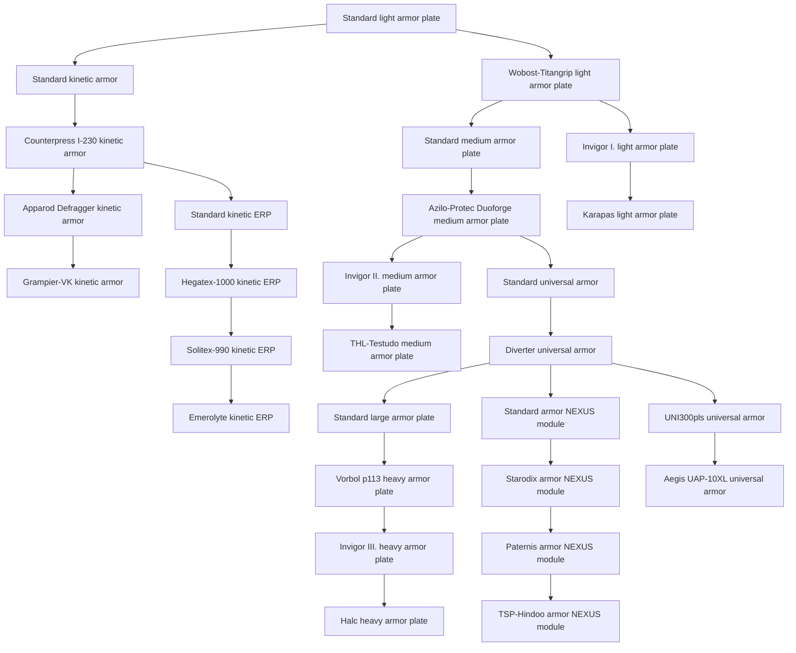
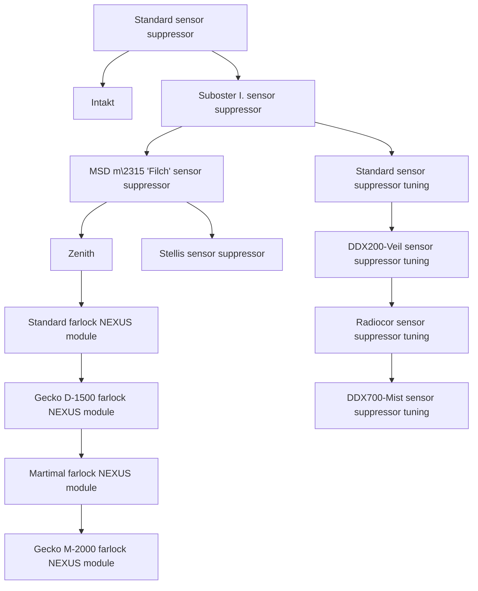

<!-- Generated by tools/generate from the live database (source: techtree + techtreenodeprices (group 5)).
     Do not edit by hand; regenerate instead. -->

# Thelodica (faction)

Research for the Thelodica Clan faction: its named weapons and the modules that fight alongside them.

[Tech tree](/content/techtree/) → Thelodica (faction). The category is split into its **research lines** — one per top-level item (the chips above jump to each line's graph). Every node in a graph links to its detail page (prerequisites, what it unlocks next, point prices).

<a href="#line-14">Light armor plate</a>&ensp;
<a href="#line-51">Sensor suppressor</a>&ensp;
<a href="#line-57">Light HCL laser</a>&ensp;

## Standard light armor plate

**28 nodes** — everything that descends from [Standard light armor plate](/content/techtree/nodes/standard-small-armor-plate/).

## Standard sensor suppressor

**14 nodes** — everything that descends from [Standard sensor suppressor](/content/techtree/nodes/standard-sensor-dampener/).

## Standard light HCL laser

**45 nodes** — everything that descends from [Standard light HCL laser](/content/techtree/nodes/standard-small-laser/).

```mermaid
graph TD
    n57["Standard light HCL laser"]
    n58["Standard medium LCL laser"]
    n59["Standard heavy LCL laser"]
    n194["Prometheus"]
    n202["Baphomet"]
    n206["Artemis"]
    n214["Seth"]
    n271["Small chemoactive energy cell"]
    n272["Small sonic energy cell"]
    n273["Small photokinetic energy cell"]
    n274["Small thermic energy cell"]
    n275["Medium chemoactive energy cell"]
    n276["Medium sonic energy cell"]
    n277["Medium photokinetic energy cell"]
    n278["Medium thermic energy cell"]
    n279["Large chemoactive energy cell"]
    n280["Large sonic energy cell"]
    n281["Large photokinetic energy cell"]
    n282["Large thermic energy cell"]
    n831["Thelotec-Dabis light HCL laser"]
    n832["Pikolo light HCL laser"]
    n833["Thelotec-Stroyar light HCL laser"]
    n834["Thelotec-Grazier medium LCL laser"]
    n835["Kauska Heatpin I. medium LCL laser"]
    n836["Thermodissector medium LCL laser"]
    n837["Thelotec-Etequitor heavy LCL laser"]
    n838["Thelotec-Apocalyptor heavy LCL laser"]
    n839["Kauska Heatpin II. heavy LCL laser"]
    n911["Standard laser tuning"]
    n930["Reflexis II. laser tuning"]
    n931["Kauska Optibrace laser tuning"]
    n932["Oqulus laser tuning"]
    n1002["Standard medium HCL laser"]
    n1003["Longrange Standard Large Laser"]
    n1024["Tertzer medium HCL laser"]
    n1025["Thelotec-Iocle I. medium HCL laser"]
    n1026["Phisker 30PW medium HCL laser"]
    n1027["T2 Longrange Large Laser"]
    n1028["T3 Longrange Large Laser"]
    n1029["T4 Longrange Large Laser"]
    n2555["Standard critical hit NEXUS module"]
    n2595["Qandellay critical hit NEXUS module"]
    n2596["E-scope critical hit NEXUS module"]
    n2597["ZTW critical hit NEXUS module"]
    n6013["Onyx"]
    n832 --> n58
    n835 --> n59
    n57 --> n194
    n831 --> n202
    n58 --> n206
    n1024 --> n214
    n274 --> n271
    n274 --> n272
    n274 --> n273
    n57 --> n274
    n278 --> n275
    n278 --> n276
    n278 --> n277
    n58 --> n278
    n282 --> n279
    n282 --> n280
    n282 --> n281
    n1003 --> n282
    n57 --> n831
    n831 --> n832
    n832 --> n833
    n58 --> n834
    n834 --> n835
    n835 --> n836
    n59 --> n837
    n837 --> n838
    n838 --> n839
    n57 --> n911
    n911 --> n930
    n930 --> n931
    n931 --> n932
    n834 --> n1002
    n1002 --> n1003
    n1002 --> n1024
    n1024 --> n1025
    n1025 --> n1026
    n1003 --> n1027
    n1027 --> n1028
    n1028 --> n1029
    n931 --> n2555
    n2555 --> n2595
    n2595 --> n2596
    n2596 --> n2597
    n214 --> n6013
    click n57 "/content/techtree/nodes/standard-small-laser/" "Standard light HCL laser"
    click n58 "/content/techtree/nodes/standard-medium-laser/" "Standard medium LCL laser"
    click n59 "/content/techtree/nodes/standard-large-laser/" "Standard heavy LCL laser"
    click n194 "/content/techtree/nodes/prometheus/" "Prometheus"
    click n202 "/content/techtree/nodes/baphomet/" "Baphomet"
    click n206 "/content/techtree/nodes/artemis/" "Artemis"
    click n214 "/content/techtree/nodes/seth/" "Seth"
    click n271 "/content/techtree/nodes/ammo-small-lasercrystal-a/" "Small chemoactive energy cell"
    click n272 "/content/techtree/nodes/ammo-small-lasercrystal-b/" "Small sonic energy cell"
    click n273 "/content/techtree/nodes/ammo-small-lasercrystal-c/" "Small photokinetic energy cell"
    click n274 "/content/techtree/nodes/ammo-small-lasercrystal-d/" "Small thermic energy cell"
    click n275 "/content/techtree/nodes/ammo-medium-lasercrystal-a/" "Medium chemoactive energy cell"
    click n276 "/content/techtree/nodes/ammo-medium-lasercrystal-b/" "Medium sonic energy cell"
    click n277 "/content/techtree/nodes/ammo-medium-lasercrystal-c/" "Medium photokinetic energy cell"
    click n278 "/content/techtree/nodes/ammo-medium-lasercrystal-d/" "Medium thermic energy cell"
    click n279 "/content/techtree/nodes/ammo-large-lasercrystal-a/" "Large chemoactive energy cell"
    click n280 "/content/techtree/nodes/ammo-large-lasercrystal-b/" "Large sonic energy cell"
    click n281 "/content/techtree/nodes/ammo-large-lasercrystal-c/" "Large photokinetic energy cell"
    click n282 "/content/techtree/nodes/ammo-large-lasercrystal-d/" "Large thermic energy cell"
    click n831 "/content/techtree/nodes/named1-small-laser/" "Thelotec-Dabis light HCL laser"
    click n832 "/content/techtree/nodes/named2-small-laser/" "Pikolo light HCL laser"
    click n833 "/content/techtree/nodes/named3-small-laser/" "Thelotec-Stroyar light HCL laser"
    click n834 "/content/techtree/nodes/named1-medium-laser/" "Thelotec-Grazier medium LCL laser"
    click n835 "/content/techtree/nodes/named2-medium-laser/" "Kauska Heatpin I. medium LCL laser"
    click n836 "/content/techtree/nodes/named3-medium-laser/" "Thermodissector medium LCL laser"
    click n837 "/content/techtree/nodes/named1-large-laser/" "Thelotec-Etequitor heavy LCL laser"
    click n838 "/content/techtree/nodes/named2-large-laser/" "Thelotec-Apocalyptor heavy LCL laser"
    click n839 "/content/techtree/nodes/named3-large-laser/" "Kauska Heatpin II. heavy LCL laser"
    click n911 "/content/techtree/nodes/standard-damage-mod-laser/" "Standard laser tuning"
    click n930 "/content/techtree/nodes/named1-damage-mod-laser/" "Reflexis II. laser tuning"
    click n931 "/content/techtree/nodes/named2-damage-mod-laser/" "Kauska Optibrace laser tuning"
    click n932 "/content/techtree/nodes/named3-damage-mod-laser/" "Oqulus laser tuning"
    click n1002 "/content/techtree/nodes/longrange-standard-medium-laser/" "Standard medium HCL laser"
    click n1003 "/content/techtree/nodes/longrange-standard-large-laser/" "Longrange Standard Large Laser"
    click n1024 "/content/techtree/nodes/named1-longrange-medium-laser/" "Tertzer medium HCL laser"
    click n1025 "/content/techtree/nodes/named2-longrange-medium-laser/" "Thelotec-Iocle I. medium HCL laser"
    click n1026 "/content/techtree/nodes/named3-longrange-medium-laser/" "Phisker 30PW medium HCL laser"
    click n1027 "/content/techtree/nodes/named1-longrange-large-laser/" "T2 Longrange Large Laser"
    click n1028 "/content/techtree/nodes/named2-longrange-large-laser/" "T3 Longrange Large Laser"
    click n1029 "/content/techtree/nodes/named3-longrange-large-laser/" "T4 Longrange Large Laser"
    click n2555 "/content/techtree/nodes/standard-gang-assist-precision-firing-module/" "Standard critical hit NEXUS module"
    click n2595 "/content/techtree/nodes/named1-gang-assist-precision-firing-module/" "Qandellay critical hit NEXUS module"
    click n2596 "/content/techtree/nodes/named2-gang-assist-precision-firing-module/" "E-scope critical hit NEXUS module"
    click n2597 "/content/techtree/nodes/named3-gang-assist-precision-firing-module/" "ZTW critical hit NEXUS module"
    click n6013 "/content/techtree/nodes/onyx/" "Onyx"
```

## Nodes (all)

| Unlocks item | Parent node | Enabler extension | Point prices |
|---|---|---|---|
| [Standard light armor plate](/content/techtree/nodes/standard-small-armor-plate/) | – (root) | – | common=100; thelodica=100 |
| [Standard sensor suppressor](/content/techtree/nodes/standard-sensor-dampener/) | – (root) | – | common=2.7k; thelodica=2.7k |
| [Standard light HCL laser](/content/techtree/nodes/standard-small-laser/) | – (root) | – | common=100; thelodica=100 |
| [Standard kinetic armor](/content/techtree/nodes/standard-kin-armor-hardener/) | [Standard light armor plate](/content/techtree/nodes/standard-small-armor-plate/) | – | common=2.7k; thelodica=2.7k |
| [Wobost-Titangrip light armor plate](/content/techtree/nodes/named1-small-armor-plate/) | [Standard light armor plate](/content/techtree/nodes/standard-small-armor-plate/) | – | common=800; thelodica=800 |
| [Azilo-Protec Duoforge medium armor plate](/content/techtree/nodes/named1-medium-armor-plate/) | [Standard medium armor plate](/content/techtree/nodes/standard-medium-armor-plate/) | – | common=6.4k; thelodica=6.4k |
| [Vorbol p113 heavy armor plate](/content/techtree/nodes/named1-large-armor-plate/) | [Standard large armor plate](/content/techtree/nodes/standard-large-armor-plate/) | – | hitech=25.6k; thelodica=51.2k |
| [Counterpress I-230 kinetic armor](/content/techtree/nodes/named1-kin-armor-hardener/) | [Standard kinetic armor](/content/techtree/nodes/standard-kin-armor-hardener/) | – | common=6.4k; thelodica=6.4k |
| [Intakt](/content/techtree/nodes/intakt/) | [Standard sensor suppressor](/content/techtree/nodes/standard-sensor-dampener/) | – | common=32k; thelodica=32k |
| [Suboster I. sensor suppressor](/content/techtree/nodes/named1-sensor-dampener/) | [Standard sensor suppressor](/content/techtree/nodes/standard-sensor-dampener/) | – | common=6.4k; thelodica=6.4k |
| [Prometheus](/content/techtree/nodes/prometheus/) | [Standard light HCL laser](/content/techtree/nodes/standard-small-laser/) | – | common=4k; thelodica=4k |
| [Small thermic energy cell](/content/techtree/nodes/ammo-small-lasercrystal-d/) | [Standard light HCL laser](/content/techtree/nodes/standard-small-laser/) | – | common=800; thelodica=800 |
| [Thelotec-Dabis light HCL laser](/content/techtree/nodes/named1-small-laser/) | [Standard light HCL laser](/content/techtree/nodes/standard-small-laser/) | – | common=800; thelodica=800 |
| [Standard laser tuning](/content/techtree/nodes/standard-damage-mod-laser/) | [Standard light HCL laser](/content/techtree/nodes/standard-small-laser/) | – | common=800; thelodica=800 |
| [Artemis](/content/techtree/nodes/artemis/) | [Standard medium LCL laser](/content/techtree/nodes/standard-medium-laser/) | – | common=62.5k; thelodica=62.5k |
| [Medium thermic energy cell](/content/techtree/nodes/ammo-medium-lasercrystal-d/) | [Standard medium LCL laser](/content/techtree/nodes/standard-medium-laser/) | – | common=12.5k; thelodica=12.5k |
| [Thelotec-Grazier medium LCL laser](/content/techtree/nodes/named1-medium-laser/) | [Standard medium LCL laser](/content/techtree/nodes/standard-medium-laser/) | – | common=12.5k; thelodica=12.5k |
| [Thelotec-Etequitor heavy LCL laser](/content/techtree/nodes/named1-large-laser/) | [Standard heavy LCL laser](/content/techtree/nodes/standard-large-laser/) | – | hitech=25.6k; thelodica=51.2k |
| [Standard farlock NEXUS module](/content/techtree/nodes/standard-gang-assist-information-module/) | [Zenith](/content/techtree/nodes/zenith/) | – | common=34.3k; thelodica=34.3k |
| [Onyx](/content/techtree/nodes/onyx/) | [Seth](/content/techtree/nodes/seth/) | – | hitech=250k; thelodica=500k |
| [Small chemoactive energy cell](/content/techtree/nodes/ammo-small-lasercrystal-a/) | [Small thermic energy cell](/content/techtree/nodes/ammo-small-lasercrystal-d/) | – | common=2.7k; thelodica=2.7k |
| [Small sonic energy cell](/content/techtree/nodes/ammo-small-lasercrystal-b/) | [Small thermic energy cell](/content/techtree/nodes/ammo-small-lasercrystal-d/) | – | common=2.7k; thelodica=2.7k |
| [Small photokinetic energy cell](/content/techtree/nodes/ammo-small-lasercrystal-c/) | [Small thermic energy cell](/content/techtree/nodes/ammo-small-lasercrystal-d/) | – | common=2.7k; thelodica=2.7k |
| [Medium chemoactive energy cell](/content/techtree/nodes/ammo-medium-lasercrystal-a/) | [Medium thermic energy cell](/content/techtree/nodes/ammo-medium-lasercrystal-d/) | – | common=21.6k; thelodica=21.6k |
| [Medium sonic energy cell](/content/techtree/nodes/ammo-medium-lasercrystal-b/) | [Medium thermic energy cell](/content/techtree/nodes/ammo-medium-lasercrystal-d/) | – | common=21.6k; thelodica=21.6k |
| [Medium photokinetic energy cell](/content/techtree/nodes/ammo-medium-lasercrystal-c/) | [Medium thermic energy cell](/content/techtree/nodes/ammo-medium-lasercrystal-d/) | – | common=21.6k; thelodica=21.6k |
| [Large chemoactive energy cell](/content/techtree/nodes/ammo-large-lasercrystal-a/) | [Large thermic energy cell](/content/techtree/nodes/ammo-large-lasercrystal-d/) | – | hitech=25.6k; thelodica=51.2k |
| [Large sonic energy cell](/content/techtree/nodes/ammo-large-lasercrystal-b/) | [Large thermic energy cell](/content/techtree/nodes/ammo-large-lasercrystal-d/) | – | hitech=25.6k; thelodica=51.2k |
| [Large photokinetic energy cell](/content/techtree/nodes/ammo-large-lasercrystal-c/) | [Large thermic energy cell](/content/techtree/nodes/ammo-large-lasercrystal-d/) | – | hitech=25.6k; thelodica=51.2k |
| [Standard medium armor plate](/content/techtree/nodes/standard-medium-armor-plate/) | [Wobost-Titangrip light armor plate](/content/techtree/nodes/named1-small-armor-plate/) | – | common=2.7k; thelodica=2.7k |
| [Invigor I. light armor plate](/content/techtree/nodes/named2-small-armor-plate/) | [Wobost-Titangrip light armor plate](/content/techtree/nodes/named1-small-armor-plate/) | – | common=2.7k; thelodica=2.7k |
| [Karapas light armor plate](/content/techtree/nodes/named3-small-armor-plate/) | [Invigor I. light armor plate](/content/techtree/nodes/named2-small-armor-plate/) | – | hitech=3.2k; thelodica=6.4k |
| [Invigor II. medium armor plate](/content/techtree/nodes/named2-medium-armor-plate/) | [Azilo-Protec Duoforge medium armor plate](/content/techtree/nodes/named1-medium-armor-plate/) | – | common=12.5k; thelodica=12.5k |
| [Standard universal armor](/content/techtree/nodes/standard-resistant-plating/) | [Azilo-Protec Duoforge medium armor plate](/content/techtree/nodes/named1-medium-armor-plate/) | – | common=12.5k; thelodica=12.5k |
| [THL-Testudo medium armor plate](/content/techtree/nodes/named3-medium-armor-plate/) | [Invigor II. medium armor plate](/content/techtree/nodes/named2-medium-armor-plate/) | – | hitech=10.8k; thelodica=21.6k |
| [Invigor III. heavy armor plate](/content/techtree/nodes/named2-large-armor-plate/) | [Vorbol p113 heavy armor plate](/content/techtree/nodes/named1-large-armor-plate/) | – | hitech=36.45k; thelodica=72.9k |
| [Halc heavy armor plate](/content/techtree/nodes/named3-large-armor-plate/) | [Invigor III. heavy armor plate](/content/techtree/nodes/named2-large-armor-plate/) | – | hitech=50k; thelodica=100k |
| [Apparod Defragger kinetic armor](/content/techtree/nodes/named2-kin-armor-hardener/) | [Counterpress I-230 kinetic armor](/content/techtree/nodes/named1-kin-armor-hardener/) | – | common=12.5k; thelodica=12.5k |
| [Standard kinetic ERP](/content/techtree/nodes/standard-kinetic-kers/) | [Counterpress I-230 kinetic armor](/content/techtree/nodes/named1-kin-armor-hardener/) | – | common=12.5k; thelodica=12.5k |
| [Grampier-VK kinetic armor](/content/techtree/nodes/named3-kin-armor-hardener/) | [Apparod Defragger kinetic armor](/content/techtree/nodes/named2-kin-armor-hardener/) | – | hitech=10.8k; thelodica=21.6k |
| [MSD m\2315 'Filch' sensor suppressor](/content/techtree/nodes/named2-sensor-dampener/) | [Suboster I. sensor suppressor](/content/techtree/nodes/named1-sensor-dampener/) | – | common=12.5k; thelodica=12.5k |
| [Standard sensor suppressor tuning](/content/techtree/nodes/standard-sensor-supressor-booster/) | [Suboster I. sensor suppressor](/content/techtree/nodes/named1-sensor-dampener/) | – | common=12.5k; thelodica=12.5k |
| [Zenith](/content/techtree/nodes/zenith/) | [MSD m\2315 'Filch' sensor suppressor](/content/techtree/nodes/named2-sensor-dampener/) | – | common=108k; thelodica=108k |
| [Stellis sensor suppressor](/content/techtree/nodes/named3-sensor-dampener/) | [MSD m\2315 'Filch' sensor suppressor](/content/techtree/nodes/named2-sensor-dampener/) | – | hitech=10.8k; thelodica=21.6k |
| [Baphomet](/content/techtree/nodes/baphomet/) | [Thelotec-Dabis light HCL laser](/content/techtree/nodes/named1-small-laser/) | – | common=13.5k; thelodica=13.5k |
| [Pikolo light HCL laser](/content/techtree/nodes/named2-small-laser/) | [Thelotec-Dabis light HCL laser](/content/techtree/nodes/named1-small-laser/) | – | common=2.7k; thelodica=2.7k |
| [Standard medium LCL laser](/content/techtree/nodes/standard-medium-laser/) | [Pikolo light HCL laser](/content/techtree/nodes/named2-small-laser/) | – | common=6.4k; thelodica=6.4k |
| [Thelotec-Stroyar light HCL laser](/content/techtree/nodes/named3-small-laser/) | [Pikolo light HCL laser](/content/techtree/nodes/named2-small-laser/) | – | hitech=3.2k; thelodica=6.4k |
| [Kauska Heatpin I. medium LCL laser](/content/techtree/nodes/named2-medium-laser/) | [Thelotec-Grazier medium LCL laser](/content/techtree/nodes/named1-medium-laser/) | – | common=21.6k; thelodica=21.6k |
| [Standard medium HCL laser](/content/techtree/nodes/longrange-standard-medium-laser/) | [Thelotec-Grazier medium LCL laser](/content/techtree/nodes/named1-medium-laser/) | – | common=21.6k; thelodica=21.6k |
| [Standard heavy LCL laser](/content/techtree/nodes/standard-large-laser/) | [Kauska Heatpin I. medium LCL laser](/content/techtree/nodes/named2-medium-laser/) | – | hitech=17.15k; thelodica=34.3k |
| [Thermodissector medium LCL laser](/content/techtree/nodes/named3-medium-laser/) | [Kauska Heatpin I. medium LCL laser](/content/techtree/nodes/named2-medium-laser/) | – | hitech=17.15k; thelodica=34.3k |
| [Thelotec-Apocalyptor heavy LCL laser](/content/techtree/nodes/named2-large-laser/) | [Thelotec-Etequitor heavy LCL laser](/content/techtree/nodes/named1-large-laser/) | – | hitech=36.45k; thelodica=72.9k |
| [Kauska Heatpin II. heavy LCL laser](/content/techtree/nodes/named3-large-laser/) | [Thelotec-Apocalyptor heavy LCL laser](/content/techtree/nodes/named2-large-laser/) | – | hitech=50k; thelodica=100k |
| [Gecko D-1500 farlock NEXUS module](/content/techtree/nodes/named1-gang-assist-information-module/) | [Standard farlock NEXUS module](/content/techtree/nodes/standard-gang-assist-information-module/) | – | common=51.2k; thelodica=51.2k |
| [Starodix armor NEXUS module](/content/techtree/nodes/named1-gang-assist-defense-module/) | [Standard armor NEXUS module](/content/techtree/nodes/standard-gang-assist-defense-module/) | – | common=51.2k; thelodica=51.2k |
| [Reflexis II. laser tuning](/content/techtree/nodes/named1-damage-mod-laser/) | [Standard laser tuning](/content/techtree/nodes/standard-damage-mod-laser/) | – | common=6.4k; thelodica=6.4k |
| [Kauska Optibrace laser tuning](/content/techtree/nodes/named2-damage-mod-laser/) | [Reflexis II. laser tuning](/content/techtree/nodes/named1-damage-mod-laser/) | – | common=21.6k; thelodica=21.6k |
| [Oqulus laser tuning](/content/techtree/nodes/named3-damage-mod-laser/) | [Kauska Optibrace laser tuning](/content/techtree/nodes/named2-damage-mod-laser/) | – | hitech=25.6k; thelodica=51.2k |
| [Standard critical hit NEXUS module](/content/techtree/nodes/standard-gang-assist-precision-firing-module/) | [Kauska Optibrace laser tuning](/content/techtree/nodes/named2-damage-mod-laser/) | – | common=34.3k; thelodica=34.3k |
| [Diverter universal armor](/content/techtree/nodes/named1-resistant-plating/) | [Standard universal armor](/content/techtree/nodes/standard-resistant-plating/) | – | common=21.6k; thelodica=21.6k |
| [Standard large armor plate](/content/techtree/nodes/standard-large-armor-plate/) | [Diverter universal armor](/content/techtree/nodes/named1-resistant-plating/) | – | hitech=17.15k; thelodica=34.3k |
| [Standard armor NEXUS module](/content/techtree/nodes/standard-gang-assist-defense-module/) | [Diverter universal armor](/content/techtree/nodes/named1-resistant-plating/) | – | common=34.3k; thelodica=34.3k |
| [UNI300pls universal armor](/content/techtree/nodes/named2-resistant-plating/) | [Diverter universal armor](/content/techtree/nodes/named1-resistant-plating/) | – | common=34.3k; thelodica=34.3k |
| [Aegis UAP-10XL universal armor](/content/techtree/nodes/named3-resistant-plating/) | [UNI300pls universal armor](/content/techtree/nodes/named2-resistant-plating/) | – | hitech=25.6k; thelodica=51.2k |
| [Longrange Standard Large Laser](/content/techtree/nodes/longrange-standard-large-laser/) | [Standard medium HCL laser](/content/techtree/nodes/longrange-standard-medium-laser/) | – | hitech=17.15k; thelodica=34.3k |
| [Tertzer medium HCL laser](/content/techtree/nodes/named1-longrange-medium-laser/) | [Standard medium HCL laser](/content/techtree/nodes/longrange-standard-medium-laser/) | – | common=34.3k; thelodica=34.3k |
| [Large thermic energy cell](/content/techtree/nodes/ammo-large-lasercrystal-d/) | [Longrange Standard Large Laser](/content/techtree/nodes/longrange-standard-large-laser/) | – | hitech=17.15k; thelodica=34.3k |
| [T2 Longrange Large Laser](/content/techtree/nodes/named1-longrange-large-laser/) | [Longrange Standard Large Laser](/content/techtree/nodes/longrange-standard-large-laser/) | – | hitech=25.6k; thelodica=51.2k |
| [Seth](/content/techtree/nodes/seth/) | [Tertzer medium HCL laser](/content/techtree/nodes/named1-longrange-medium-laser/) | – | common=256k; thelodica=256k |
| [Thelotec-Iocle I. medium HCL laser](/content/techtree/nodes/named2-longrange-medium-laser/) | [Tertzer medium HCL laser](/content/techtree/nodes/named1-longrange-medium-laser/) | – | common=51.2k; thelodica=51.2k |
| [Phisker 30PW medium HCL laser](/content/techtree/nodes/named3-longrange-medium-laser/) | [Thelotec-Iocle I. medium HCL laser](/content/techtree/nodes/named2-longrange-medium-laser/) | – | hitech=36.45k; thelodica=72.9k |
| [T3 Longrange Large Laser](/content/techtree/nodes/named2-longrange-large-laser/) | [T2 Longrange Large Laser](/content/techtree/nodes/named1-longrange-large-laser/) | – | hitech=36.45k; thelodica=72.9k |
| [T4 Longrange Large Laser](/content/techtree/nodes/named3-longrange-large-laser/) | [T3 Longrange Large Laser](/content/techtree/nodes/named2-longrange-large-laser/) | – | hitech=50k; thelodica=100k |
| [Qandellay critical hit NEXUS module](/content/techtree/nodes/named1-gang-assist-precision-firing-module/) | [Standard critical hit NEXUS module](/content/techtree/nodes/standard-gang-assist-precision-firing-module/) | – | common=51.2k; thelodica=51.2k |
| [Martimal farlock NEXUS module](/content/techtree/nodes/named2-gang-assist-information-module/) | [Gecko D-1500 farlock NEXUS module](/content/techtree/nodes/named1-gang-assist-information-module/) | – | common=72.9k; thelodica=72.9k |
| [Gecko M-2000 farlock NEXUS module](/content/techtree/nodes/named3-gang-assist-information-module/) | [Martimal farlock NEXUS module](/content/techtree/nodes/named2-gang-assist-information-module/) | – | hitech=50k; thelodica=100k |
| [Paternis armor NEXUS module](/content/techtree/nodes/named2-gang-assist-defense-module/) | [Starodix armor NEXUS module](/content/techtree/nodes/named1-gang-assist-defense-module/) | – | common=72.9k; thelodica=72.9k |
| [TSP-Hindoo armor NEXUS module](/content/techtree/nodes/named3-gang-assist-defense-module/) | [Paternis armor NEXUS module](/content/techtree/nodes/named2-gang-assist-defense-module/) | – | hitech=50k; thelodica=100k |
| [E-scope critical hit NEXUS module](/content/techtree/nodes/named2-gang-assist-precision-firing-module/) | [Qandellay critical hit NEXUS module](/content/techtree/nodes/named1-gang-assist-precision-firing-module/) | – | common=72.9k; thelodica=72.9k |
| [ZTW critical hit NEXUS module](/content/techtree/nodes/named3-gang-assist-precision-firing-module/) | [E-scope critical hit NEXUS module](/content/techtree/nodes/named2-gang-assist-precision-firing-module/) | – | hitech=50k; thelodica=100k |
| [Hegatex-1000 kinetic ERP](/content/techtree/nodes/named1-kinetic-kers/) | [Standard kinetic ERP](/content/techtree/nodes/standard-kinetic-kers/) | – | common=21.6k; thelodica=21.6k |
| [Solitex-990 kinetic ERP](/content/techtree/nodes/named2-kinetic-kers/) | [Hegatex-1000 kinetic ERP](/content/techtree/nodes/named1-kinetic-kers/) | – | common=34.3k; thelodica=34.3k |
| [Emerolyte kinetic ERP](/content/techtree/nodes/named3-kinetic-kers/) | [Solitex-990 kinetic ERP](/content/techtree/nodes/named2-kinetic-kers/) | – | hitech=25.6k; thelodica=51.2k |
| [DDX200-Veil sensor suppressor tuning](/content/techtree/nodes/named1-sensor-supressor-booster/) | [Standard sensor suppressor tuning](/content/techtree/nodes/standard-sensor-supressor-booster/) | – | common=21.6k; thelodica=21.6k |
| [Radiocor sensor suppressor tuning](/content/techtree/nodes/named2-sensor-supressor-booster/) | [DDX200-Veil sensor suppressor tuning](/content/techtree/nodes/named1-sensor-supressor-booster/) | – | common=34.3k; thelodica=34.3k |
| [DDX700-Mist sensor suppressor tuning](/content/techtree/nodes/named3-sensor-supressor-booster/) | [Radiocor sensor suppressor tuning](/content/techtree/nodes/named2-sensor-supressor-booster/) | – | hitech=25.6k; thelodica=51.2k |

