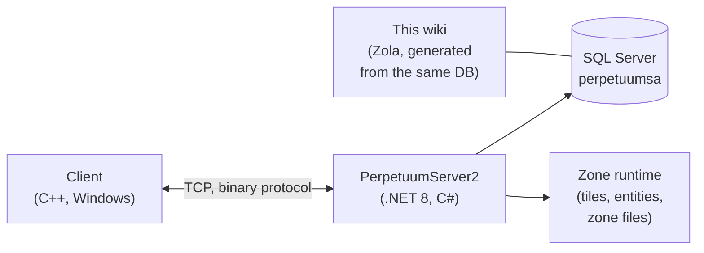

# Developer home

A high-level map of how the game works, from a developer/devops point of view.
Dedicated deep-dive pages are on the way — for now this is the orientation.

## The pieces

- **Client** — the Perpetuum game client (Windows; see [Client & PC
  setup](/features/client-setup/) for running it, incl. Linux). It talks to the
  server over a binary TCP protocol; every player action is a named *command*
  (the same names this wiki uses in the [action inventory](/features/#complete-action-inventory)).
- **Server (PerpetuumServer2)** — a C#/.NET 8 codebase. One process runs the
  whole server: the connection layer, the game logic (robots, zones, missions,
  market, production, research), and the zone runtime that ticks each zone's
  tile world (terrain, entities, teleports).
- **Database** — SQL Server, database `perpetuumsa`. Static game content (entity
  defaults, recipes, extensions, tech tree, shop, teleport descriptions) and all
  dynamic state (characters, robots, containers, market, zone state).
- **Zone files** — zones are tile grids (altitude + control layers, 2 bytes/
  tile) shipped in `.gbf` archives and editable per zone; see the
  [zone file format](/formats/zone-files/).
- **Reference data** — the client downloads stat tables from the server at
  startup (see [Server & reference](/features/server/)).

## Running it

- The server runs in Docker Compose alongside SQL Server
  (the `perpetuumserver2` project); the DB container is what this wiki's
  generator reads.
- Static content is validated against **plantrules** rule files; the wiki's
  C# generator (`make generate`) runs in the same ecosystem and reads the same
  database, so every generated table on this site reflects live server data.
- The zone teleport maps on this wiki are rendered from the same altitude
  layers the game itself uses.

## Where to go next

- **[Formats](/formats/)** — developer field reference: how every stat field is
  stored (DB column, rule-file key, binary layer byte) and consumed, with
  worked examples.
- **[Server & reference](/features/server/)** — the meta systems: server info,
  high scores, the reference data the client downloads, and the in-game store.

> More developer pages (protocol, zone lifecycle, deployment) are planned —
> this page is the landing spot for them.
