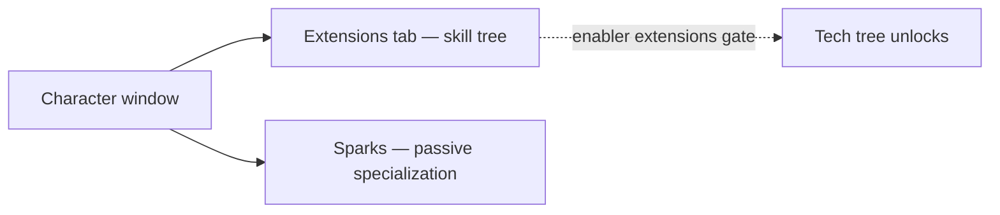

# Character

The **character window** (top bar → **Character**, top-left) is where your character's
progression lives: profile, credits, the **extensions** (skills), and settings.
Everything on this page is per character — accounts can hold several, each with its
own tree. UI locations follow the [client UI overview](/features/ui/).

## Extensions

The **extensions tab** is the character's skill tree: per-character skill levels
that unlock gameplay and tune attributes — most importantly the **enabler
extensions** required to pilot a robot class. Level 1 costs credits, every further
level costs Extension Points (EP), and prerequisites gate the path.

- [Main categories](/content/extensions/#categories) — the 15 categories at a glance:
  which categories open up which
- [Extension tree](/content/extensions/#tree) — the whole tree: every extension by
  rank and category, with prerequisite edges
- [Extensions table](/content/extensions/) — every extension: rank, price, bonus,
  prerequisites
- How EP and the tech tree work: [Research](/features/research/)

## Sparks

Your **spark** is the nanobot specialization installed on the character — while it
is active its bonuses apply to every robot you pilot. Switching sparks has a cost;
authorization gates the higher lines. Details in [Sparks](/features/sparks/).
