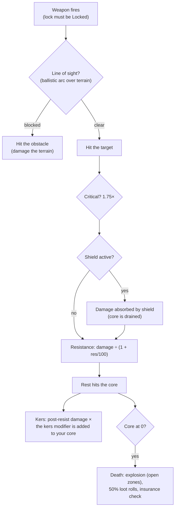

# Combat

Combat happens **in zones**, with your active robot. You fight other players (PvP),
NPCs, and hostile structures. This page covers the mechanics that are confirmed on the
server side; detailed damage/fitting interactions live under [robots & fitting](/features/robots/).

> UI locations follow the [client UI overview](/features/ui/): your robot's **shield/armor/hull and
> energy** are shown on the undocked status panel. In-combat targeting and weapon
> controls are not yet documented in detail.

## Entering combat

- You can only fight while **undocked** — you are your active robot.
- Firing an offensive weapon at another player in an open (PvP) zone raises the
  **PvP flag** on the attacker. Firing back, or using a support module on an
  already-flagged player, raises it on you too. The flag lasts **5 minutes**
  (the `effect_pvp` definition, 300,000 ms) and is refreshed with each new act
  of aggression.
- While the flag is up:
  - you **cannot use teleports** (including mobile ones), and
  - you **cannot dock normally** — the only way out is **force dock**, which is
    deliberately not blocked by the flag.

## What you can fight

- **Other players' robots** (PvP).
- **NPCs** — zone NPCs are organized into **flocks** (groups with shared behaviour).
- **Hostile structures / deployables** in the zone.

## When your robot is destroyed

Your robot is **destroyed** and a **loot container** appears where it died. The loot is
rolled per item, each roll at 50%:

| What | Fate |
|---|---|
| Each fitted **module** | 50% chance to drop **damaged** (reparable); otherwise destroyed |
| Each module's loaded **ammo** | 50% chance to drop (only if the module dropped) |
| **Cargo** (packs/boxes) | contents drop as loot, the pack itself is destroyed |
| Other **stackable items** in cargo | 50% chance to drop, with a randomly reduced quantity (the rest is destroyed) |
| Your **paint/tint** | 50% chance to drop as a paint item |
| The **robot itself** | destroyed — unless it had active **insurance**, in which case the payout is paid to you in credits (the robot is still gone) |

**Insurance** (bought at a base's insurance facility, docked — see
[production → insurance](/features/production/)) covers a robot for **15 days** (plus
extension bonus days). Each robot has a content-defined **fee** and **payout** (the
`insuranceprices` table — 67 robot definitions); the fee can be reduced by an extension
bonus and paid from your corp wallet. Starter bots can't be insured. You can hold
insurance on 1 + (extension bonus) robots.

After a kill you are left with **no active robot**. To get back in the game you can:

- **select another robot** you own that has the required enabler extensions, or
- **request a starter robot** while docked — but there is a short lock after a kill:
  **3 minutes if you were killed by a player, 1 minute by an NPC**. If an **NPC** killed
  you, the base also drops you a **free starter robot** automatically on return.

## Escaping

When a fight goes badly:

- **Force dock** — the emergency exit. Pulls you out of the zone and docks you at the
  main base (TMA) immediately, even mid-fight.
- **SOS** — an alternative exit: docks you at the current base after the normal
  (7-second) undock delay.

Both are your safety nets; force dock is the "I'm about to die" button.

## Target lock, range and hit

- **Lock first.** Weapons only fire at *locked* targets — and only once the lock
  has filled. Locking a target takes your robot's **locking time** (a stat in ms);
  firing while it is still in progress is rejected. You can hold several locks at
  once (limited by the **max locked targets** stat), but only one is *primary*, and
  some weapons fire only at the primary target.
- **Optimal range + falloff.** Inside a weapon's **optimal range** you deal full
  damage. Beyond it, damage tapers smoothly over the **falloff** distance —
  roughly half damage at the falloff's midpoint, zero at its edge. Beyond
  optimal + falloff you deal no damage at all.
- **Blast size vs. target size.** Guns do not "miss": a gun's **accuracy** stat
  works as a blast radius, and a target whose **signature** is smaller than it
  takes proportionally less damage. Missiles *can* miss outright (the miss chance
  comes from the robot's missile-accuracy stat), but when they hit they explode
  for their **explosion radius** — and, as with guns, a small target takes less of
  the blast.
- **Critical hits.** Each shot rolls your **critical hit chance**; a crit
  multiplies the whole hit by 1.75×, and every hit also varies randomly by ±10%.
- **Line of sight.** Shots travel in a straight line and terrain, obstacles and
  plants block them. Missiles fly an arc and can clear low cover — but the arc is
  limited, so high ground still blocks.
- **Your own shield blocks your own weapons.** While your shield is active, your
  weapons will not fire.

### Damage types

Ammo carries the damage: every ammo has a value for one or more damage types —
usually one dominant type plus a smaller secondary one (missile ammo is explosive
plus kinetic or chemical, laser crystals thermal plus chemical, railgun rounds
kinetic plus thermal). The types:

| Type | Notes |
|---|---|
| **Chemical** | The common component of gun and laser ammo |
| **Kinetic** | Railgun, projectile and missile ammo |
| **Thermal** | Lasers, some projectile ammo |
| **Explosive** | Missiles |
| **Toxic** | Some gun ammo; only damages plants and terrain |
| **Electric** | Special effects (e.g. the scorcher) — **penetrates shields** |

Incoming damage is reduced per type by the target's **resistance** to that type:
a 50% resist cuts damage by 50/(50+100) ≈ 33%. Resistances apply only to what
gets *through* the shield — the shield absorbs first, and is paid out of the
shield's energy: the harder the hit, the more energy it costs. **Kers** modules
let a share of a damage type burn the shield's energy directly even after
resistance. [Adaptive alloy](/features/modules/#the-module-families)
redistributes your resistances toward whatever is actually hitting you.

## Detection, masking and speed

- **Detection vs. masking.** You can see a unit within a range that grows with
  your **detection** stat and shrinks with the target's **masking** stat —
  roughly 100 m × detection ÷ masking. A unit that has locked you is always
  visible to you, regardless of its masking. Stealth modules temporarily raise
  your own masking (see [modules](/features/modules/)); mines use a dedicated
  detection range instead.
- **Blob.** Some units and structures emit a *blob* field. While you stand inside
  an emitter's radius, the blob level on your unit rises; between your two blob
  threshold stats it **increases your locking time** (up to 6× the base value)
  and **cuts your locking range and sensor strength** (down to half).
- **Speed.** Top speed falls with mass: speed = base × (design mass ÷ actual
  mass) — every ton of extra modules, armor and cargo you fit makes you slower.
- **Demobilization ("demob").** The webber effect slows a target's top speed.
  How hard it lands scales with the target's **massiveness** — heavier units get
  demobbed harder, so big slow targets feel it most.

## Alarms

An **alarm** is triggered in a zone by an **alarm switch** (a mission-related
structure). When started:

- It runs for a fixed **alarm period** (set by the mission; short by default).
- You have to **stay within the switch's range** for the whole period — it is
  checked every couple of seconds, and drifting away cancels the alarm.
- You can have only **one alarm running at a time**.

Alarms are tied to mission content — see [missions](/features/missions/).

## Kill reports

Your combat history is available as **kill reports**:

- Filter by **time window**.
- Filter by **role**: as **victim**, **attacker**, or **killer**.

Use them to review how you died or who you destroyed.

## High scores

- **Server high scores** — top results across the server.
- **My high scores** — your personal bests.

## Practical notes

- **Don't die carelessly** — a destroyed robot means downtime while you refit or
  re-request.
- **Force dock is instant** — if you're outmatched, get to TMA now; you can refit later.
- **PvP locks teleports** — plan your escapes; you can't blink out of a fight.
- **Alarms are a signal** — an active alarm means a mission event is live in that area.

<!--
Developer notes: rewritten 2026 from backend sources; no community-wiki text reused.
Verified against:
- Locking: Zones/Locking/LockHandler.cs (locking time in ms from
  AggregateField.locking_time; MaxLockedTargetsProperty; one primary lock;
  lock states Inprogress -> Locked), Zones/Locking/Locks/Lock.cs,
  Zones/Locking/LockValidator.cs (dead/not-lockable/out-of-range validation);
  ZoneSession.cs (weapons take an existing lock id; firing a weapon whose lock is
  not fully Locked raises LockIsInProgress — there is NO auto-lock on fire).
- Damage: Modules/Weapons/Damage.cs (CalculateDamages: crit = attacker.
  CriticalHitChance, CRITICALHIT_MOD 1.75, random 0.9-1.1; falloff =
  cos(x*PI)/2+0.5 with x=(distance-optimal)/falloff; zero beyond optimal+falloff;
  explosion modifier = target.SignatureRadius/explosionRadius clamped 0..1;
  toxic excluded from unit damage), Modules/Weapons/WeaponAmmo.cs (damage values
  per type live on the ammo: damage_chemical/thermal/kinetic/explosive/toxic;
  firearm adds damage_toxic to plants).
- Weapons: Modules/Weapons/FirearmWeaponModule.cs (CheckAccuracy always false —
  firearms never miss; WithExplosionRadius(Accuracy) — accuracy IS the blast
  radius), Modules/Weapons/MissileWeaponModule.cs (miss when rnd >
  robot.MissileHitChance; missile_miss property), WeaponModule.cs (shield active
  => ShieldIsActive error; LOS check before firing).
- Resistances: Units/Unit.cs GetResistByDamageType = resist/(resist+100);
  Zones/DamageProcessors/DamageProcessor.cs (shield absorbs first, paid from
  core: coreDamage = damage * AbsorbtionModifier; Electric damage penetrates as
  coreDamage; kers = damage * type kers modifier, scaled by
  (sin(core/coreMax*PI)/2)+0.5, added to target core);
  EffectModules/ShieldGeneratorModule.cs (AbsorbtionModifier =
  max(SigRadius/shieldRadius,1)/shieldAbsorbtion).
- Damage types: Modules/Weapons/DamageType.cs — Chemical, Kinetic, Thermal,
  Explosive, Toxic, Electric (no "seismic"; missile damage is Explosive).
  Electric is only produced by ScorcherModule.cs in this backend.
- Detection: Units/Unit.Visibility.cs (IsDetected: range = 100/max(1,
  target.StealthStrength)*max(1, DetectionStrength); locked-on-you always
  visible; mine detection range separate); stealth_strength property includes
  effect_stealth_strength_modifier (stealth modules raise masking).
- Speed: Units/UnitProperties/SpeedMaxProperty.cs (speed_max * Mass/ActualMass;
  dreadnought => 0.05; massiveness/drone/highway effect modifiers).
- Demob: Modules/EffectModules/WebberModule.cs (effect_demobilizer; effect
  property = module value + target.Massiveness, clamped at 1.0 — heavier targets
  get the full effect; longrange webbers additionally require LOS; accuracy
  check via optimal-range modifier).
- Blob: Zones/Blobs/BlobHandler.cs (emitters raise blob level inside
  BlobEmissionRadius; between blob_level_low/high the multiplier scales:
  locking_time modifier -5, i.e. lock time x(1+5*m) — up to 6x base at full blob, max_targeting_range *0.5,
  sensor_strength *0.5).
- LOS: Zones/LineOfSight.cs (raycast vs terrain blocks incl. Plant flag;
  ballistic arc for missiles: max amplitude 16 m over 40 m);
  Zones/Terrains/BlockingFlags.cs (Obstacle/Plant/Decor/Island block).
Corrections vs ingested page: "seismic" damage type does not exist (explosive
does); "firearms lose damage instead of missing" verified (accuracy = explosion
radius); auto-lock on fire NOT in backend (lock must be created and completed
first); "interference" (emission/minimum/peak, emitters, anomaly degradation)
has NO equivalent in this backend — only a comment in Services/RiftSystem/Rift.cs
— section removed; shield "absorbs" is core-energy based, and Electric damage
penetrates it.
Developer files: Zones/Locking/*; Zones/Locks via Zones/Locking/Locks/*;
Modules/Weapons/*.cs; Zones/DamageProcessors/*.cs; Units/Unit.Visibility.cs;
Units/Unit.cs; Units/UnitProperties/SpeedMaxProperty.cs;
Modules/EffectModules/ShieldGeneratorModule.cs, WebberModule.cs,
StealthModule.cs; Modules/ScorcherModule.cs; Zones/Blobs/*.cs;
Zones/LineOfSight.cs; Zones/ZoneSession.cs (lock/fire packet handling).
Previously verified (kept as-is): PvP flag = effect_pvp 300000 ms
(effect_pvp definition), raised by attack/aggro/support (Player.cs
ApplyPvPEffect); blocks teleport + normal dock (CantDockThisState), ForceDock.cs
has no PvP check; death loot 50% rolls (Player.cs OnUnitDeath,
Services/Looting/LootHelper.cs DROP_CHANCE 0.5); insurance (InsuraceFacility.cs,
InsuranceHelper.cs, insuranceprices 67 defs); starter-robot lock 3 min PvP /
1 min NPC; alarms (Zone/AlarmStart.cs, AlarmSwitch.cs); kill reports
(GetMyKillReports.cs); high scores (GetHighScores.cs / GetMyHighScores.cs).
-->
