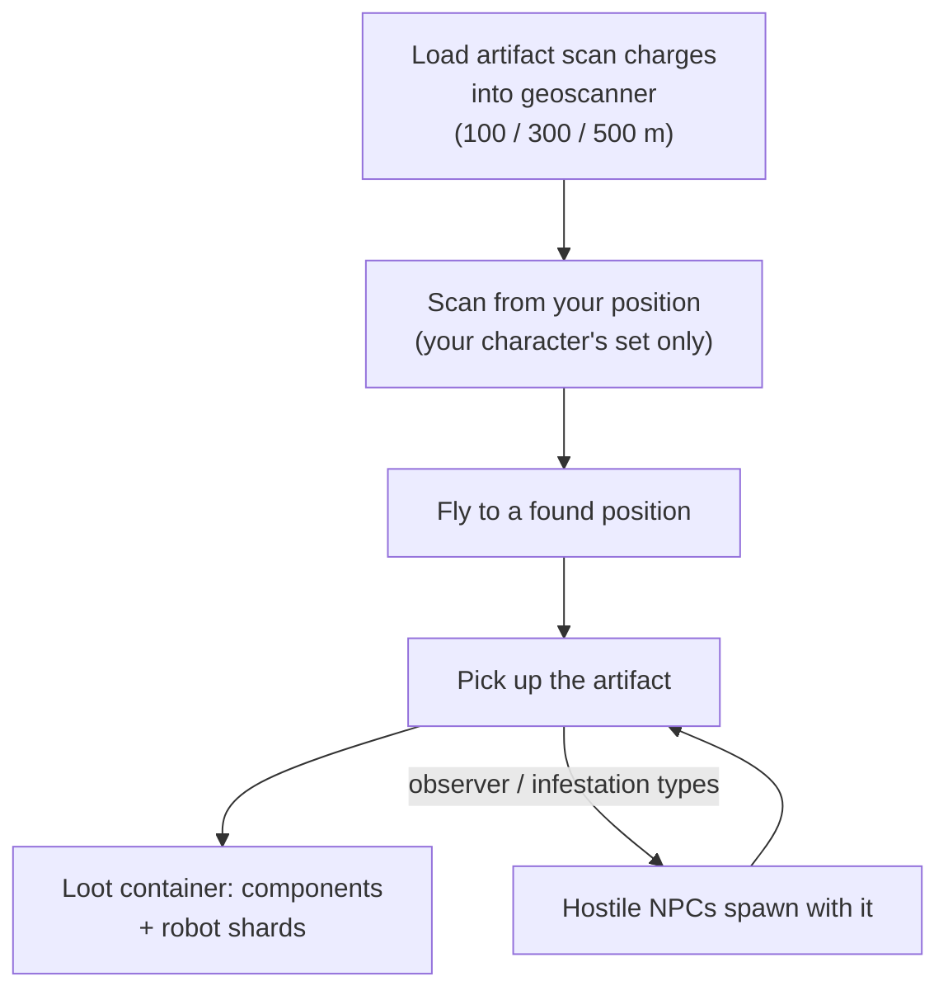

# Exploration (artifacts & relics)

Exploration is finding hidden value in the terrain — a strong solo activity at
any level. It comes in two forms: **artifacts**, which are personal and hidden,
and **relics**, which are open and contested.

## Artifacting

Artifacts are points that exist **per character**: the server keeps a separate
artifact set for every character on every island, so what you find is yours
alone. They are invisible until you scan for them.

1. Load **artifact scan charges** into a geoscanner module. There are three
   charge grades with different scan ranges (100 / 300 / 500 m).
2. Scan from your robot's position — the scanner returns the artifact positions
   within range (the geoscanner's accuracy stat narrows the reported position).
3. Fly to a found position and pick the artifact up; it spawns a **loot
   container** at the spot.

Two things make artifacting a combat activity as well as a gathering one:

- Some artifact types **spawn NPCs with you** — the "observer" and
  "infestation" variants pull in hostiles the moment the artifact is found, so
  pilot something that can fight.
- Loot is random per artifact type: module components (armor plates, hardeners,
  generators, repairers…) and **robot shards** — the faction-specific
  research/production ingredients, which is what makes artifacting a core
  industrial career.

Artifact types are tiered (level 1–3, more loot at higher levels) and exist in
neutral and per-faction variants.

## Relic hunting

Relics are **open-world**: the zone spawns them at random positions (on a
roughly 90-minute respawn cycle with random spread), they are visible objects
with a beam, and whoever picks one up first gets the loot. Loot is a roll of
NIC plus **robot shards**, scaled by the relic's level and the island's value
tier — the same shards artifacting produces.

Relic types are tiered per island (levels 1–3, with different EP values by
level) and come in neutral, per-faction and industrial variants. Some relics
are tied to [outposts](/features/outposts/) — the SAP activity spawns its own
relics, which live up to 12 hours — and on open-PvP islands the spawn points
sit in contested ground, so expect to meet other hunters.

## Missions pay for it too

[missions](/features/missions/) can also put artifact work in front of you,
where you are paid directly and the goods go to the employer instead of your
inventory.

<!--
Written from scratch against the server backend, 2026-09-27:
Zones/Artifacts/Repositories/ZoneArtifactRepository.cs (per-character artifact
rows), Zones/Scanning/Scanners/Scanner.Artifact.cs (scan range + accuracy),
Zones/Artifacts/Generators/Loot/ (random loot per type),
Services/Relics/RelicManagers/ZoneRelicManager.cs (~1.5 h respawn + random
window) and SAPRelic.cs (12 h lifespan),
artifacttypes/artifactloot/relictypes/relicloot tables,
ammo_artifact_scan_a/b/c (scan ranges 100/300/500).
An earlier version of this page was adapted from the Open Perpetuum
community wiki (perpetuum.miraheze.org) and has been fully rewritten from
backend sources; no text was reused.
-->
