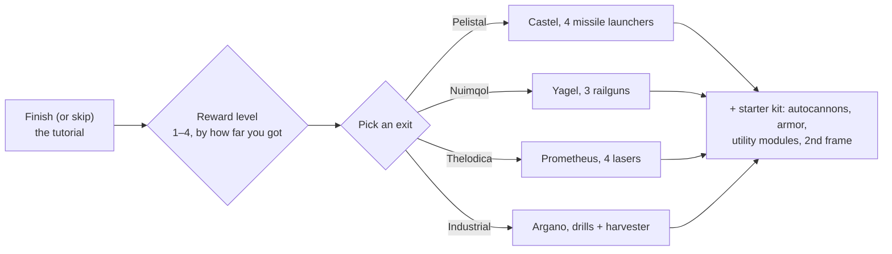

# FAQ

## Can I skip the tutorial?

You can leave the training zone early, but you'll give up the reward that
completing it earns. When a character exits the tutorial, the server:

- pays the **starting NIC** plus a bonus **per reward level** you earned in the
  tutorial (there are four reward levels),
- moves you into the **default corporation** for the race and school you chose,
- grants your **starting extensions** (skills) and your **spark**,
- creates your **starter robot**, docks you at the New Virginia docking base and
  sets it as your **home base** — the place you respawn when your robot is
  destroyed,
- drops your **reward items** into a public container at that docking base and
  sends you a welcome mail.

## How do I complete the tutorial?

Work through the objectives in order; the client's **Rookie Checklist** (Help
menu on the top bar) tracks them and can be pinned to the bottom bar. How far
you get determines your reward level, which decides which reward tiers you
receive on exit — a level-1 exit gets the first tier only, a full completion
gets all four.

## What does each exit give me?

Your choice determines three things: the **starter robot** you pilot, the **reward
items** you receive, and the **default corporation and starting skills** you get.
Everything else — any skill, any robot, any faction's gear — can be trained and
bought later with EP and NIC, so the choice is a starting kit, not a lock-in.

| Exit | Starter robot (fitted) | Reward theme |
|---|---|---|
| **Pelistal** | Castel — four missile launchers | missiles + autocannons |
| **Nuimqol** | Yagel — three railguns | railgun ammo + autocannons |
| **Thelodica** | Prometheus — four lasers | laser crystals + autocannons |
| **Industrial** | Argano — two drillers, a harvester, a mining probe | mining, harvesting and artifact-scan ammo |

Every exit also includes a set of small autocannons with bullets, armor and
utility modules (armor repairer, sensor booster or mass reductor, core
recharger, damage modifiers), a second (empty) frame and a wall-bomb capsule at
the top reward levels.

## What do I do once I'm out?

Nearly any activity earns EP for skills and NIC for gear:

- Mine, harvest, artifact — and sell the bounty on the [markets](/features/market/).
- Shoot NPCs and sell the [loot](/features/npcs/).
- Gather or buy materials and [build](/features/production/) things.
- Run [missions](/features/missions/) — anything offered at a terminal or
  outpost can be completed by you alone in the world.

New to open-world PvP? Read the [survival notes in Getting
started](/features/getting-started/#survival) first.

## Can I revisit the training zone?

No. The training zone is for new characters and there is no re-entry once you've
left it. The Rookie Checklist stays available in the Help menu if you want to
re-read the objectives, and you can always create another character and leave it
in the tutorial as a test sandbox.

<!--
Written from scratch against the server backend, 2026-09-27:
Zones/Teleporting/Strategies/TrainingExitStrategy.cs (exit rewards, NIC,
corporation, extensions, spark, starter robot, home base, reward items),
Zones/Training/Reward/TrainingReward*.cs + trainingrewards/robottemplates
(reward levels 1-4, per-race starter packs and items),
Robots/Robot.Properties.cs (race ids 1=Pelistal, 2=Nuimqol, 3=Thelodica, 5=industrial).
An earlier version of this page was adapted from the Open Perpetuum
community wiki (perpetuum.miraheze.org) and has been fully rewritten from
backend sources; no text was reused.
-->
