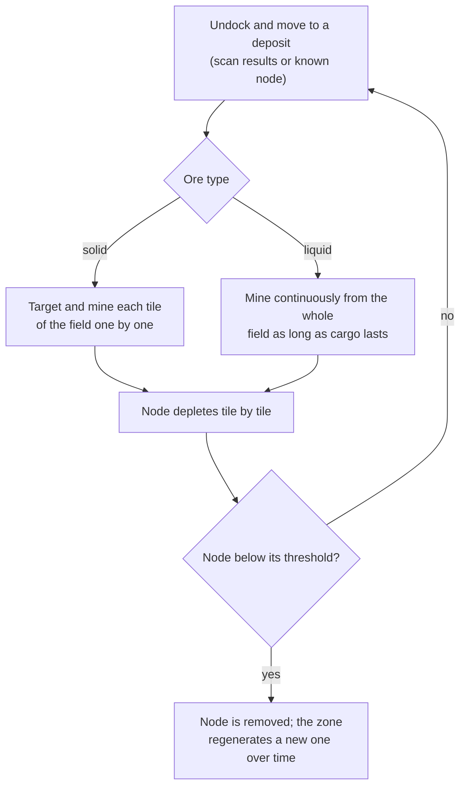
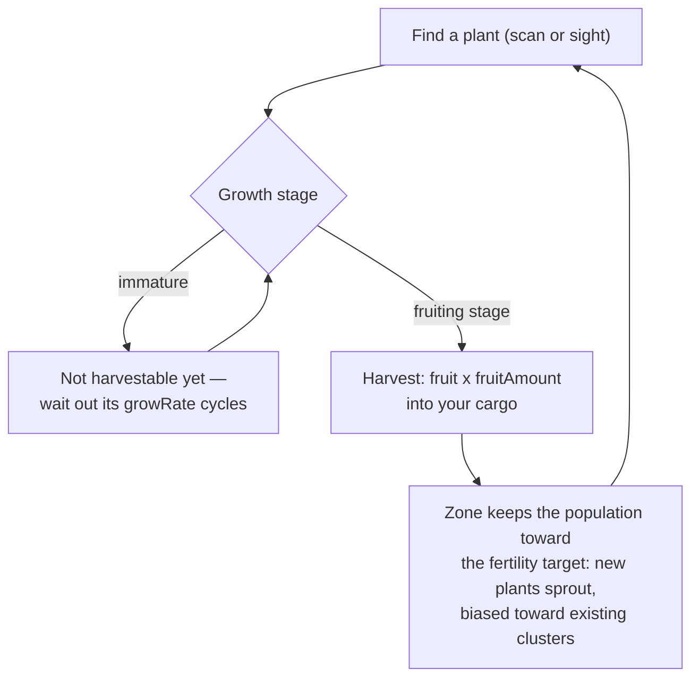
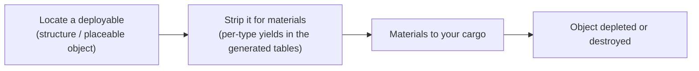

# Gathering & scanning

Resources in the game come from three sources in a zone: **ore deposits**, **plants**,
and **deployables**. This page explains how each works and how the collection loop goes.

> UI locations follow the [client UI overview](/features/ui/): scanning and harvest actions live in
> the **undocked actions** list (top-right while in a zone). Yield numbers per resource
> type are in the generated tables: [Content → Ores](/content/ores/) and
> [Content → Plants](/content/plants/). Mechanics below are confirmed against the server
> implementation.

## The basic loop

1. **Undock** and move into a zone (see [movement](/features/movement/)).
2. **Scan** the area with your robot's scanner module.
3. **Collect** — harvest ore, pick plant fruit, or strip deployables.
4. **Dock** and deliver your cargo to a base container.

## Ore deposits

- Ore exists in the ground as **deposits (nodes)** scattered across the zone.
- To find and record them you need a **geo-scanner module** fitted on your active robot.
  A scan produces a **scan result**; you then **upload** it, which stores it in your
  personal mineral-scan list.
- Your stored scan results can be **listed, moved, deleted, or converted into items**
  (the "mineral scan" items used for processing/production).

- Deposits are **finite**: each node holds a limited total amount. When a node is
  mined below its threshold it is removed, and the zone **regenerates new nodes** over
  time up to its configured maximum. How nodes are placed and how plant populations
  are maintained — with real zones as worked examples — is in
  [Zones → Generation](/zones/generation/).
- **Solid vs liquid ores.** Solid ores deplete tile by tile — you target and mine
  each tile of the field until it's empty. Liquid ores draw from the whole field, so
  your miner can run continuously as long as you have cargo. That ease is exactly why
  liquid ores tend to be worth less: less skill and attention to mine.

### Plant & ore stats at a glance

Ore and plant behaviour is driven by per-type rule data. The fields that matter to a
player:

| Field | What it means in-game |
|---|---|
| `fertility` | How common the type is — higher value = the zone tries to keep more of it around |
| `growRate` | How many growth cycles a plant must sit in each stage before advancing (higher = slower) |
| `spreading` | Whether the type grows in clusters (groups) or scattered |
| `killDistance` | Minimum spacing between two plants of the same type |
| `slope` / `minSlope` | The ground steepness the plant will grow on |
| `allowedAltitudeLow/High` | The elevation band where the plant can grow |
| `allowedWaterLevelLow/High` | Distance-from-shore band (creates coastal vegetation) |
| `fruitingState` | Which growth stage the plant must reach before it produces (is harvestable) |
| `fruitDefinition` / `fruitAmount` | What the plant yields and the base amount |
| `maxAmount` | Cap on how many of this type exist in a processing area |
| `health` | Hit points per growth stage (higher stages can be tougher) |
| `damageScale` | Damage resistance of the plant |
| `playerSeeded` | The plant only exists where a player planted it |
| `onlyOnUnprotectedZone` | Only grows on unprotected (beta/gamma-class) zones |

The full field-by-field reference (types, defaults, storage, and how the zone tick
uses them) is in [Formats → Plant fields](/formats/plant-fields/).

## Plants

- Plants **grow over time** through a sequence of stages. Each stage takes a number of
  growth cycles (`growRate`) before the plant randomly advances.
- A plant only **produces fruit once it reaches its fruiting stage** — immature plants
  are not harvestable.
- The zone maintains plant populations toward a **fertility target**: if a patch of
  ground is under-planted for its fertility level, new plants sprout; the type chosen
  weighs each species' `fertility`, and `spreading` biases new growth toward existing
  clusters.

- Some plants are **player-seeded** (they only exist in player gardens) and some are
  **unprotected-zone only**.
- Plants can be **damaged and killed**; their `health` and `damageScale` determine how
  hard that is.

## Deployables

Deployables are placed objects in a zone (see [Power base stations](/features/pbs/) for the
structure side). Some can be **stripped** for materials. Stripping rules and per-type
yields are in the generated tables: [Content → Ores](/content/ores/) and [Content → Plants](/content/plants/).

## Kiosks

A **kiosk** is a mission-related structure: you **submit items** to it (in range) as
part of a mission. It is not a gathering source on its own — see [missions](/features/missions/).

## Practical notes

- **Scanning requires the module** — no geo-scanner fitted, no scan results.
- **Scan results are yours** — they live per character and are not shared.
- **Ore nodes respawn, but slowly** — if an area is bare, the deposit is gone, not
  hidden. Regeneration restores the node count, not instantly.
- **Harvest what's mature** — fruiting-stage plants give the full yield; younger stages
  give nothing.

<!-- TODO: only the client UI flow remains (scan screen, harvest interaction, cargo UI) —
     needs a running client. Per-type ore yields are at /content/ores/ and plant fruit
     definitions at /content/plants/ (generated from the live DB).
     Developer notes: Zone/ZoneUploadScanResult.cs (GeoScannerModule required);
     MineralScanResult*.cs (per-character repository);
     Zones/Terrains/Materials/Plants/PlantRule.cs (all plant rule fields);
     Zones/Terrains/NatureCube.cs (GrowPlants, fertility/spreading/killDistance logic);
     Zones/Terrains/Materials/Minerals/MineralLayer.cs (ore node lifecycle);
     Zone/UseItem.cs + UseItemVisitor.cs (IUsableItem harvest path);
     Zone/KioskSubmitItem.cs (mission item submission, range-limited). -->
