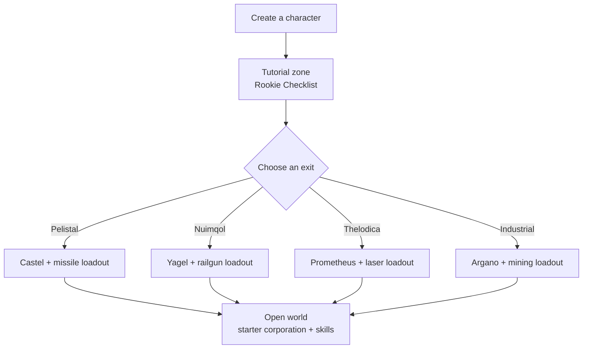

# Getting started

This page covers the first steps: creating a character, getting your first robot,
and the character-level settings you'll touch early on.

> UI locations follow the [client UI overview](/features/ui/). Mechanics below are confirmed
> against the server implementation.

## Get the game

Perpetuum is free on [Steam](https://store.steampowered.com/app/223410/Perpetuum/).

  <a class="steam-card-link" href="https://store.steampowered.com/app/223410/Perpetuum/" target="_blank" rel="noopener">
    
    Perpetuum on Steam — free to play
  </a>

## Watch first

Guides from the Open Perpetuum Project. Click a card to play it here.

  

    
    &#9654;
    
Perpetuum Online Tutorial Walkthrough. + Extension Advice and lots more.

  

  

    
    &#9654;
    
Syndicate Careers Help — Artifacting

  

  

    
    &#9654;
    
Open Perpetuum Tutorial — How to run multiple clients

  

## Creating a character

- You can **check whether a name is free** before creating (`characterCheckNick`).
- **Create the character** — it is attached to your account. An account can hold several
  characters; you play one at a time.
- **Select a character** to play it. Switching characters deselects the current one.
- You can **rename** a character later (name must be available).
- You can **delete** a character you no longer use.

## Your first robot

- While **docked at a base**, you can **request the starter robot** (base facilities —
  see the [client UI overview](/features/ui/) for where base actions live).
  - The base must still have starter robots in stock — at popular bases this can run out,
    in which case the request fails.
  - There is a **5-minute cooldown** between starter-robot requests per character.
  - The new robot is delivered to the base's public container.

- While docked you can also **request an "infinite box"**: a special container added to
  your inventory for a **5,000 credit fee**. This is a convenience container, not a
  source of free resources.

## Character settings

- **Avatar** — how your character looks.
- **Mood message** — a short line shown to other players.
- **Private note** — a note only you see on one of your own characters.
- **Home base** — set or clear your home base; it is your default dock when the game
  needs to put you somewhere safe.
- **Settings** — per-character preferences (get/set).
- **Block trades** — turn trading on or off for a character.
- **Credits** — transfer credits between your own characters; view the transaction
  history.
- **Account level** — change session e-mail/password, view the account's transaction
  history and the EP-for-activity history.

## Leaving / re-entering

- **Sign out** ends the session; **select character** starts it again.
- If the server kicks you (e.g. forced to base), you reappear docked — see [movement](/features/movement/).

## The tutorial

New characters start in the training zone with a **Rookie Checklist** — finish it:
it covers the basics and pays out several robots with modules and ammo. You can
skip it (undock and walk to a faction exit) but you lose the rewards, and you
cannot return to the training zone later. What the four faction exits give you is
in the [FAQ](/features/faq/#what-faction-should-i-pick).

## Survival

Perpetuum is a risk-and-reward sandbox, and when your robot dies you lose it —
docked or not, killed by a player or an NPC — and reappear at your [home base](#character-settings)
(you can request a free starter robot there if you arrive empty-handed). A few
rules that keep the losses survivable:

- **Only commit what you can replace.** Undocking is a bet: if the robot goes
  down, it and its fitted modules are gone (or loot). Before you launch, make
  sure that loss is survivable.
- **Know the zones.** The protected (PvE) islands are safe from players; the
  open-PvP islands are free-for-fight with no crime/punishment system. See
  [zones](/zones/) for the map.
- **Know the NPCs.** Orange markers only aggress when provoked; red markers
  aggress on approach. Run and break line-of-sight to drop aggro. See
  [NPCs & PVE hunting](/features/npcs/).
- **Mitigate, don't just accept, risk.** Going to an open-PvP island in your best
  T4-fitted mech is how mechs die. Cheaper, replaceable gear that pays for itself
  in a few trips beats the expensive bot that takes twenty.
- **Build a sustainable loop.** Whatever you do — missions, gathering, hunting,
  production, hauling — someone pays NIC for it. Keep backup assets so one bad day
  doesn't zero your income.

## What to do next

1. Select your starter robot and learn the [hangar & fitting](/features/robots/) screen.
2. Undock and move into the zone — see [movement](/features/movement/).
3. Scan the ground and start collecting resources — see [gathering](/features/gathering/).
4. Research your first extensions — see [research](/features/research/).
5. Pick a career — the [FAQ](/features/faq/#what-do-i-do-once-i-m-out) has the menu.

<!-- TODO(Phase 1): verify client UI flow (account creation screen, character wizard).
     UI model: see features/ui.md (EVE-style, project-provided).
     Developer notes: Perpetuum.RequestHandlers.Characters/* (CharacterCreate,
     CharacterSelect, CharacterRename, CharacterSetHomeBase, ...);
     RequestStarterRobot (5-minute cooldown, base stock), RequestInfiniteBox
     (5000 credits, docked-only). -->
