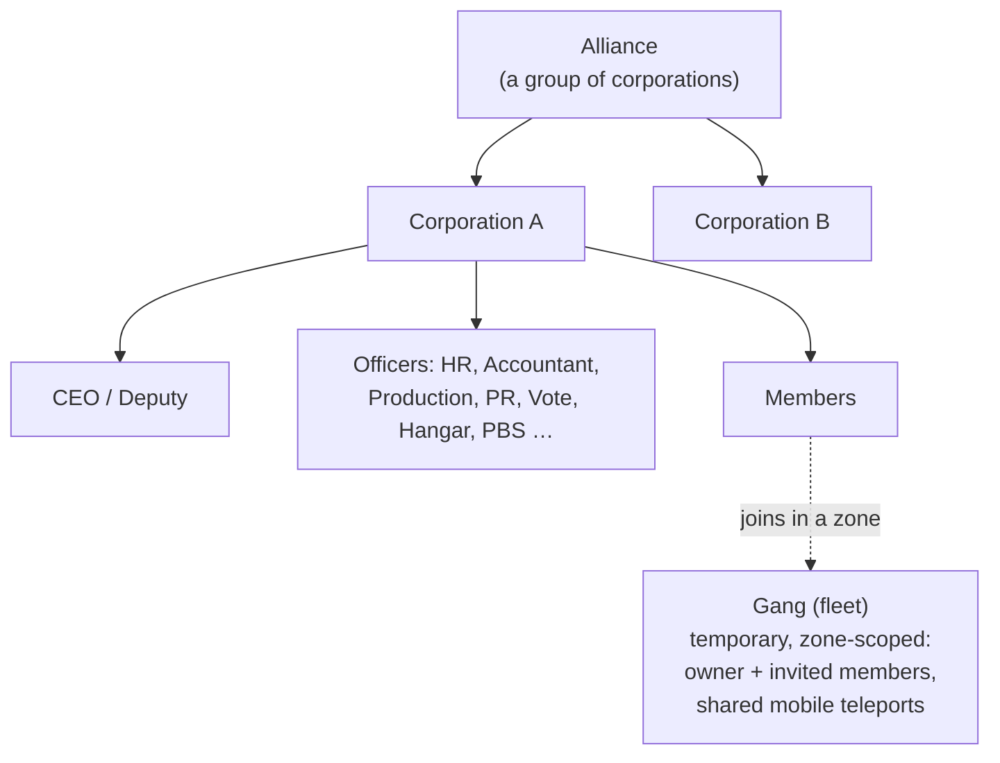

# Groups

There are three groupings: **corporations** (your main org), **alliances** (groups of
corporations), and **gangs** (temporary fleets for zone play).

> UI locations follow the [client UI overview](/features/ui/) (the **Corporation** button top-left;
> the **Corp Storage** category; gangs have their own window). Mechanics below are
> confirmed against the server.

## Corporations

### Joining & leaving
- **Create** a corporation — requires the basic corporation-management extension
  (level 1) and a founding fee of **250,000 NIC**. You choose the official name,
  a **short ID** (max 6 characters, shown on the terrain to identify your members),
  and the **tax rate** — a cut of members' earnings (notably mission pay) that goes
  to the corp account automatically.
- **Apply** to one, or **invite** a character in.
- **Accept an application** / **list applications** (officers).
- **Reply** to an invite you received.
- **Leave**, or **cancel** a pending leave.
- **Remove a member**, **set a member's role**, **drop your own roles**, or set members
  neutral.

### Roles
Corporations have a role hierarchy. Roles gate what you can do — e.g. unlocking
corporation tech tree nodes, managing the hangar, or editing the PBS (see
[pbs](/features/pbs/)). The roles defined by the server (`CorporationRole`):

- **CEO** — full control.
- **Deputy CEO** — second-in-command.
- **HR Manager** — membership (apply/invite/remove).
- **Corporation Delegate** / **Alliance Delegate** — act on the org's behalf.
- **Accountant** — corp money.
- **Production Manager** — corp production.
- **Vote Admin** — votes.
- **PR Manager** — public relations / bulletin.
- **Hangar access (low / medium / high / secure)** — tiered hangar permissions, with
  matching **hangar-remove** tiers and a **hangar operator** role.
- **view PBS / edit PBS** — see or modify the corporation's PBS structures.
- **Tech tree list / unlock** — view or unlock the corporation's tech tree.

A few typical gates: membership actions (apply/invite/remove, set roles) need
**CEO / deputy / HR manager**; the bulletin and PR need **CEO / deputy / PR manager**;
corp money and facility upgrades need **CEO / deputy / accountant** (production adds the
**production manager**); PBS deployment needs **CEO / deputy / edit-PBS**.

You can review **role history** for yourself and members. Hangar space is rented (default
server config: 50,000 credits per 7-day period).

### Info & search
- **Corporation info / my info** — details and your membership.
- **Search** corporations.
- **Standings / reputation** — your corp's standing and reputation.
- **Delegates** — characters acting on the corp's behalf.

### Money
- **Donate** to the corporation wallet.
- **Pay out** from it.
- **Transfer** between wallets.

### Appearance & profile
- **Rename**, **set colour**, **set info** (public profile).
- **Logo** — up to 5 symbols from a fixed set, each editable (size, transparency,
  layering); only entitled members may create or change it.
- **Name history** — past names.

### CEO
- **Volunteer for CEO**, or check the **CEO takeover status**.
- **Takeover in practice**: once a CEO has been offline for **30 days**, a Deputy
  can initiate a takeover — a **48-hour countdown** starts, announced in the corp
  window. The CEO or any other Deputy can **veto** it instantly (a veto doesn't
  stop the next attempt if the CEO still doesn't log in). If the countdown reaches
  zero, the Deputy becomes CEO with full privileges.

### Votes
Corporations can hold **votes**:
- **Start** a vote, **set its topic**, **list** votes, **cast** a vote, **delete** a vote.

## The bulletin board
A corporation-run notice board:
- **Start** it, **list** entries, see **new entries**, **post** an entry, **moderate**
  (edit/remove others' entries), and view **details**.

## Corporation hangar (storage)
A shared corp storage area at bases:
- **Rent** a hangar section, **pay rent**, check **rent price**, **close** it.
- **List** contents (all, or on a specific base).
- **Folders** — create/delete sub-folders.
- **Set access** (who can use it) and **set a name**.
- **Logs** — view, set, and clear the hangar's access log.

Note: you **cannot select a robot from the corp hangar** as your active robot
(see [robots](/features/robots/)).

## Corporation documents
A shared, versioned text-document system for the corporation. There are two document
types:

- **PBS plan** — a plan/blueprint for the corporation's PBS network.
- **Terraform project** — a terrain-modification project record.

Operations: **create**, **list**, **open**, **update body** (versioned), **delete**,
**transfer** ownership, **rent** (extend the validity period), **monitor** / **unmonitor**
(get notified of changes), and a **registration list** (up to 25 members) controlling who
can work on the document.

## Alliances

An alliance groups corporations:
- **My alliance info**, **default alliances**, and **alliance role history**.
- Standings can target alliances (see [social](/features/social/)).

## Gangs (fleets)

A **gang** is a temporary group for zone play (e.g. to share a mobile teleport or fight
together):
- **Create**, **delete**, **info**.
- **Invite**, **reply** to an invite, **kick**, **leave**.
- **Set leader**, **set role**.

Gang membership matters for **mobile teleports** — only the owner or a gang member may
use one (see [movement](/features/movement/)).

## Practical notes

- **Roles gate power** — most officer actions (applications, hangar, PBS, votes) require
  the right role.
- **Corporation tech is shared** — unlocking for the corp uses shared points and a
  multiplier (see [research](/features/research/)).
- **The hangar is storage, not a launch pad** — you can't undock from it into a robot.
- **Gangs are ephemeral** — use them for a zone session, not as a permanent org.
- **Standings follow your corp** — your corporation's standing affects how the universe
  treats you (see [social](/features/social/)).

<!-- TODO: only the corp UI remains (window layout, role picker).
     Confirmed: CorporationRole enum (21 roles incl. hangar access/remove tiers
     low/medium/high/secure, viewPBS/editPBS, TechTreeList/TechTreeUnlock, delegates);
     permission gates sampled from handlers (membership CEO/Deputy/HRManager;
     bulletin CEO/Deputy/PRManager; money+facility upgrades CEO/Deputy/Accountant;
     production +ProductionManager; PBS CEO/Deputy/editPBS); documents = pbsPlan(1) +
     terraformProject(2) (CorporationDocumentType.cs), versioned, rent extends validity,
     monitor for change notifications, register list max 25 (MAX_REGISTERED_MEMBERS).
     Developer notes: Corporations/* (apply/invite/accept, roles, leave, info, money,
     votes, bulletin, hangar, documents, histories, CEO); AllianceGetMyInfo.cs /
     AllianceGetDefaults.cs / AllianceRoleHistory.cs; Gangs/* (create/invite/kick/leave,
     leader/role). SelectActiveRobot.cs forbids corp-hangar robots. -->
