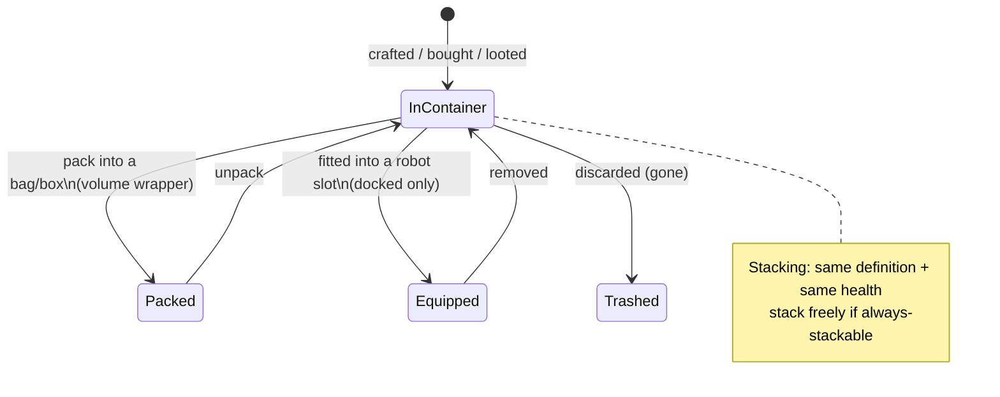

# Items & inventory

Your **inventory** is a set of **containers** (the base's public container, your robot's
container, bags/boxes, etc.). This page covers manipulating items inside them.

> UI locations follow the [client UI overview](/features/ui/). Mechanics below are confirmed against
> the server.

## Containers

- **List a container** — view its contents.
- **Relocate items** — move items between containers you can access.

Access rules apply: some containers (corp hangar, robot inventory, system containers) are
restricted — see [robots](/features/robots/) and [groups](/features/groups/).

## Packing & unpacking

- **Pack items** — put items into a bag/box (a "volume wrapper" container) to carry them
  compactly.
- **Unpack items** — take items back out of a bag/box.

Packing is also how a **robot** is compacted for storage/transport: the server strips its
dynamic state and components and marks it *repacked*. A robot can only be packed while
it is **undamaged**, **not selected**, **not insured**, and with an **empty inventory**.
Unpacking rebuilds the robot and repairs it. Only items flagged *repackable* in content
can be packed; a repackaged robot can't be selected or fitted until unpacked
(see [robots](/features/robots/)).

## Stacking

Many items stack. Stacking operations:

- **Stack items** / **stack to** / **stack selection** — combine items of the same type
  into a stack (or move a stack onto another).
- **Unstack an amount** — split a specific quantity off a stack.

The server only merges items that share the **same definition and the same health**.
Items flagged *always stackable* (ores, ammo, most raw materials) stack freely; items
flagged *non-stackable* never stack; everything else may stack **only while repackaged**
(packed) — so unpacked, damaged gear stays individual.

## Naming & using

- **Rename an item** — give an item a custom name.
- **Use an item** — activate a usable item (context-dependent; in a zone this can also
  interact with zone objects — see [gathering](/features/gathering/)).
- **Use a lottery item** — open/activate a lottery-style item.

## Trash & reimbursement

- **Trash items** — discard items (deletes them).
- **Reimburse an item** — a staff/admin reimbursement flow: creates the item and gives
  it to a character, logged to the transaction log. Players don't invoke this directly.

## Special items

- **Redeemables** — list, **redeem**, or **activate** redeemable items (codes/grants).
- **Goodie packs** — list and **redeem** goodie packs (bundles of items).
- **Open a gift** — a gift contains one **random** item drawn from a server-wide loot
  pool (ammo, raw ores, plasma, research kits, modules, capsules, paint, boosters —
  221 possible definitions, each with its own quantity range).

## Practical notes

- **Access is per-container** — you can only touch containers you own or are granted.
- **Pack to carry more** — bags/boxes let you move bulk items compactly.
- **Stacks save space** — combine like items; unstack to take out exactly what you need.
- **Trashing is permanent** — deleted items are gone.
- **Redeemables/goodie packs are one-time** — redeeming consumes the code/item.
- **Packed robots are inert** — unpack before you select or fit them.
- **Only packed items stack** — if like items won't merge, pack (or repair) them first.

<!-- TODO: only the inventory UI remains.
     Confirmed: stacking rules (Item.cs CanStackTo: same ED + same health; AttributeFlags
     alwaysStackable/nonStackable; others must be repackaged); pack rules (ItemPacker.cs:
     robot must be undamaged, not selected, not insured, empty inventory; repackable
     flag); unpack rebuilds + repairs (ItemUnpacker.cs); gifts = random draw from
     giftloots (221 defs: ammo x1500-2000, epriton/fluxore x600-1000, reactor plasma
     x10-20k, research kits, paints, capsules, named3 modules, boosters, respec tokens);
     goodie packs are campaign-based (GoodiePackRedeem: campaignID + indy selection);
     ReimburseItem = admin tool (opp_reimburselog). AttributeFlags bit positions:
     nonStackable=10, alwaysStackable=11, repackable, consumable=24, deployable=23.
     Developer notes: ListContainer.cs; RelocateItems.cs; PackItems.cs / UnpackItems.cs;
     StackTo.cs / StackSelection.cs / UnstackAmount.cs; SetItemName.cs; UseItem.cs /
     UseLotteryItem.cs; TrashItems.cs; ReimburseItem.cs (PbsReimburseRequestHander.cs);
     RedeemableItemList.cs / RedeemableItemRedeem.cs / RedeemableItemActivate.cs;
     GoodiePackList.cs / GoodiePackRedeem.cs; GiftOpen.cs. Container access:
     ContainerAccess / ContainerAccessChecker.cs. -->
