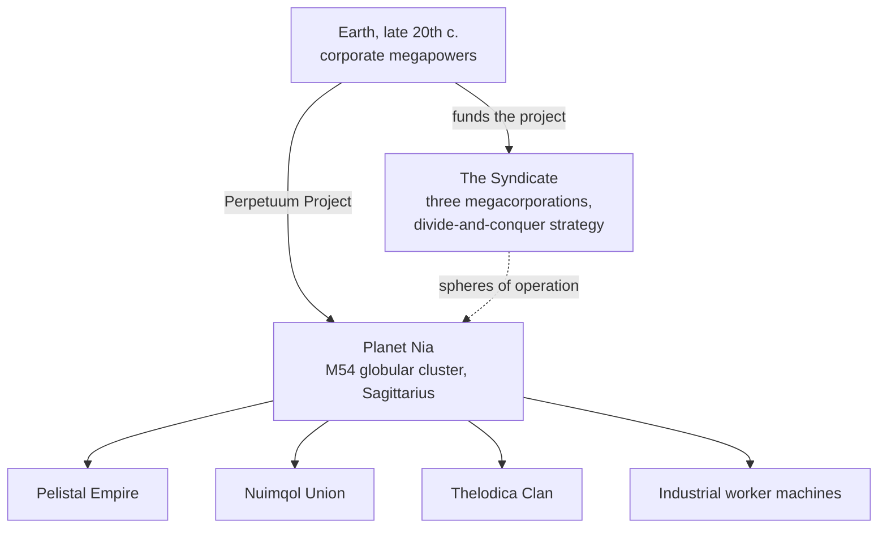

# Lore

## The discovery of Nia

Earth's late-20th-century tech boom — the internet, medical IT fusion, space
research — broke down the old physical and mental boundaries. Communication and
trade got faster and cheaper, and the great corporations grew into the de facto
governments of their regions.

Into that world came the discovery of **planet Nia**, in the M54 globular cluster
of Sagittarius (the source of the project's logo). Nia orbits one of a pair of
stars — the fourth planet of that pair — and is strikingly Earth-like: mean
surface temperature around 19 °C and a near-Earth atmospheric density. Two
quirks set it apart. Its oceans are impassable barriers to anything
electric-driven — the planet's dense core and rapid rotation keep them charged —
and only about 17% of the surface is land, which fast plate tectonics keep
shredding into islands. On that land, life flourishes.

## The Nians

Nia's inhabitants break the usual meaning of "life form": a synthetic species,
not unlike our robots in form, but organized into separate, technologically
advanced **societies** — each with its own industry, military and culture. The
achievement that matters most to an energy-hungry Earth is their **energy
production technology**.

Three alien races fight for final victory across the island chains of their
domains — the **Pelistal Empire**, the **Nuimqol Union** and the **Thelodica
Clan** — with a scattered **Industrial** population of worker machines in
between (these are the same four groups you meet as
[NPCs](/features/npcs/)).

## The Syndicate

The main investor of the Perpetuum Project is the **Syndicate** — an alliance of
the three most powerful Terran megacorporations, each running its own sphere of
operations on the surface:

| Corporation | Domain |
|---|---|
| **Truhold-Markson** | North American consumer-industry giant; pushing into the decaying **Pelistal** domain. |
| **ICS — Institute of Corporate Security** | European-Russian association; operating inside the rebel **Nuimqol** territory. |
| **Asintec** | Asian industrial hegemon with its high-tech neighbours; waging a full-scale offensive against the **Thelodica Clan**. |

The strategy is the old *divide and conquer*: keeping the three spheres
balanced against each other keeps the alien powers fighting one another instead
of uniting. Human "Agents" work the surface — harvesting the Nians' energy
resources, studying their technology, and policing the peace the Syndicate
wants.

That is where you come in.

<!--
Developer notes: rewritten 2026 in original prose from the canonical setting.
An earlier version was adapted from the Open Perpetuum community wiki
(perpetuum.miraheze.org: Discovery of Nia, Nia, Syndicate); that text was
fully replaced, not reused.
Consistency with backend: the three alien races + Industrial match the NPC
races (see /features/npcs/); the corporation names match the zone abbreviations
(zone_ICS, zone_ASI, zone_TM — the beta-tier zones in /zones/ are named after
their megacorporations).
-->
