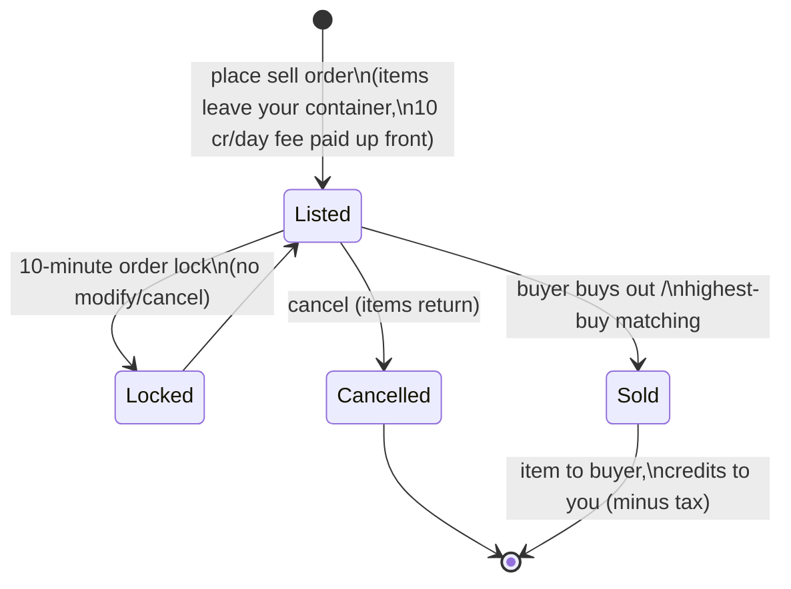

# Market & trade

The **market** is where you buy and sell items at a base. All market actions are
**docked-only** (you trade at the base you're docked to).

> UI locations follow the [client UI overview](/features/ui/) (the **Market** category on the top
> bar). Mechanics below are confirmed against the server.

## Market orders

You place two kinds of orders at your current base's market:

### Sell orders
List items for sale.
- Choose the **item**, **quantity**, **price per piece**, and **duration** in days
  (minimum 1).
- The item is pulled from your container (unstacked if you're selling part of a stack).
- **Listing fee** — you pay `10 credits × duration` up front (reducible by the
  *market transaction fee* extension); the fee goes to the base's central bank (zone
  profit pool).
- **Price guard** — when enabled, your price must fall within **±30%** of the item's
  **14-day average price**; prices outside the band are refused. *(This guard is
  currently **disabled** on this server.)*
- **Order lock** — an order can't be modified or cancelled for **10 minutes** after
  it's placed.
- **Order count** — you can hold 1 + (*market sellorder expert* extension) open sell
  orders (buy orders have their own counter).
- **For my corporation** — you can restrict a sell order to your own corp's members
  (only for non-default corporations).
- Pay from your **personal** or **corporation** wallet as relevant.

### Buy orders
Place a standing order to buy an item at a price.
- The market fills it when a matching sell appears.

### Managing orders
- **Modify an order** — change price/quantity/duration.
- **Cancel an item / order** — withdraw it (item returns to your container).
- **My items** — see your open orders.
- **Highest-buy matching** — a sell can be routed to an existing buy order.

## Direct purchase

- **Buy an item** — instantly buy an item that's on the market (no standing order).

## Browsing the market

- **Item list / available items / items in range** — browse what's for sale.
- **Market info** — details about the base's market.
- **Average prices** — market average, per-definition average, and **global** average.
  These are what the price guard is based on.

## Market tax

- **Change market tax** — set the tax rate on the market. Only **PBS-base markets**
  are player-controlled; everywhere else the fixed default applies.
- **Tax log** — review tax changes.

Tax is deducted from what the **seller** receives on a market sale. The default rate is
**12%** (the seller gets 88% of the sale price); the rate can be lowered by the *market
transaction tax* extension and, on player-controlled markets, by the PBS owner setting
a custom rate.

## Direct player trades

A **trade** is a peer-to-peer exchange between two docked characters:

- **Begin a trade** — start a session with another player.
- **Set / retract my offer** — put items/credits on your side.
- **Accept** — both sides accept to complete the swap atomically.
- **Cancel** — abort the trade.
- **Trade finished / state** — completion and current state.

A character can **block trades** on themselves (see [getting started](/features/getting-started/)).

## The item shop

The **item shop** is a fixed-price vendor at a base (not player-driven). The full
catalog (every item, quantity, price per currency, standing requirement) is generated in
[Item shop](/content/shop/).

- **List** — see what the shop sells.
- **Buy** — purchase an item for credits.

## Transferring credits

- **Transfer credits** between your own characters (see [getting started](/features/getting-started/)).

## Practical notes

- **Everything is docked-only** — you can't trade in a zone.
- **Factor the 12% tax into your pricing** — sellers receive 88% of the listed price
  by default (less on high-tax PBS markets).
- **The listing fee is up front** — a long-duration listing costs more even if it sells
  on day one.
- **Corp-only orders** are a way to move goods inside your corp without public exposure.
- **Trades are atomic** — both sides must accept, or nothing moves.
- **Tax changes effective cost** — factor the market tax into your pricing.

<!-- TODO: only the client UI remains (market and trade screen flows).
     Confirmed: MarketInfoService(0.3, 10, false) registered in
     PerpetuumBootstrapper.cs -> margin +-30% vs 14-day average (MARKET_AVERAGE_DAYSBACK
     14), fee 10 credits/day (Market.MARKET_FEE), CheckAveragePrice=false on this
     server; DEFAULT_MARKET_TAX = 0.12 (seller gets 88%), player-controlled tax only on
     PBSDockingBase markets (MarketTaxHelper); order modify/cancel locked 10 min after
     submit (MARKET_CANCEL_TIME); order count = 1 + expert extension bonus;
     fee paid up front to the base's central bank. -->
     Developer notes: Markets/MarketCreateSellOrder.cs (docked, price guard vs average
     price, corp-only, unstack, corp wallet), MarketCreateBuyOrder.cs,
     MarketModifyOrder.cs, MarketCancelItem.cs, MarketBuyItem.cs, MarketItemList.cs,
     MarketAvailableItems.cs, MarketItemsInRange.cs, MarketGetMyItems.cs,
     MarketGetAveragePrices.cs / MarketGetDefinitionAveragePrice.cs /
     MarketGlobalAveragePrices.cs, MarketTaxChange.cs / MarketTaxLogList.cs;
     Trade*.cs (begin/offer/accept/cancel, atomic); ItemShopList.cs / ItemShopBuy.cs;
     CharacterTransferCredit.cs. -->
