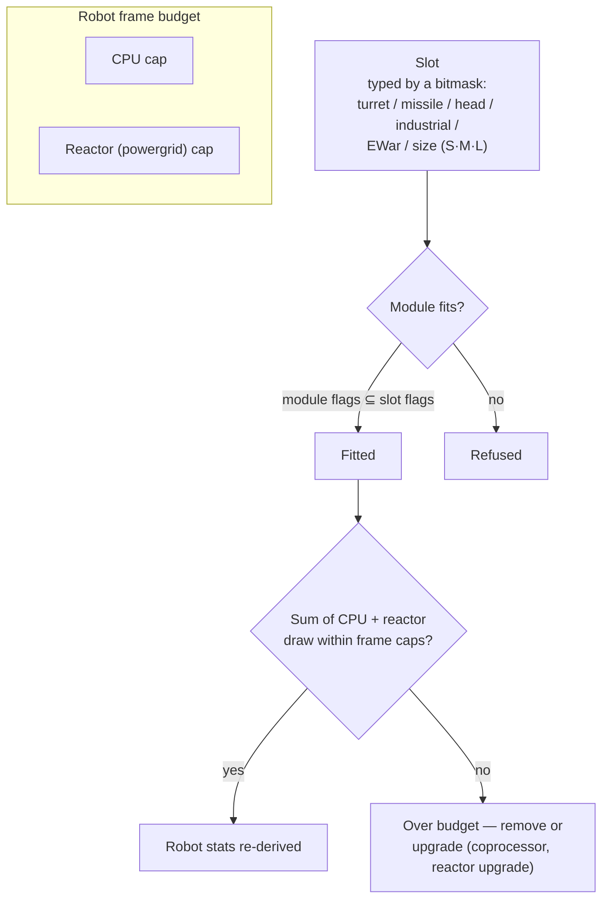

# Modules & fitting

"Buying a robot only gets you the chassis." Outfitting it with modules is where a
robot becomes what you need it to be. *Fitting* means both the module loadout
("send me your fitting") and the CPU/reactor budget it consumes.

## Slots & resources

A robot's frame has a fixed set of **slots**, defined by its chassis. Each slot is
typed by a bitmask — turret, missile launcher, head, industrial, EWar/engineering,
size (small / medium / large) — and a module only fits a slot when its own type
mask is a subset of the slot's. So a turret slot on a caster accepts small,
medium *or* large turret modules, but no missile launcher will ever go in a
turret slot. Head modules (coprocessors, tuning modules) and chassis/leg modules
(plates, frames) occupy their own dedicated slots.

Every module draws **CPU** and **reactor** (powergrid) from the frame — the sum of
everything fitted must stay under both limits, and some modules also draw
**accumulator** (core) per cycle. Leftover capacity is the *available output*
shown in the fitting window. Rough chassis scale (T1/T2/T3 examples):

| Frame class | CPU | Reactor | Example |
|---|---:|---:|---|
| Small crawler | ~250 | ~140 | Castel |
| Light mech | ~480 | ~300 | Waspish |
| Heavy mech | ~1 100 | ~1 000 | Tyrannos |
| Walker | ~3 200+ | ~1 100+ | Gropho |

When you're short on capacity: **CPU** — coprocessor modules (e.g. the T3
coprocessor grants +20% CPU) or T2 module variants (lower draw). **Reactor** —
reactor upgrades (e.g. T3 gives +20% reactor output) or reactor sealing (lowers
radiation, which also protects you from EnWar — see below).

## The module families

Per-model numbers live in the [items catalog](/content/) and the
[formats reference](/formats/); this is the family map.

### Weapons & ammo

Four weapon technologies, each with its own ammo and distance profile:

| Weapon | Ammo | Distance profile | Notes |
|---|---|---|---|
| **Firearms** | Bullets | Short optimal, huge falloff | Projectiles that *never miss* — but their "accuracy" works as an area radius, so small targets still take reduced damage from wide sprays. |
| **Magnetic (railguns)** | Slugs | Medium range, sharp falloff | High impact velocity; heavy energy use. |
| **Lasers** | Energy cells | Long range | Most energy-hungry; concentrated beams. |
| **Missiles** | Missiles | Long range | Hit or miss is decided by the *robot's* hit-chance stat, not distance. Damage scales with the target's size relative to the explosion radius — big missiles on small targets hit for much less. |

Damage falls off with distance on a smooth cosine curve: full damage at optimal
range, zero at optimal + falloff (see [damage falloff](/features/combat/#damage-types-and-armor)).

Ammo is where you tune damage: primary + secondary damage types let you fine-tune
against a target (see [damage types](/features/combat/#damage-types-and-armor)) —
at the cost of a bit of total damage versus pure-primary ammo.

Turrets come in small/medium/large; **match the size to the robot** (small bots
run small modules, mechs and heavies run medium/large).

### Defense

- **Armor plates** — the main hitpoint pool; when armor hits zero, the robot
  explodes. **LWF** (lightweight frame) plates trade durability for speed: a T2
  LWF plate multiplies armor by ~0.73 but grants +19% speed, −0.2 signature and
  −0.2 mass.
- **Shield generator** — an accumulator-fed barrier that absorbs damage ahead of
  armor. The shield spends *your own core* to absorb: a hit that would deal 100
  damage on a 2× shield draws 50 core instead of 100 armor. While the shield is
  active your own weapons cannot fire. Absorption quality scales with the shield
  radius relative to your signature — big shields on small frames work best.
- **Armor repair** — active repair modules (small/medium/large); **remote armor
  repair** reaches a locked target (allies, or a PBS) but has a short range and a
  longer cycle.
- **Armor hardeners** — passive resist points per damage type (chemical /
  kinetic / thermal / explosive variants).
- **Adaptive alloy** — a passive that *learns* the damage mix it takes and
  redistributes a fixed pool of resist points toward whatever you've been hit
  with most.
- **Evasive / maneuvering** — signature-reduction modules and NEXUS (below) make
  the target smaller: less damage from area effects and a harder lock.

### Energy

- **Reactor** — the sustained output limit; reactor upgrades raise it, reactor
  sealing lowers radiation (less EnWar damage taken, at a small reactor cost).
- **Accumulator (core)** — the burst-energy reserve that powers module cycles. It
  recharges over time (chassis `core_recharge_time`, ~120 ms on a T1 crawler);
  **accumulator rechargers** speed the recharge.
- **Energy injectors (core boosters)** — consume a charge to instantly top up the
  accumulator.
- **Energy transferers** — beam core from your robot to a locked ally (players
  can't beam NPCs).

### Electronics

- **Sensor booster** — passive, self: shortens your lock time and extends your
  lock range.
- **Remote sensor booster** — active, target: same boost applied to a locked ally
  for ~10.5 s.
- **Coprocessors** — raise the frame's CPU limit (T1 +10% … T3 +20%).
- **Weapon stabilizers** — improve weapon accuracy (smaller effective area
  radius) and shave a bit of mass.
- **Tuning modules** (head slots) — flat bonuses to specific families: damage
  mods (+25% damage per weapon family at T3), mining upgrades (+10% mining and
  harvesting at T3), armor-repairer upgrades (+16% repair, −8% cycle at T3).

### Electronic Warfare (EWar)

Make the enemy blind and deaf:

- **Sensor dampener** — ranged debuff: lengthens the target's lock time and cuts
  its lock range for ~5.5 s. Only lands if your ECM strength beats the target's
  (randomized) sensor strength.
- **Sensor jammer** — instant: resets *all* of the target's locks on a successful
  ECM check.
- **ECCM** — self buff for 20 s: raises sensor strength and lock resistance, and
  *cures* ECM-vulnerable debuffs (dampeners, webs).
- **Neuralyzer** — resets the locks of **every** player within ~1.65 km. A panic
  button.

Counterplay: sensor strength (chassis), ECCM, and keeping distance.

### Stealth & detection

- **Stealth module** — ~10.5 s of stealth; the drain scales with your signature
  radius (bigger frame, faster core burn).
- **Target painter** — ~10.5 s debuff that strips the target's stealth strength.
- **Detection module** — passive boost to your detection strength.

Detection strength vs. stealth strength decides whether you can see (and lock) a
cloaked target at all — see [detection & masking](/features/combat/#detection-interference-and-speed).

### Energy Warfare (EnWar)

Drain or cut the enemy's energy:

- **Drainers (energy vampires)** — siphon core from a locked target and add it to
  your own accumulator.
- **Neutralizers** — the same, but the drained core is destroyed.
- Both are weakened by the target's **reactor radiation** — sealing is a real
  counter.
- **Demobilizers (webs)** — ~5.5 s speed reduction on the target; the effect
  scales with the target's mass (heavy frames are slowed less) and fails against
  targets outside the module's optimal range.
- **Scorcher** — an electric weapon that *chains* up to 5 targets, hitting
  shields and armor with penetrating damage.

### Industrial

- **Drills** (small / large) and **harvesters** (small / large) — the gathering
  modules; yield, cycle time and accumulator use are the stats that matter.
  Mining grants EP (with a daily cap and liquid penalty).
- **Geoscanner** — scans the mineral field around you with the probe's accuracy;
  the result is a map of what's under the ground (see [gathering](/features/gathering/)).
- **Excavator** — aura module: boosts mining/harvesting yield of nearby units
  (T3: +50%) at the cost of stealth.
- **Terraforming** (gamma zones) — terrain locks that raise, lower or level
  ground (max radius 5 m) and grow wall plants; see the [zones section](/zones/zone-gamma-z106/).
- **Remote controllers** — turrets and drones on a leash: each controller
  module carries a bandwidth (how many), an operational range and a drone
  lifetime (5–10 min by tier). Variants: tactical (damage/cycle), assault
  (damage), support (remote repair), industrial (mining/harvesting drones),
  hunter. A **remote command translator** module amplifies drone damage, armor,
  mining yield and repair output (T3: +7.5% each) and can extend the controller's
  bandwidth.

### NEXUS

Networked Extension Utilization Systems: **squad buffs**. A NEXUS module emits an
aura around its own robot that buffs **gang members** (and their turrets/drones)
within the aura radius — default 10 m, refreshable every 10 s. Rules:

- a robot can carry at most **3 NEXUS auras**, and at most **one of each type**;
- the aura only reaches units in your **gang**, not random allies.

The T3 type list (13): velocity, armor, shield, farlock (lock range), lock
booster (lock time), critical hit, assault (weapon cycle), EW (EWar range),
evasive (signature), repairer, industrial (accumulator use while gathering),
fast extractor (gathering cycle), recharger (core recharge). Each T3 module
grants roughly +7.5% of its stat; e.g. the velocity NEXUS multiplies max speed
by 1.075 for every gangmate standing within 10 m.

### NOX

Cultist-grade counters: **negator** modules that *disable* enemy modules inside
their radius — a **shield negator** (cuts shield absorption by ~90%), a
**repair negator** (cuts repair output) and a **teleport negator** (blocks
teleporting). Each activation **consumes plasma** from your cargo, and using one
on an open (non-training) zone **flags your character for PvP**.

### Special-purpose

- **Siege hack module** — the active-SAP tool: 5 s cycle, 3 m range (see
  [outposts](/features/outposts/)).
- **Self-destruct** — arms an 8-second countdown; the beam is visible for 600 m.
  Last-resort cleanup.
- **Mine detector** — extends the frame's mine detection range.
- **Blob emitters** — deploy an emitter that spreads a blob field; the
  emission-modulator module tunes the field (see [combat](/features/combat/)).
- **PBS construction** — the module used to place PBS structures on gamma zones.

## Rules of thumb

1. **Don't mix your guns.** Magnetic + laser + missiles on one bot usually
   underperforms all three; mixing short- and long-range rarely ends well.
2. **Mind the mass.** Every plate and shield module adds mass and signature —
   sometimes speed matters more than defense.
3. **Don't do everything.** A bot that mines, scans and shoots does none of it
   as well as a specialist.
4. **Size-match your modules** to the robot, and leave a little CPU/reactor head
   for the tuning modules that make a build actually work.
5. …and yes, some niche fits break all of the above and still work. Just put
   some thought into it.

<!--
Developer notes: rewritten 2026 from backend sources; no community-wiki text reused.
Verified against:
- src/Perpetuum/Robots/RobotComponent.cs (slot bitmask fitting: moduleFlagMask & slotFlagMask)
- src/Perpetuum/Modules/SlotFlags.cs (12 slot flag bits)
- src/Perpetuum/Modules/Weapons/WeaponModule.cs + FirearmWeaponModule.cs +
  MissileWeaponModule.cs (accuracy: firearms never miss, explosion radius from
  Accuracy; missiles use ParentRobot.MissileHitChance)
- src/Perpetuum/Modules/Weapons/Damage.cs (cosine falloff, critical 1.75x +/-10%,
  explosion scaling signature/explosionRadius clamped [0,1])
- src/Perpetuum/Units/Unit.cs GetResistByDamageType (resist/(resist+100))
- src/Perpetuum/Zones/DamageProcessors/DamageProcessor.cs (shield draws core,
  electric = penetrating)
- src/Perpetuum/Modules/EffectModules/ShieldGeneratorModule.cs (absorption
  modifier = shieldRadius ratio / shieldAbsorbtion; WeaponModule.cs:112 blocks
  firing while HasShieldEffect)
- src/Perpetuum/Modules/EffectModules/{Webber,SensorDampener,SensorBooster,
  Stealth,TargetPainter,Eccm,Detection,AdaptiveAlloy}.cs (durations from
  effects table: dampener/web 5.5s, stealth/paint/remote-boost 10.5s, ECCM 20s)
- src/Perpetuum/Modules/SensorJammerModule.cs + Neuralyzer.cs (lock reset,
  NEURALYZER_RANGE=1650)
- src/Perpetuum/Modules/{EnergyVampire,EnergyNeutralizer,Scorcher,
  CoreBooster,EnergyTransferer}.cs (EnWar, reactor radiation modifier, chain)
- src/Perpetuum/Modules/GangModule.cs + Zones/Effects/GangEffect.cs +
  EntitiesModule.cs:532-544 (13 aura types, gang-members-only, effects table
  auraradius=10)
- src/Perpetuum/Modules/NoxModule.cs (plasma consumption, PvP flag)
- src/Perpetuum/Modules/RemoteControl/* (bandwidth/range/lifetime, translator
  amplification)
- entitydefaults rows: named1-3 armor plates/hardeners, shield generators
  (absorbtion 2.0-2.3, radius 5-33), LWF (mass_reductor), cpu/powergrid
  upgrades, damage/mining/repairer tuning, NEXUS named3 values, NOX cultist
  values, siege hack (5s/3m), chassis core_max/powergrid_max.
Corrections vs ingested page: NEXUS auras reach gang members only (not "all
friendly units"); no "co-reactor" module exists (reactor upgrades/sealing do
that); demobilizer effect scales with target mass, no "resistance stat";
sensor suppressor = sensor dampener (5.5s debuff).
-->
