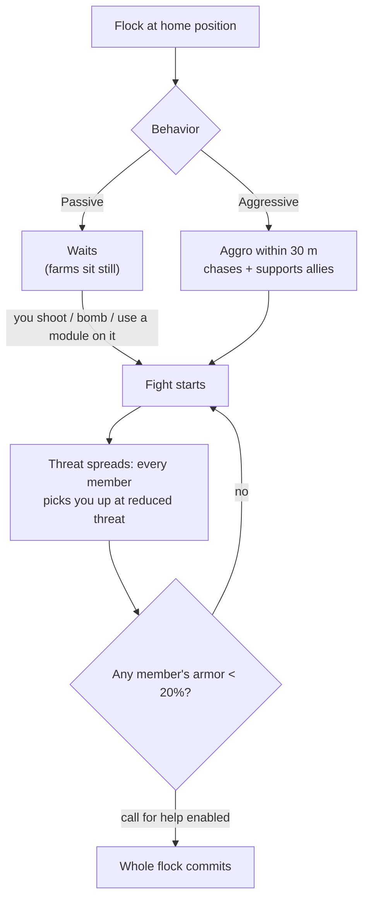

# NPCs & PVE hunting

NPCs are the game's main source of [reactor plasma](/content/ores/),
[kernels](/features/research/) and modules, and a reliable way to earn extension
points at any level. They exist in **flocks**: groups that share a home
position, a home range, a respawn time, and a behavior.

## Who's out there

NPCs come in four races — **Nuimqol, Pelistal, Thelodica and Industrial** —
each with several robot classes (runners, crawlers, mechs, heavy mechs) and
ranks 1–5 that scale up in stats and loot. Beyond the regular ranks:

- **Goblins** — EWar guards on the protected islands. Fragile, but their
  locking modifiers are extreme (they lock you ~5× faster than normal, from
  ~2× further): a goblin camp makes it painful to fight or mine nearby.
- **Elites** — rare variants of the ranked NPCs with roughly doubled
  base stats and better loot.
- **Observers** — roaming, aggressive NPCs (Arbalest, Baphomet, Waspish,
  Tyrannos, Artemis, Kain, Gropho, Sequer, Seth, Mesmer…). They patrol large
  parts of the island and are significantly harder than ranked NPCs of the
  same class — *grand* observers on protected islands and their open-island
  variants are the strongest regular hunters there are.
- **Bosses** — rare, individually configured NPCs. They never flee, can
  announce themselves server-wide, and some are tied to outposts (killing them
  moves [outpost stability](/features/outposts/)) or spawn relic rifts when
  killed. Weaker bosses are soloable on protected islands; the strongest
  need a dedicated group.
- **Syndicate spawns** — a special faction (the Syndicate, with its own
  named NPCs) that runs its own static farms, usually on protected and
  shallow open islands.

## Passive vs aggressive

- **Passive flocks** never attack on their own — you have to shoot, bomb or
  use an active module on them first. Most classic static farms are passive.
- **Aggressive flocks** aggro on their own when you come within **30 m**,
  chase you, and support allies that are fighting. All Observers, most roaming
  spawns and outpost guardians/invaders are aggressive.

When a fight starts, **threat spreads through the flock**: every member picks
you up at reduced threat, and if any member's armor drops below **20%**, the
whole group commits to you (for flocks with call-for-help enabled). Assume you
are fighting the whole spawn the moment the first bot fires.

## Spawns and respawning

- **Static spawns** sit on a fixed home position with a home range; members
  respawn **individually** on their own timer. A flock that has been farmed
  hard respawns faster; a fresh one respawns slower.
- **Roaming spawns** move around the island — they are the Observers and
  convoy-type flocks, and they are usually aggressive.
- **Mining-site reinforcements** — industrial NPCs working a resource node
  have pre-configured reinforcement waves: as the fight drags on, further
  waves arrive at the node. Bosses also call in reinforcements when damaged.
  So a "one-robot" farm can become a group fight; check the area before you
  commit.

## What they drop

Loot is configured per NPC type: **reactor plasma of the island's race**,
**kernels** (common, hitech, industrial and race-specific), module components
and, less often, packed modules. Higher ranks and special types drop more.

Every kill also pays **extension points**, configured per NPC type — and
doubled on open (beta-tier) islands.

## Zone tier perks

Islands come in three tiers — protected (alpha), open PvE (beta) and open
PvP (gamma). Hunting gets more dangerous, but also more rewarding, as you go
deeper:

- **Death explosions** — on protected islands, a robot dying does *not*
  explode. On open islands (beta and gamma), every destroyed robot — player
  or NPC — detonates and deals area damage. Chain-explosions make farming
  faster and gank spots deadlier.
- **Doubled EP** — every activity's base EP reward is doubled on beta-tier
  islands.
- **Better missions** — the higher mission levels live on the open islands,
  and their mission EP is doubled too.
- **Faction mission coins** — missions on the open islands pay that race's
  mission coin (Nuimqol / Pelistal / Thelodica coin) instead of the universal
  coin. The faction coins are also vendored directly at open-island terminals,
  and the universal coin can be bought where the faction ones can't.

## Practical notes

- **Check the flock before you engage** — count members, note the ranks and
  whether the spawn is aggressive; a passive farm you walked into can still
  be five bots deep.
- **Outrange them** — static spawns stay in their home range; positioning for
  clear long-range shots is usually the cheapest way to win.
- **Resource sites are traps** — mining-site reinforcements mean the longer
  you fight, the more opponents there are.
- **Observers on the move** — if you are exploring, artifacting or running a
  long haul, an aggressive Observer in your path is a fight or a detour.

<!--
Written from scratch against the server backend, 2026-09-27:
Zones/NpcSystem/Flocks/ (Flock.cs, NormalFlock.cs — group respawns, adaptive
respawn multiplier), AI/Behaviors/ (Passive vs Aggressive; threat spread at
50%, call-for-help at 20% armor in SmartCreature.cs), AI/BodyPullThreatHelper.cs
(30 m aggro range, aggressive-only body-pull), Reinforcements/ + npcreinforcements
(mining-site and boss waves at HP thresholds), NpcSpecialType + npcbossinfo
(boss respawn noise, outpost stability links, server-wide announce),
entitydefaults (rank1-5 + dps/interceptor/scout/miniboss/elite variants, 30
elite definitions with ~2x modifiers; 13 def_npc_roaming_* observers; goblin
lancer/shark with 5x lock-time / 2x lock-range modifiers),
npcloot (26k rows: race plasma, common/hitech/industrial/race kernels,
modules), NpcEp.cs + GetNpcKillEp (EP per NPC, x2 on beta),
Unit.DoExplosion (death AoE suppressed on protected zones, active on
beta/gamma; radius from signature, damage from remaining core),
MissionLocation.cs (race-specific mission coins; universal coin on protected
zones), ZoneConfiguration (IsAlpha/IsBeta/IsGamma).
An earlier version of this page was adapted from the Open Perpetuum
community wiki (perpetuum.miraheze.org) and has been fully rewritten from
backend sources; no text was reused.
The ingested "TAP" section was dropped: no teleport-attractor concept exists
in this backend (no definition, code or table).
-->
