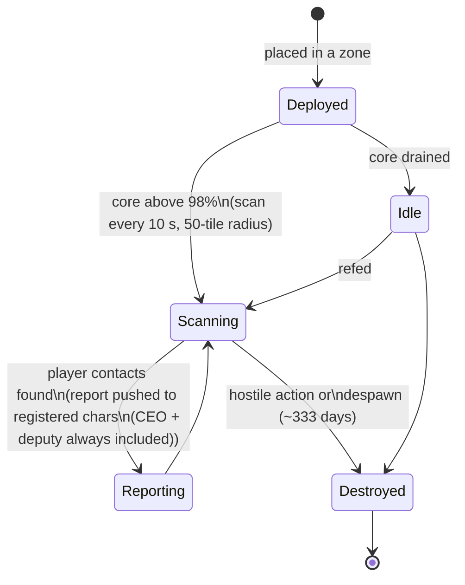

# Proximity probes

Probes come in two families:

- **Visibility (proximity) probes** — small devices you deploy in a zone to **watch an
  area**. While powered they scan for player units around them and push reports to the
  characters you've registered. This is a surveillance/recon tool.
- **Mining probes** — a **module** fitted in your robot (tiers from *noob* up through
  *standard*, *industrial*, *named*, *elite* to *artifact*) plus **per-ore probe
  ammo** (tile / direction / area variants for each ore). Firing it produces a scan
  result for that ore in the area, stored per character (see
  [gathering → scanning](/features/gathering/)).

> UI locations follow the [client UI overview](/features/ui/). Mechanics below are confirmed against
> the server.

## Managing your probes

- **List** your probes — see the probes you have.
- **Registration info** — the registration state/info for a probe.
- **Set registration** — bind characters to the probe's report list.
- **Set a name** — give a probe a label.
- **Remove** a probe's registration (in a zone) — stop it watching / clear it.

### How a visibility probe works

- It is **core-powered**: it only scans while its core is nearly full (above 98% of
  `core_max`); an empty probe sits idle.
- While active it scans **every 10 seconds** for player robots within its **detection
  radius (50 tiles)** and pushes a report (each contact's character ID and position) to
  everyone on the registration list.
- **Registration** is a corporation activity: you can only register **members of your
  own corporation**, and the **CEO and deputy are always on the list** automatically.
  The list has a maximum size.
- **Lifespan**: a deployed probe despawns after its content-defined `despawn_time`
  (the visibility probe is set to ~333 days) or is destroyed.

## Lifecycle events

The server reports probe lifecycle events as they happen:
- **created**, **updated**, **dead** — a probe is deployed, reports, or is destroyed.

These arrive as pushes; you don't send them, you react to them.

## Practical notes

- **Register before you read** — a probe only reports to its registered characters.
- **Probes can die** — hostile action or expiry can kill a probe; watch the lifecycle
  events.
- **Name them** — with several probes in the field, labels keep you sane.
- **Recon, not combat** — probes gather information; they don't fight.

<!-- TODO: only the UI remains (probe list, registration picker).
     Confirmed: visibility probe (def_visibility_probe): core_max 50, active only at
     core>98%, 10 s scan interval (ProximityDevice.cs _probingInterval), detection via
     blob_emission 10 / blob_emission_radius 50, report = characterID + x/y per contact
     pushed to registered characters (ProximityProbe.OnUnitsFound); registration =
     own-corp members only, CEO+Deputy always included, max count
     (ProximityProbeRegisterSet.cs); despawn_time 28,800,000 s (~333 d) on the capsule;
     stealth_strength 275 / detection_strength 45. Mining probes: tiered modules
     (noob/standard/industrial1-2/named1-3/elite t2-t4/artifact) + per-ore tile/
     direction/area ammo (79 def_*probe* definitions).
     Developer notes: ProximityProbeList.cs / ProximityProbeGetRegistrationInfo.cs /
     ProximityProbeRegisterSet.cs / ProximityProbeSetName.cs; Zone/ProximityProbeRemove.cs;
     Zones/ProximityProbes/ProximityProbe.cs + ProximityProbeDeployer.cs +
     ProximityDevice.cs; Zones/Blobs/* (blob emission/stealth); lifecycle events via
     ProximityProbeCreated/Update/Dead/Info commands. -->
     Developer notes: ProximityProbeList.cs / ProximityProbeGetRegistrationInfo.cs /
     ProximityProbeRegisterSet.cs / ProximityProbeSetName.cs; Zone/ProximityProbeRemove.cs;
     Zones/ProximityProbes/ProximityProbe.cs + ProximityProbeDeployer.cs; lifecycle
     events via ProximityProbeCreated/Update/Dead/Info commands. -->
