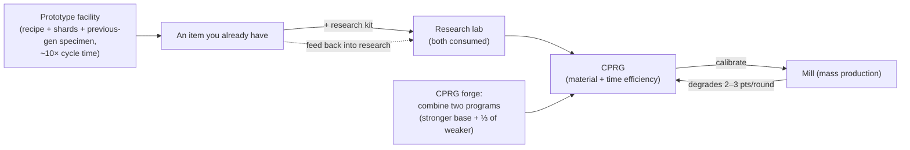

# Production

Production is how you turn raw resources and components into usable items. It happens at
a **production facility** (a "mill") at your docked base. Everything here is **docked-only**.

> UI locations follow the [client UI overview](/features/ui/) (the **Refinery / Recycling / Repair /
> Insurance** categories on the top bar). Mechanics below are confirmed against the server.

## Production lines

A **production line** is a saved recipe: it defines what you produce and from what. The
full component list for every craftable item (with research levels) is generated in
[Recipes](/content/recipes/). You run a line for a number of **rounds**.

- **List lines** — see your available lines.
- **Start a line** — run it in a facility for a chosen number of rounds (minimum 1).
  - You can pay from your **personal wallet** or the **corporation wallet**.
  - The source components can be searched from your **inventory** or your **robots**.
- **Calibrate a line** — tune a line's settings.
- **Set rounds** — choose how many rounds to run.
- **Query next round** — preview what the next round will consume/produce.
- **Cancel** — stop a running production.
- **Delete a line** — remove a saved line.

Running a line consumes components (and credits) and produces the target item over the
rounds.

## One-shot operations

These are single actions rather than multi-round lines. Each has a **Query** variant
that previews cost/output before you commit.

- **Refine** — raw materials → commodity, using the item's recipe (see [Recipes](/content/recipes/)).
  You choose how many of the target item to make; the recipe's nominal inputs are scaled
  by a material multiplier of `1 + 50/(bonus + 100)` where *bonus* is your refining skill
  (extensions + facility points + standing points). With no bonus you consume **150%** of
  the nominal recipe; with maximum bonus it drops toward **100%**.
- **Recycle / reprocess** — breaks an item back into its recipe components (the reverse
  recipe). The yield is `nominal × (1 − 75/(bonus + 100)) × the item's health ratio` —
  with no skill bonus that's a base **25%**, improving toward 100%, and a **damaged item
  yields proportionally less** (repair it first if it's valuable). Only whole "batches"
  (full default quantities) are recycled; the remainder stays. Mission items are deleted,
  not recycled.
- **Repair** — restores a damaged item/robot to full health. The price is
  `(missing health %) × the item's material value × 75/(bonus + 100)`. The "material
  value" is computed recursively: the item's recipe is broken down to raw materials and
  priced at the **world market averages**, so repair cost floats with the market. The
  skill multiplier starts at **75%** with no bonus and trends to 0 with maximum bonus.
- **Research components** — produce research components (query + run).

## The item lifecycle (the circular process)

Item creation is a loop of three connected facilities:

1. **Research (reverse engineering)** — feed an item of the item you want to
   produce, plus a **research kit** whose level meets the item's research level
   (kits are levels 0–10), into the research lab. Both inputs are **consumed**,
   and the job yields one **CPRG** for that item. The resulting program's
   efficiencies start from the item's per-item base (most items 50, ammo higher,
   turrets up to 90) and are raised by *kit level above the required level × 5*
   plus your research-skill bonus (up to +50 more). So a kit a couple of levels
   above the item — and decent production extensions — is what turns a fresh
   50/50 program into a competitive one. This is how new items enter your
   production repertoire.
2. **The mill (mass production)** — mass-produce from the program. Each round
   **degrades** the line's efficiencies (2–3 points per round, per item category;
   see [CPRG](#cprg-calibration-programs)) — when waste gets too high, calibrate
   a fresh program onto the line. Prototype items also take a **specimen of the
   previous generation** as a component (one standard module to make a T2
   prototype, one T2 to make a T3), which is consumed in the process.
3. **The prototype facility** — produce a **prototype** of an item directly:
   the recipe's materials plus robot shards *and* the previous-generation
   specimen, at roughly **10× the mill's cycle time** (plus the usual time
   multiplier). You can only prototype items unlocked in your tech tree.
   Prototypes cost dramatically more than their standard equivalents; their main
   purpose is to be **researched into high-quality programs** (researching a
   prototype item is what unlocks the next tier) — or used on the robot when the
   item is too rare to drop and too expensive on the market.

## Tier progression

Most modules and robots come in **tiers T1 → T4** (the client's tier badge; the
`standard → named1 → named2 → named3` definition lines, then the `elitet4`/
`artifact` special lines). The rules:

- **Each tier is a separate item with its own tech-tree node.** Unlocking a
  node costs research points (researched from kernels) and requires the
  **parent node** — so tiers must be unlocked in order. You can only
  **prototype** (or mass-produce) an item whose node is already unlocked:
  there is no way to make a higher tier without the research.
- **Each higher tier consumes one specimen of the previous tier** as a
  component (plus materials and robot shards). A T1 item therefore can never
  be "turned in" for a T3 — the T3 prototype needs a **T2** item, and the
  specimen is **consumed**, not converted: the output is a brand-new item.
- Every item page shows its **tier line** — the whole `T1 → T2 → T3 → T4`
  chain as links — and the [tech tree node pages](/content/techtree/) show
  each tier's parent/next node and point prices.

Example, the small miner module line: [standard small miner (T1)](/content/items/standard-small-driller/) →
[Biroter 5050 small miner module (T2)](/content/items/named1-small-driller/) →
[Sublimator Low-D small miner module (T3)](/content/items/named2-small-driller/) →
[Scraper-990 small miner module (T4)](/content/items/named3-small-driller/) —
and the same pattern for every module/robot family.

## Prototypes & research kits

- **Prototype** — produce a prototype item (start + query). One prototype per
  slot; more parallel prototype jobs come from production extensions.
- **Merge research kits** — combine multiple research kits into a higher one
  (run + query). A higher kit both shortens research time and raises the
  resulting program's efficiencies.

## CPRG (calibration programs)

A **CPRG** (calibration program) is what a production line runs on — a per-item program
with **material efficiency** and **time efficiency** points (0–100 each). You get one by
**researching the item** at a research lab (the research level gates which items you can
produce at all), or by activating a **calibration capsule**.

- A freshly researched CPRG starts at **50/50** points.
- **Forge CPRGs** at the calibration-program forge: combine two CPRGs for the same item;
  the result keeps the stronger program's points as a base and adds a third of the
  weaker one's. Forging takes time and costs credits (time × the facility's price per
  second).
- **Calibrate a line** with a CPRG to set its efficiencies. Each production round
  **degrades** the line's efficiency (a per-item decalibration value), so lines drift
  back down over time — recalculate before long runs.

The efficiencies feed the mill's formulas (per production cycle):

- **Materials consumed** = recipe × `1 + 50/(material points + skill + 100 + millBonus)`
  — a new 50-point CPRG with no skill and no tech-tree mass-production bonus consumes
  ≈ **133%** of the nominal recipe.
- **Production time** = facility base time (3,600 s per cycle for a mill) ×
  `1 + 100/(time points + skill + 100)` × the item's duration modifier — a new CPRG with
  no skill takes ≈ **1 hour 40 minutes** per item.
- **Price** = production time × the facility's price per second (7 credits/s for the PBS
  mill, 3 for the large/medium PBS research labs) × the item's price modifier (1–10).
- Mission-related CPRGs are free and fixed at 10 seconds.

## Insurance

The insurance facility insures **your robots**, not your production output:

- **Buy** a policy for a robot (it must be undamaged, unpacked, and not a starter bot),
  **list** your policies, **query** a policy, **delete** a policy.
- Coverage lasts **15 days** (+ extension bonus days); you can hold policies on
  1 + (extension bonus) robots.
- Each robot has a content-defined **fee** and **payout** (the `insuranceprices` table,
  67 robot definitions); the fee is discounted by a fee-extension bonus and can be paid
  from the corporation wallet.
- If the insured robot is destroyed, the **payout is paid in credits** (the robot is
  still lost) — see [combat](/features/combat/).

## Facility & status

- **Facility info / description** — what a production facility offers.
- **In progress (mine / corporation)** — what is currently being produced.
- **Production history** — your past production.
- **Components list** — available production components.
- **Server info** — production server status.

## Practical notes

- **You must be docked at a base with a production facility.**
- **Query before you run** — the query variants show cost and output so you don't burn
  components on a mistake.
- **Corporation wallet** — you can spend corp funds for production if allowed.
- **Components come from robots too** — a line can pull source components from your
  fitted robots, not just your inventory.
- **Recycle at full health** — a damaged item yields less; repair expensive items before
  reprocessing them.
- **Skill multipliers are the real economy levers** — the refine/recycle/repair/mill
  bonuses all scale the same way; investing in production extensions pays off in
  material savings on every run.
- **Insurance is a robot safety net** — buy it for expensive fits before deep-space PvP.
- **Research kits are the gate** — an item's research level (1–9) decides which
  kits can decode it, and running a kit several levels above the item is the
  cheapest way to raise the resulting program's efficiencies.

<!--
Developer notes: rewritten 2026 from backend sources; no community-wiki text reused.
Verified against:
- refine = 1 output per unit, input = nominal x (1+50/(bonus+100)) (Refinery.cs);
- recycle = reverse recipe x (1-75/(bonus+100)) x healthRatio, whole batches only,
  mission items deleted (ReprocessSessionMember.cs);
- repair price = (1-healthRatio) x PriceCalculator world-market value x
  75/(bonus+100) (Repair.cs + PriceCalculator.cs);
- ResearchLab.cs (StartResearch/EndResearch: source item + research kit both
  consumed; kit level must be >= itemresearchlevels.researchlevel (1-9);
  efficiency = per-item base + levelDifference*5 + (1-100/(100+skill))*50);
- itemresearchlevels (1101 rows, levels 1-9), research kits def_research_kit_0..10
  (#level option), RandomResearchKit (mission kits, fake 100/100);
- calibrationdefaults (per-CPRG base efficiencies 50-90; default fallback 50/50;
  CalibrationProgram.OnInsertToDb sets 50/50);
- PBSFacilities.cs CalculateResultingPoints (forge = better base + weak/3 +
  (1-100/(100+skill))*25);
- productiondecalibration (2-3 points decrease per round per category,
  distorsion 0.5-1%);
- Prototyper.cs (StartPrototype: components include previous-gen specimen via the
  components table — e.g. T2 NEXUS consumes 1x standard module, T3 consumes 1x T2;
  time = 10x cycle x multiplier; tech-tree unlock check in
  ProductionPrototypeStart.cs);
- prototypes table (339 rows, standard->prototype mapping);
- Mill.cs (CalculateFinalMaterialMultiplier 1+50/(pts+skill+100+millBonus) with
  tech-tree mass-production bonus; CalculateFinalTimeMultiplier;
  productionduration table);
- Insurance: InsuraceFacility.cs (15d + time-extension bonus, 1+slot-extension
  policies, noob bot excluded, must be single+unpacked), InsuranceDescription.cs
  (payout in credits via central bank), insuranceprices (67 robot definitions,
  payout = 80x fee except noob/arkhe2 at 4x).
- Facility options (entitydefaults): def_pbs_facility_mill #perSecondPrice=7
  #productionTime=3600; refinery #materialEfficiency=0.95;
  calibration_program_forge #perSecondPrice=7; def_production_public_factory
  #materialEfficiency=0.6 #manufactureTime=3600 #perSecondPrice=3.
Developer files: Production/ProductionLineStart.cs (PrepareProductionForPublicContainer,
LineStartInMill, corp wallet, search-in-robots, rounds); Production/ProductionLine*.cs;
Production/ProductionRefine*.cs, ProductionReprocess*.cs, ProductionRepair*.cs,
ProductionResearch*.cs (query+run pairs); Production/ProductionPrototype*.cs,
ProductionMergeResearchKitsMulti*.cs; Production/ProductionCPRG*.cs,
ProductionGetCPRGFromLine*.cs; Production/ProductionInsurance*.cs;
Production/ProductionFacility*.cs, ProductionInProgress*.cs, ProductionHistory.cs;
Services/ProductionEngine/Facilities/*.cs; Services/ProductionEngine/PBSFacilities.cs;
Services/ProductionEngine/ResearchKits/*.cs; Services/ProductionEngine/CalibrationPrograms/*;
Services/Insurance/InsuranceHelper.cs; Items/PriceCalculator.cs.
Corrections vs ingested page: no "decoder" item exists (research kits are the
level-gated inputs); the "researched to 100%" claim is wrong (tech-tree unlock is
the gate; research levels run 1-9); prototype time is 10x the mill cycle; specimen
consumption verified from the components table; insurance payout is 80x the fee.
-->
