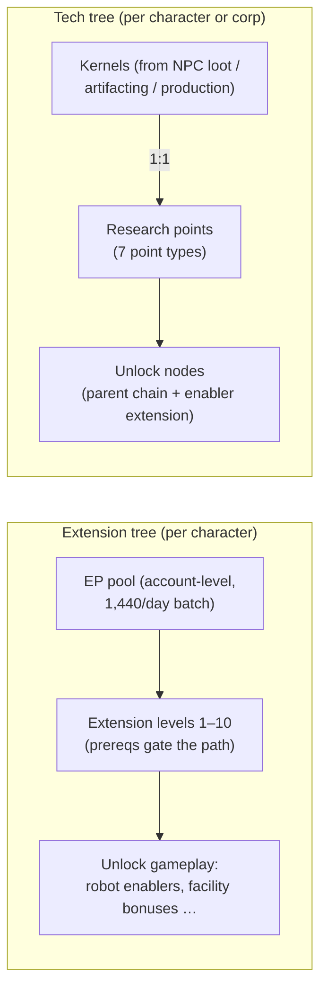

# Research

There are **two separate progression systems**. Both are docked-only.

> UI locations follow the [client UI overview](/features/ui/) (Character window → extensions; the
> tech tree has its own window). Mechanics below are confirmed against the server.

## The extension tree (character skills)

Extensions are per-character skill levels that unlock gameplay — most importantly the
**enabler extensions** that let you pilot a robot class (required to undock and select
a robot, see [movement](/features/movement/) and [robots](/features/robots/)).

### How learning works

- You must be **docked** to learn.
- Each extension can be raised to **levels 1–10** (level 10 is the cap).
- **Level 1 costs credits** (the extension's `price`), spent from your wallet.
- **Every level costs Extension Points (EP)** according to a fixed rank × level table —
  for levels 1–5 the cost is `60 × rank × level`; levels 6–10 jump to
  `rank × (1440, 2520, 3840, 5400, 12000)`. A rank-1 extension's ten levels cost
  60 → 6,000 EP, 13,500 in total; a rank-10 one costs ten times as much at each level.
- **Prerequisites** must already be learned before you can take an extension
  (the "prerequire" list).
- EP is an **account-level pool**: it is shared across your characters and earned over
  time (see "EP sources" below).

### Managing extensions

- **Category list / get all / learned list / prerequire list** — browse the tree and what
  you already have.
- **Available points** — see your current EP pool.
- **Remove one level** — drop a single level of an extension.
- **Reset character extensions** — reset the whole tree for a character.
- **Free locked EP** — release EP that is locked (e.g. after removing levels).
- **Buy an EP boost** — a paid accelerator that increases EP gain.
- **EP-for-activity daily log** — review how much EP you've been earning from play.

### EP sources

EP is not a spendable currency you buy — it accrues on a **daily batch**:

- Every account receives **1,440 EP per day** (granted once a day, between 08:00 and
  11:00 server time, by the `extensionPointsAdd` procedure). The code also defines a
  doubled **2,880 EP** batch for paid-subscription accounts, but the current procedure
  pays the base batch to all accounts.
- **Paid boosts** (EP boost purchases) add on top.
- Your **available EP** = all daily batches received − penalties − EP spent in-game.
  (The EP-for-activity log shows the daily earnings breakdown.)

**Full catalog** — every extension (rank, level-1 price, bonus, prerequisites) is in
[Extensions](/content/extensions/), and every tech tree node (unlocked item, enabler
extension, point prices) is in [Tech tree](/content/techtree/).

## The tech tree (unlocks)

The tech tree is a graph of **nodes** you unlock by spending **research points**. Unlike
EP (account pool), tech-tree points are **earned by consuming "kernels"** — items you
research and then submit.

### How it works

- **Research kernels** — submit kernel items from a container. Each kernel converts
  **1:1** into research points of a given **point type**; the kernels are consumed.
  There are seven kernel types, one per point type: Theodica, Pelistal, Nüimqol,
  Industrial, Common, HiTech and NewTech.
- **Unlock a node** — spend the required research points. A node can only be unlocked if:
  - all of its **parent nodes** are already unlocked, and
  - you have the node's **enabler extension** learned on your character.
- **Corporation unlocks** — with the right corporation role, a node can be unlocked
  **for the corporation** (shared). Corporation unlocks cost more (a corporation price
  multiplier applies) and are paid from the corporation's points.
- **Donate** — donate research points (e.g. to your corporation).
- **Info / logs** — view node details and your unlock/research history.

### Why it matters

Unlocked tech-tree nodes gate access to higher-tier content and features. Check a
node's prerequisites (parent chain + enabler extension) before spending points.

## Practical notes

- **Enabler extensions gate robots** — you can't pilot a robot class you haven't
  researched (this is the same check that blocks undock/select).
- **Level 1 is the only credit cost** in the extension tree; beyond that it's all EP.
- **Tech tree is irreversible** — points spent on an unlock are gone; plan your path.
- **Corporation tech is a team effort** — it uses shared points and a price multiplier.

<!-- TODO: only the research UI remains (window layout, point display).
     Confirmed: EP earn = 1440/day flat via dbo.extensionPointsAdd (08:00-11:00 window,
     once per day; 2880 bonus constant exists in GiveExtensionPointsService for paid
     subscriptions but the current SP pays base to all); available = batches -
     penalties - spent (extensionPointsAvailable fn); EP cost table in
     Services/ExtensionService/ExtensionPoints.cs (60*rank*level for levels 1-5, then
     rank*(1440,2520,3840,5400,12000)); kernels convert 1:1 (TechTreeResearch.cs), 7
     kernel definitions -> point types n1..n7 (Theodica/Pelistal/Nuimqol/Industrial/
     Common/HiTech/NewTech).
     Developer notes: Extensions/ExtensionBuyForPoints.cs (docked, prereq, level cap 10,
     level-1 credit price, EP by rank/level, account pool, training-char free);
     Extensions/ExtensionGetAvailablePoints.cs; Extensions/ExtensionBuyEpBoost.cs,
     ExtensionFreeLockedEp.cs, ExtensionRemoveLevel.cs, ExtensionResetCharacter.cs;
     EpForActivityDailyLog.cs; TechTree/TechTreeResearch.cs (kernels → points);
     TechTree/TechTreeUnlock.cs (parent chain + enabler extension, corp multiplier);
     TechTree/TechTreeDonate.cs; Services/ExtensionService/GiveExtensionPointsService.cs;
     Services/ExtensionService/ExtensionPoints.cs. -->
     Developer notes: Extensions/ExtensionBuyForPoints.cs (docked, prereq, level cap 10,
     level-1 credit price, EP by rank/level, account pool, training-char free);
     Extensions/ExtensionGetAvailablePoints.cs; Extensions/ExtensionBuyEpBoost.cs,
     ExtensionFreeLockedEp.cs, ExtensionRemoveLevel.cs, ExtensionResetCharacter.cs;
     EpForActivityDailyLog.cs; TechTree/TechTreeResearch.cs (kernels → points);
     TechTree/TechTreeUnlock.cs (parent chain + enabler extension, corp multiplier);
     TechTree/TechTreeDonate.cs. -->
