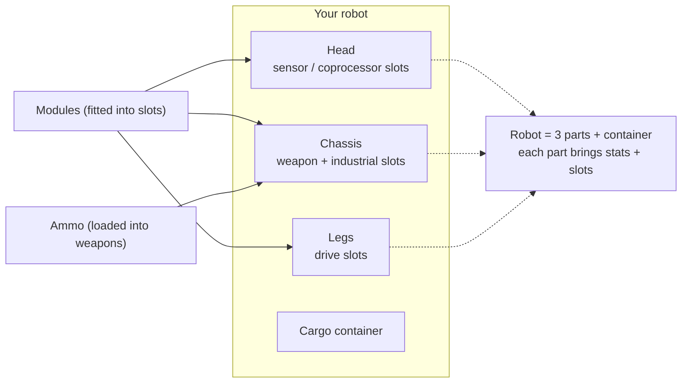

# Robots & fitting

Your **active robot** is the robot you pilot in a zone and fight with. Fitting means
loading **modules** into the robot's component slots and **ammo** into your weapons. All
fitting is **docked-only**.

> UI locations follow the [client UI overview](/features/ui/) (the **Equip** category on the top
> bar). Mechanics below are confirmed against the server.

## The active robot

- **Select active robot** — choose which of your robots to pilot. Requirements:
  - you are **docked**,
  - the robot is in a container you own (not the corp hangar, robot inventory, or a
    system container),
  - the robot is **single and unpacked** (not repackaged),
  - you have the robot class's **enabler extension** researched
    (see [research](/features/research/)).
- Only **one** robot can be the active robot per character, and a robot can't be the
  active robot for two characters at once.
- **Empty a robot** — unload everything from it.
- **Robot info / fitting info** — view its components, modules, ammo, and derived stats.
- **Set tint** — cosmetic colour for your robot.

## Fitting modules

A robot has several **components** (weapon, shield, armour, drive, sensor, etc.), each
with a set of **slots**.

- **Equip a module** — take a module from a container and load it into a specific
  component slot. The module type must be valid for that slot on that robot class.
  If the slot is occupied, the existing module is returned to the container.
- **Swap modules** — move a module between two slots of the same component.
- **Remove a module** — take a module out of a slot back into a container.

The server re-derives the robot's stats after every change (modules affect the values
shown on the undocked status panel — see [combat](/features/combat/)).

## Fitting ammo

- **Equip ammo** — load a compatible ammo item into an active (weapon) module. The module
  must **accept that ammo type**, and it loads up to the module's **ammo capacity**.
  Any previously loaded ammo is returned to the container first.
- **Change ammo** — swap the loaded ammo for a different compatible type.
- **Unequip ammo** — return the loaded ammo to a container.

## Fitting presets

A **preset** is a saved fitting you can re-apply quickly:

- **Save** — store the current fitting of a robot under a name.
- **List** — see your saved presets.
- **Apply** — load a preset onto a (different) robot from a container.
- **Delete** — remove a saved preset.

Presets are handy for re-fitting after a battle or when swapping between roles.

## Practical notes

- **You can't fit in a zone** — everything here needs you docked.
- **Enabler extension first** — no researched robot class means you can't select or pilot it.
- **Ammo must match the weapon** — an incompatible ammo definition is refused.
- **Repackaged robots can't be used** — unpack a robot before selecting or fitting it.
- **Use presets to re-fit fast** — save a known-good loadout, then apply it after losses.

## Slot categories

A robot's components (head, chassis, legs) provide **slots**, and each slot carries a set
of category flags. A module fits a slot only if the module's own flags are a **subset** of
the slot's flags. The flag categories are:

`small`, `medium`, `large`, `turret`, `missile`, `melee`, `industrial`,
`ew_and_engineering`, `specialized` (a specialized slot accepts only specialized
modules), plus the structural `head` / `chassis` / `leg` slots.

Modules can also be restricted to specific robots, and some carry a **unique** flag so
only one of that type can be fitted at a time. Per-module stat effects live in the
generated [robots table](/content/robots/).

<!-- TODO: only the preset UI flow remains.
     Confirmed: SlotFlags enum (12 categories); fit rule moduleFlags ⊆ slotFlags
     (RobotComponent.IsValidSlotTo); specialized slot/module rule; robot-allowlist
     (IsRobotAllowed) and unique-category modules; slot count = component's SlotFlags
     option length.
     Developer notes: SelectActiveRobot.cs (docked, container-type restrictions,
     enabler extension, single-active); RobotEmpty.cs; GetRobotInfo.cs /
     GetRobotFittingInfo.cs; EquipModule.cs / ChangeModule.cs / RemoveModule.cs
     (component slots, MakeSlotFree, re-init stats); EquipAmmo.cs / ChangeAmmo.cs /
     UnequipAmmo.cs (ammo type check, capacity); FittingPreset/*.cs; SetRobotTint.cs. -->
