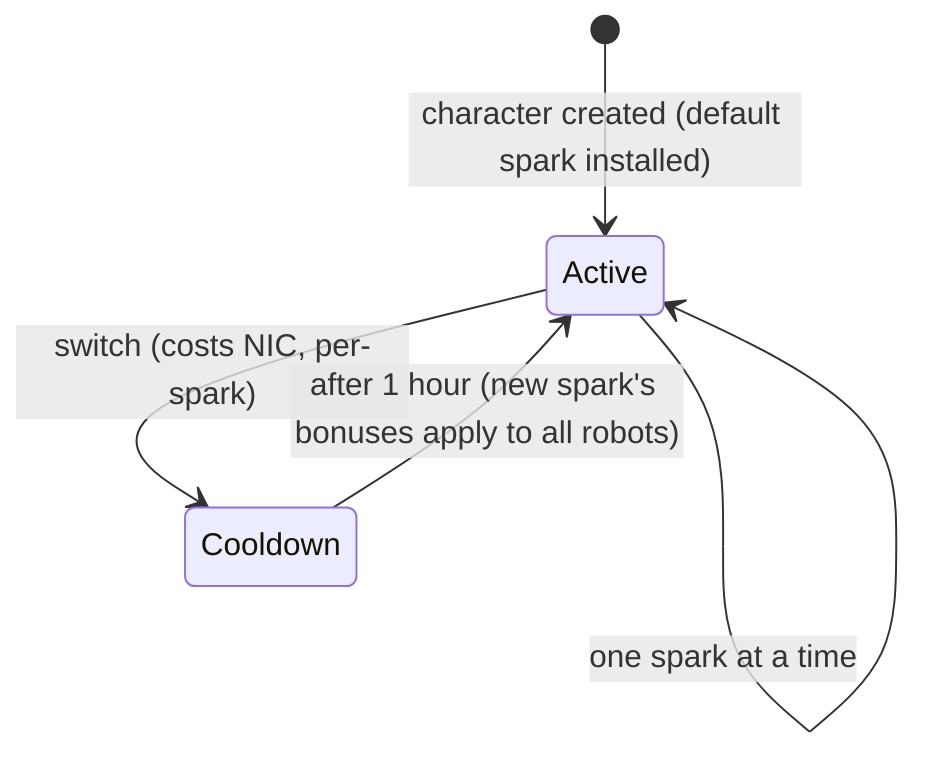

# Sparks

A **spark** is a nanobot specialization installed on your character. While it is
active, its bonuses apply to every robot you pilot — the spark for a faction's
combat line, for example, raises weapon damage and critical chance level by
level, while an industrial line raises core capacity and mining yield.

Each character has a **default spark** given at creation. Beyond that, sparks
come in families — per-faction combat/industrial/social lines (three levels
each), paid Syndicate lines, and special limited lines — and a spark's exact
bonuses are just a bundle of fixed skill levels you can see on the
[extensions page](/content/extensions/).

## Unlocking (authorizing) a spark

Installing a spark you don't own yet requires **unlocking** it first (docked
only). Depending on the spark, the server checks:

- a **price** in NIC (the paid lines — e.g. the Syndicate utility sparks and the
  limited special sparks),
- **standing** with the developer megacorporation (the per-faction lines need a
  minimum standing with that faction's megacorp, built by completing its
  [missions](/features/missions/)),
- or an **item** taken from your inventory (some special sparks are unlocked
  with a key item).

Unlocking is one-time: once unlocked, the spark stays in your collection.

## Spark connection tree

Which spark grants which extension levels — all 47 sparks (grouped by family,
left) and the extension bundles they carry (right). The arrows are labeled
with the granted level; hover a spark for its unlock requirement. **Scroll
over the diagram to zoom**, drag to pan, and use the ⟲ button to reset.

<button type="button" class="zoommap-reset" title="Reset the zoom">⟲</button>

## Switching sparks

- You can only have **one active spark** at a time; installing another swaps it.
- Each switch **costs NIC** — the amount is per-spark (the common lines cost
  10k, the paid special lines up to a million).
- There is a **one-hour cooldown** between switches: the server tracks when your
  current spark was activated and refuses a new one until the minute is over.

Because switching always costs NIC and takes an hour, pick the spark that
matches the activity you are spending the most time on, and treat re-
specializing as an occasional decision rather than a per-session one.

<!--
Written from scratch against the server backend, 2026-09-27:
RequestHandlers/Sparks/SparkUnlock.cs (unlock rules: price, standing, item),
RequestHandlers/Sparks/SparkChange.cs + Services/Sparks/SparkHelper.cs
(60-minute switch cooldown, per-spark change price),
Services/Sparks/Spark.cs, sparks + sparkextensions tables (47 sparks, per-line
bonus bundles).
An earlier version of this page was adapted from the Open Perpetuum
community wiki (perpetuum.miraheze.org) and has been fully rewritten from
backend sources; no text was reused.
-->
