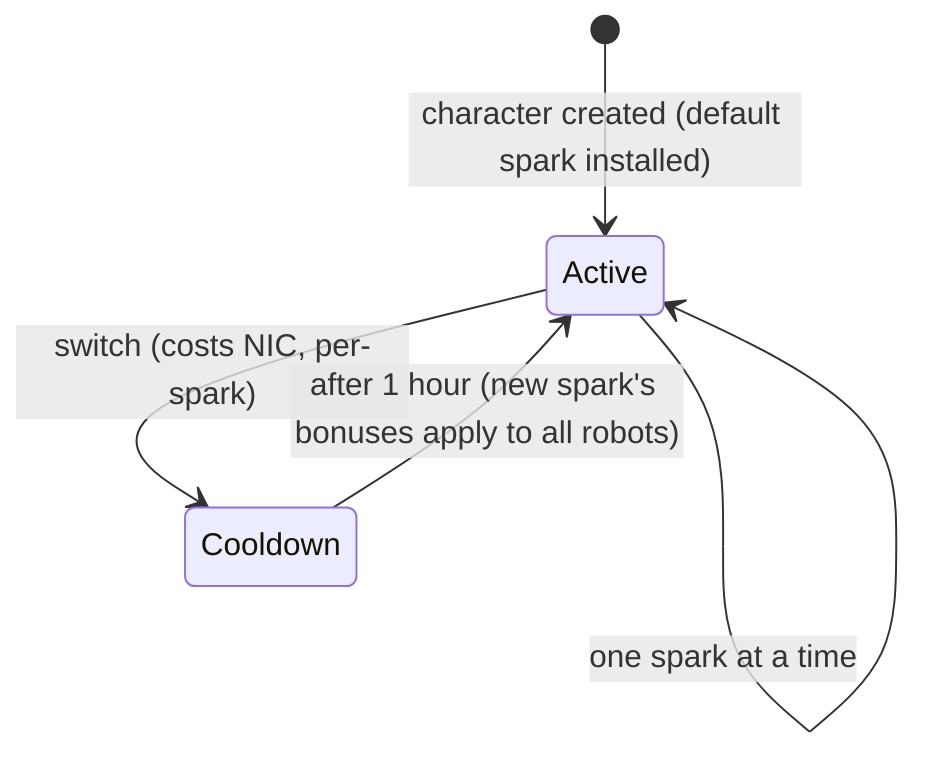

# Sparks

A **spark** is a nanobot specialization installed on your character. While it is
active, its bonuses apply to every robot you pilot — the spark for a faction's
combat line, for example, raises weapon damage and critical chance level by
level, while an industrial line raises core capacity and mining yield.

Each character has a **default spark** given at creation. Beyond that, sparks
come in families — the basic default lines, per-faction combat/industrial/social
lines (three levels each), paid Syndicate lines, and special limited lines
— and a spark's exact bonuses are just a bundle of fixed skill levels you can
see on the [extensions page](/content/extensions/). The [family overview below](#families)
jumps straight to each family's sparks.

## Unlocking (authorizing) a spark

Installing a spark you don't own yet requires **unlocking** it first (docked
only). Depending on the spark, the server checks:

- a **price** in NIC (the paid lines — e.g. the Syndicate utility sparks and the
  limited special sparks),
- **standing** with the developer megacorporation (the per-faction lines need a
  minimum standing with that faction's megacorp, built by completing its
  [missions](/features/missions/)),
- or an **item** taken from your inventory (some special sparks are unlocked
  with a key item).

Unlocking is one-time: once unlocked, the spark stays in your collection.

<!-- sparkfamilies:generated -->

## Spark families

The 47 sparks in 6 families at a glance: one box per family (spark count, how the line unlocks), left to right in the order the lines were added. **Click a box to jump to that family's sparks below.** **Scroll over the diagram to zoom**, drag to pan, and use the ⟲ button to reset. The full spark-to-extension detail is the [connection tree](#tree) further down.

<button type="button" class="zoommap-reset" title="Reset the zoom">⟲</button>
<svg class="zoommap" xmlns="http://www.w3.org/2000/svg" viewBox="0 0 1698 154" width="1280" height="116" role="img" aria-label="Spark families: 6 families, 47 sparks; click a family to jump to its sparks below">
  <rect x="0" y="0" width="1698" height="154" fill="#10151f" stroke="#39445a" stroke-width="1"/>
  <g><title>Event &amp; special: 9 sparks, unlocks with free</title><a href="#family-special"><rect x="24" y="40" width="250" height="74" rx="10" fill="#10151f" stroke="#c8d2e0" stroke-width="1.5"/><text x="149" y="68" text-anchor="middle" fill="#e8eefc" font-size="15" font-weight="700">Event &amp; special</text><text x="149" y="92" text-anchor="middle" fill="#c8d2e0" font-size="12">9 sparks · free</text></a></g>
  <g><title>TM (Truhold-Markson): 9 sparks, unlocks with TM standing</title><a href="#family-tm"><rect x="304" y="40" width="250" height="74" rx="10" fill="#10151f" stroke="#41d3ff" stroke-width="1.5"/><text x="429" y="68" text-anchor="middle" fill="#e8eefc" font-size="15" font-weight="700">TM (Truhold-Markson)</text><text x="429" y="92" text-anchor="middle" fill="#41d3ff" font-size="12">9 sparks · TM standing</text></a></g>
  <g><title>ICS: 9 sparks, unlocks with ICS standing</title><a href="#family-ics"><rect x="584" y="40" width="250" height="74" rx="10" fill="#10151f" stroke="#6ee7a0" stroke-width="1.5"/><text x="709" y="68" text-anchor="middle" fill="#e8eefc" font-size="15" font-weight="700">ICS</text><text x="709" y="92" text-anchor="middle" fill="#6ee7a0" font-size="12">9 sparks · ICS standing</text></a></g>
  <g><title>ASI: 9 sparks, unlocks with ASI standing</title><a href="#family-asi"><rect x="864" y="40" width="250" height="74" rx="10" fill="#10151f" stroke="#f5a05a" stroke-width="1.5"/><text x="989" y="68" text-anchor="middle" fill="#e8eefc" font-size="15" font-weight="700">ASI</text><text x="989" y="92" text-anchor="middle" fill="#f5a05a" font-size="12">9 sparks · ASI standing</text></a></g>
  <g><title>Syndicate (NIC): 5 sparks, unlocks with NIC price</title><a href="#family-syndicate"><rect x="1144" y="40" width="250" height="74" rx="10" fill="#10151f" stroke="#a78bfa" stroke-width="1.5"/><text x="1269" y="68" text-anchor="middle" fill="#e8eefc" font-size="15" font-weight="700">Syndicate (NIC)</text><text x="1269" y="92" text-anchor="middle" fill="#a78bfa" font-size="12">5 sparks · NIC price</text></a></g>
  <g><title>Limited: 6 sparks, unlocks with NIC price</title><a href="#family-limited"><rect x="1424" y="40" width="250" height="74" rx="10" fill="#10151f" stroke="#f472b6" stroke-width="1.5"/><text x="1549" y="68" text-anchor="middle" fill="#e8eefc" font-size="15" font-weight="700">Limited</text><text x="1549" y="92" text-anchor="middle" fill="#f472b6" font-size="12">6 sparks · NIC price</text></a></g>
</svg>

### Event &amp; special (9)

Unlock: nothing — these are the basic default lines. Each switch costs NIC (the amount is per spark, see the cards) and takes a one-hour cooldown — see [Switching sparks](#switching-sparks) below.

ww

unlock no cost · switch 10k NIC

Default spark — installed at character creation

wi

unlock no cost · switch 10k NIC

Default spark — installed at character creation

ws

unlock no cost · switch 10k NIC

Default spark — installed at character creation

iw

unlock no cost · switch 10k NIC

Default spark — installed at character creation

ii

unlock no cost · switch 10k NIC

Default spark — installed at character creation

is

unlock no cost · switch 10k NIC

Default spark — installed at character creation

sw

unlock no cost · switch 10k NIC

Default spark — installed at character creation

si

unlock no cost · switch 10k NIC

Default spark — installed at character creation

ss

unlock no cost · switch 10k NIC

Default spark — installed at character creation

### TM (Truhold-Markson) (9)

Unlock: standing with the TM megacorporation (2 → 4 → 6 by level). Each switch costs NIC (the amount is per spark, see the cards) and takes a one-hour cooldown — see [Switching sparks](#switching-sparks) below.

Combat Lvl1

unlock standing 2 with TM · switch 10k NIC

Bundles 2 extension levels (see the <a href="#tree">connection tree</a>)

Combat Lvl2

unlock standing 4 with TM · switch 100k NIC

Bundles 3 extension levels (see the <a href="#tree">connection tree</a>)

Combat Lvl3

unlock standing 6 with TM · switch 1M NIC

Bundles 3 extension levels (see the <a href="#tree">connection tree</a>)

Indy Lvl1

unlock standing 2 with TM · switch 10k NIC

Bundles 2 extension levels (see the <a href="#tree">connection tree</a>)

Indy Lvl2

unlock standing 4 with TM · switch 100k NIC

Bundles 3 extension levels (see the <a href="#tree">connection tree</a>)

Indy Lvl3

unlock standing 6 with TM · switch 1M NIC

Bundles 3 extension levels (see the <a href="#tree">connection tree</a>)

Social Lvl1

unlock standing 2 with TM · switch 10k NIC

Bundles 2 extension levels (see the <a href="#tree">connection tree</a>)

Social Lvl2

unlock standing 4 with TM · switch 100k NIC

Bundles 3 extension levels (see the <a href="#tree">connection tree</a>)

Social Lvl3

unlock standing 6 with TM · switch 1M NIC

Bundles 3 extension levels (see the <a href="#tree">connection tree</a>)

### ICS (9)

Unlock: standing with the ICS megacorporation (2 → 4 → 6 by level). Each switch costs NIC (the amount is per spark, see the cards) and takes a one-hour cooldown — see [Switching sparks](#switching-sparks) below.

Combat Lvl1

unlock standing 2 with ICS · switch 10k NIC

Bundles 2 extension levels (see the <a href="#tree">connection tree</a>)

Combat Lvl2

unlock standing 4 with ICS · switch 100k NIC

Bundles 3 extension levels (see the <a href="#tree">connection tree</a>)

Combat Lvl3

unlock standing 6 with ICS · switch 1M NIC

Bundles 3 extension levels (see the <a href="#tree">connection tree</a>)

Indy Lvl1

unlock standing 2 with ICS · switch 10k NIC

Bundles 2 extension levels (see the <a href="#tree">connection tree</a>)

Indy Lvl2

unlock standing 4 with ICS · switch 100k NIC

Bundles 3 extension levels (see the <a href="#tree">connection tree</a>)

Indy Lvl3

unlock standing 6 with ICS · switch 1M NIC

Bundles 3 extension levels (see the <a href="#tree">connection tree</a>)

Social Lvl1

unlock standing 2 with ICS · switch 10k NIC

Bundles 2 extension levels (see the <a href="#tree">connection tree</a>)

Social Lvl2

unlock standing 4 with ICS · switch 100k NIC

Bundles 3 extension levels (see the <a href="#tree">connection tree</a>)

Social Lvl3

unlock standing 6 with ICS · switch 1M NIC

Bundles 3 extension levels (see the <a href="#tree">connection tree</a>)

### ASI (9)

Unlock: standing with the ASI megacorporation (2 → 4 → 6 by level). Each switch costs NIC (the amount is per spark, see the cards) and takes a one-hour cooldown — see [Switching sparks](#switching-sparks) below.

Combat Lvl1

unlock standing 2 with ASI · switch 10k NIC

Bundles 2 extension levels (see the <a href="#tree">connection tree</a>)

Combat Lvl2

unlock standing 4 with ASI · switch 100k NIC

Bundles 3 extension levels (see the <a href="#tree">connection tree</a>)

Combat Lvl3

unlock standing 6 with ASI · switch 1M NIC

Bundles 3 extension levels (see the <a href="#tree">connection tree</a>)

Indy Lvl1

unlock standing 2 with ASI · switch 10k NIC

Bundles 2 extension levels (see the <a href="#tree">connection tree</a>)

Indy Lvl2

unlock standing 4 with ASI · switch 100k NIC

Bundles 3 extension levels (see the <a href="#tree">connection tree</a>)

Indy Lvl3

unlock standing 6 with ASI · switch 1M NIC

Bundles 3 extension levels (see the <a href="#tree">connection tree</a>)

Social Lvl1

unlock standing 2 with ASI · switch 10k NIC

Bundles 5 extension levels (see the <a href="#tree">connection tree</a>)

Social Lvl2

unlock standing 4 with ASI · switch 100k NIC

Bundles 6 extension levels (see the <a href="#tree">connection tree</a>)

Social Lvl3

unlock standing 6 with ASI · switch 1M NIC

Bundles 6 extension levels (see the <a href="#tree">connection tree</a>)

### Syndicate (NIC) (5)

Unlock: a NIC price (1M per spark). Each switch costs NIC (the amount is per spark, see the cards) and takes a one-hour cooldown — see [Switching sparks](#switching-sparks) below.

Syndicate Nic Combat

unlock 1M NIC · switch 100k NIC

Bundles 2 extension levels (see the <a href="#tree">connection tree</a>)

Syndicate Nic Scout

unlock 1M NIC · switch 100k NIC

Bundles 2 extension levels (see the <a href="#tree">connection tree</a>)

Syndicate Nic Coreboost

unlock 1M NIC · switch 100k NIC

Bundles 2 extension levels (see the <a href="#tree">connection tree</a>)

Syndicate Nic Allresist

unlock 1M NIC · switch 100k NIC

Bundles 4 extension levels (see the <a href="#tree">connection tree</a>)

Syndicate Nic Fitboost

unlock 1M NIC · switch 100k NIC

Bundles 2 extension levels (see the <a href="#tree">connection tree</a>)

### Limited (6)

Unlock: a NIC price (25–50M per spark). Each switch costs NIC (the amount is per spark, see the cards) and takes a one-hour cooldown — see [Switching sparks](#switching-sparks) below.

Anniversary Combat

unlock 25M NIC · switch 1M NIC

Bundles 6 extension levels (see the <a href="#tree">connection tree</a>)

Anniversary Logistic

unlock 25M NIC · switch 1M NIC

Bundles 6 extension levels (see the <a href="#tree">connection tree</a>)

Amazon c1 Combat

unlock 25M NIC · switch 1M NIC

Bundles 2 extension levels (see the <a href="#tree">connection tree</a>)

Amazon c1 Indy

unlock 25M NIC · switch 1M NIC

Bundles 2 extension levels (see the <a href="#tree">connection tree</a>)

Steam a

unlock 50M NIC · switch 1M NIC

Bundles 2 extension levels (see the <a href="#tree">connection tree</a>)

Steam b

unlock 50M NIC · switch 1M NIC

Bundles 2 extension levels (see the <a href="#tree">connection tree</a>)

## Spark connection tree

Which spark grants which extension levels — all 47 sparks (grouped by family,
left) and the extension bundles they carry (right). The arrows are labeled
with the granted level; hover a spark for its unlock requirement. **Scroll
over the diagram to zoom**, drag to pan, and use the ⟲ button to reset.

<button type="button" class="zoommap-reset" title="Reset the zoom">⟲</button>

## Switching sparks

- You can only have **one active spark** at a time; installing another swaps it.
- Each switch **costs NIC** — the amount is per-spark (the common lines cost
  10k, the paid special lines up to a million).
- There is a **one-hour cooldown** between switches: the server tracks when your
  current spark was activated and refuses a new one until the minute is over.

Because switching always costs NIC and takes an hour, pick the spark that
matches the activity you are spending the most time on, and treat re-
specializing as an occasional decision rather than a per-session one.

<!--
Written from scratch against the server backend, 2026-09-27:
RequestHandlers/Sparks/SparkUnlock.cs (unlock rules: price, standing, item),
RequestHandlers/Sparks/SparkChange.cs + Services/Sparks/SparkHelper.cs
(60-minute switch cooldown, per-spark change price),
Services/Sparks/Spark.cs, sparks + sparkextensions tables (47 sparks, per-line
bonus bundles).
An earlier version of this page was adapted from the Open Perpetuum
community wiki (perpetuum.miraheze.org) and has been fully rewritten from
backend sources; no text was reused.
-->
