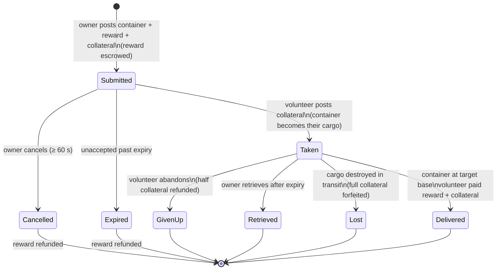

# Transport (item shipping)

A **transport assignment** moves a container of items from one base to another, with a
**volunteer carrier** who gets paid. It's a two-sided market: the **owner** posts a
shipment, a **volunteer** takes it and delivers it.

> UI locations follow the [client UI overview](/features/ui/) (the **Assignments** category on the
> top bar). Mechanics below are confirmed against the server.

## The two sides

- **Owner (principal)** — posts a shipment: a container to move, from a **source base**
  to a **target base**, for a **reward**, with a **collateral**, over a **duration**.
- **Volunteer (carrier)** — takes the assignment, carries the container, and delivers it.

## Posting a transport (owner)

**Submit a transport** with:
- the **container** (a volume-wrapper) to ship,
- the **reward** you pay on delivery,
- the **collateral** (a bond the carrier posts),
- **source base** and **target base**,
- a **duration** (days) the assignment stays open.

On submit, the **reward is held** from your wallet (escrow).

## Taking a transport (volunteer)

- **Take** an assignment — you post the **collateral** as a bond, and the container
  becomes yours to carry.

## Delivering & retrieving

- **Deliver** — bring the container to the target base. On delivery the **volunteer is
  paid reward + collateral**, and the owner receives the goods.
- **Retrieve** — the owner (or the volunteer, in the relevant case) retrieves the
  container back to a base; on retrieval the **collateral is returned** and the **reward
  is paid back** to the owner.

## Cancel / give up

- **Cancel** — cancel the assignment.
- **Give up** — the volunteer abandons it. Giving up applies a **collateral penalty**:
  only **half** of the collateral is refunded (the rest is forfeited) — the penalty
  constant is 0.5 in `TransportAssignment.cs`.

## Inspecting

- **List** transports, **list content** of one, **container info**, **is it running?**,
  and the **transport log**.

## The money flow (at a glance)

The **reward** is the owner's payment, escrowed at submit and paid only on delivery.
The **collateral** is the volunteer's bond: paid to the owner on take, held while the
cargo is in transit, and returned (with the reward) on delivery.

| Event | Condition | Owner | Volunteer | Container |
|---|---|---|---|---|
| Submit | — | reward escrowed | — | moved to transport storage |
| Take | unaccepted | receives collateral bond | pays collateral | becomes the volunteer's cargo |
| Deliver | at target base | goods received | paid **reward + collateral** | delivered |
| Cancel | unaccepted, ≥ 60 s after submit | reward refunded | — | back to source base |
| Give up | taken | reward refunded | **half** collateral refunded (0.5 penalty) | back to source base |
| Expire | unaccepted, past expiry | reward refunded | — | back to source base |
| Retrieve | taken **and** past expiry | reward refunded | — | back to source base (immediately if docked, otherwise on the volunteer's next dock) |
| Cargo destroyed | in transit | reward refunded **+ full collateral** | full collateral forfeited | lost |

## Practical notes

- **No fees** — the only money that moves is reward and collateral.
- **Reward is escrowed** — the owner can't spend it until the transport resolves.
- **Collateral is the carrier's bond** — posting it is what lets you take a shipment;
  losing the cargo in transit forfeits the **full** amount.
- **Giving up costs you** — abandoning a transport forfeits half your collateral.
- **Duration matters, but only while unaccepted** — the expiry you set at submit only
  auto-closes assignments nobody has taken (the server sweeps expired unaccepted
  assignments hourly). A **taken** assignment never expires by itself; the owner's
  escape hatch is **Retrieve**, which becomes available once the expiry passes and
  recalls the cargo (and the reward) to the source base — immediately if the carrier is
  docked, or automatically at the carrier's next dock.
- **Check content before taking** — inspect what's in the container and the route.

<!-- TODO: only the client UI remains (assignments screen layout).
     Money model confirmed: reward escrowed at submit (CashInOnSubmit), collateral paid
     by the volunteer on take (TakeCollateral -> PayCollateralToPrincipal), delivery pays
     volunteer reward+collateral (PayOutReward); cancel needs 60s after creation;
     expiry = submit time + client duration days (<=0 -> 1), cleaned hourly by
     MissionProcessor (_transportAssignmentInterval 1h), taken=0 only; retrieve requires
     expiry passed + taken, auto-completes on next dock; destroyed cargo refunds reward
     and forfeits full collateral to the owner.
     Developer notes: TransportAssignments/TransportAssignmentSubmit.cs;
     Services/MissionEngine/TransportAssignments/TransportAssignment.cs (reward/collateral
     escrow, PayOutReward = reward+collateral, PaybackCollateral, PaybackHalfCollateral
     = COLLATERAL_PENALTY on give-up, RetrieveToBasePublicContainer, expiry);
     TransportAssignmentTake/Deliver/Retrieve/Cancel/GiveUp/List/ListContent/
     ContainerInfo/Running/Log. -->
