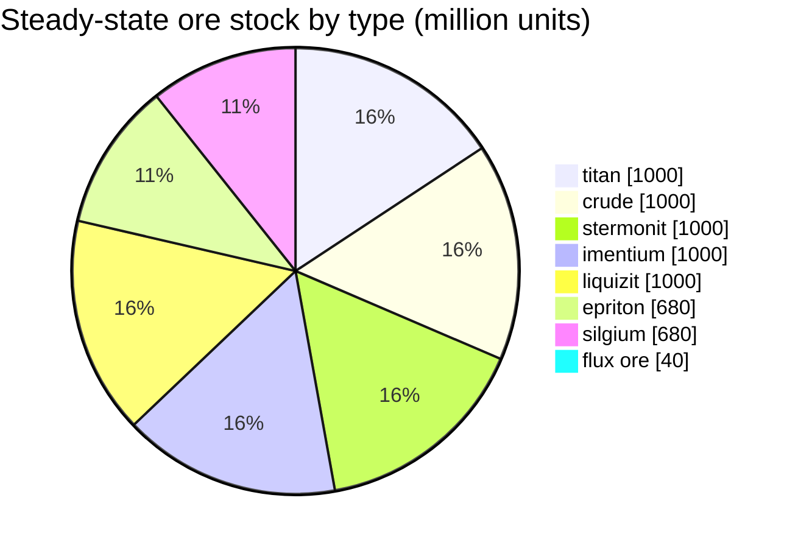

# Daoden (zone_ASI) — worked example

Where this zone's teleport columns stand (dots, labelled with the destination — dimmed where
the column is currently switched off), the landing spots of teleports arriving from other
zones (dashed circles), and the exit gates (diamonds) where one exists. Positions are the
tile coordinates the server records.
The dashed lines connect the pairs of local (in-zone) teleport columns.

An **open PvP** zone of the alpha tier — the richest ore configuration in the game and
the place where the rare types live. Everything New Virginia has, plus epriton, silgium, and
the flux-ore sites that attract NPC attacks.

| Fact | Value |
|---|---|
| Zone id | 2 |
| Type | PvP (open) |
| Protection | [Beta](/zones/protection/) — open PvP, standard terrain |
| Size | 2048 × 2048 tiles |
| Fertility | 20 |
| Plant rule set | 2 — 19 species (incl. high-tier harvestables) |
| Ore types | 8 (titan, crude, stermonit, imentium, liquizit, epriton, silgium, flux ore) |
| Total ore nodes | 64 (8 per type) |

## Ore configuration

| Material | Nodes | Max tiles/node | Total per node | Min threshold |
|---|---|---|---|---|
| [titan](/content/ores/titan/) | 8 | 500 | 125,000,000 | 0.5 |
| [crude](/content/ores/crude/) | 8 | 1257 | 125,000,000 | 0.5 |
| [stermonit](/content/ores/stermonit/) | 8 | 500 | 125,000,000 | 0.5 |
| [imentium](/content/ores/imentium/) | 8 | 500 | 125,000,000 | 0.5 |
| [liquizit](/content/ores/liquizit/) | 8 | 500 | 125,000,000 | 0.5 |
| [epriton](/content/ores/epriton/) | 8 | 500 | 85,000,000 | 0.5 |
| [silgium](/content/ores/silgium/) | 8 | 500 | 85,000,000 | 0.5 |
| [fluxore](/content/ores/fluxore/) | 8 | 300 | 5,000,000 | 0.5 |

Notes that stand out:

- **8× more nodes than New Virginia**, but each node is smaller (500 tiles vs 1,000): the
  walk radius drops from 34 to 24 tiles for the standard ores. Scanning matters more
  here — deposits are thinner and more numerous.
- **Epriton and silgium** carry reduced totals (85 M vs 125 M) — higher value, rarer
  stock. Epriton additionally keeps a **minimum distance from bases and teleports**, so
  its nodes never sit at a spawn.
- **Flux ore is the extreme case**: only 5 M per node across 300 tiles (~16,600 per
  tile — a trickle, not a deposit), 8 nodes, and a keep-out zone of **twice** the
  epriton distance from bases. Mining a flux node publishes spawn events to the NPC
  system — flux sites are contested by design (see [Intrusion & NPC
  systems](/features/intrusion/)).
- Steady-state stock: ~6.4 billion units of material in total.

## Plant mix

Rule set 2 allows 19 species — the full alpha mix: the basics, plus **devrinol**,
**wall**, **titanplant**, and the **high-tier harvestables** (high electroplant, high
iron tree, high rustbush, high slimeroot). Fertility is still 20, so density is the
same as New Virginia — what changes is *which* species can win the fertility draw. The
high-tier harvestables' own `fertility` weights decide how often they out-draw the
grasses.

Per-species rules are in [Plants](/content/plants/); per-ore yields in
[Ores](/content/ores/).

## What this means for a player

- The full ore ladder is available, including the flux-ore economy — but it's open
  PvP, so everything you mine can be taken (see
  [transport](/features/transport/) for moving goods safely between bases).
- Expect NPC pressure near flux ore nodes; the spawner listens to mining events on
  those nodes.
- Plant harvesting here targets the high-tier variants, which have better fruit than
  the low-tier species in starter zones.

<!-- Developer notes: zones row id 2 (zonetype 2 = PvP, protected 0, fertility 20,
     plantruleset 2); mineralconfigs 8 rows (7 standard + fluxore 8/300/5M);
     MineralNodeGeneratorBase.KeepOutDist: Epriton = MINERAL_DISTANCE_FROM_BASE_MIN,
     FluxOre = 2x; MineralLayer.OnNodeDecrease/OnNodeExpired -> OreNpcSpawnMessage for
     FluxOre; plantrules rulesetid 2 = 19 files (4 harvestable, incl. devrinol and
     wall). -->
