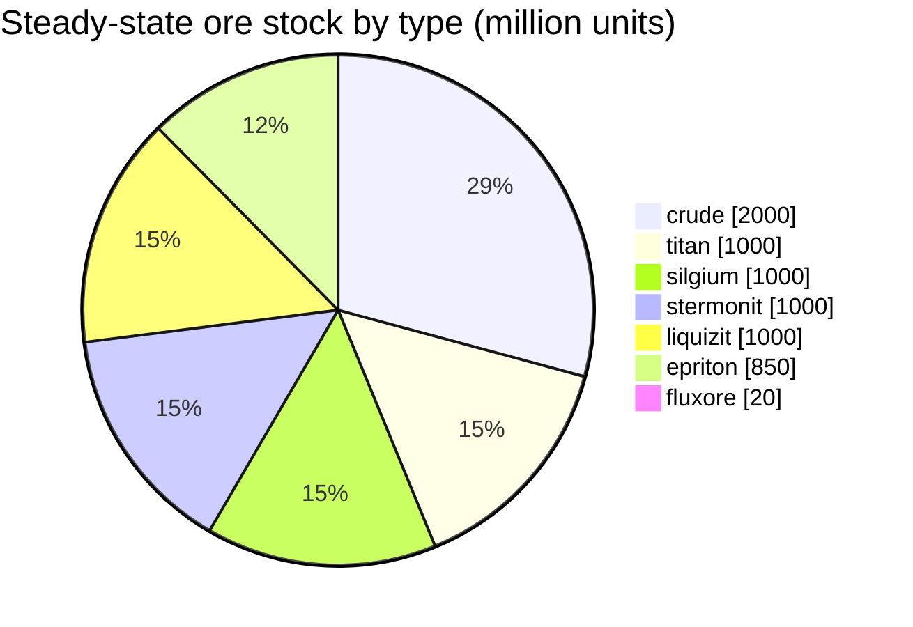

<!-- Generated by tools/generate from the live database (source: zones, mineralconfigs, plantrules, teleportdescriptions, strongholdexitconfig).
     Do not edit by hand; regenerate instead. -->
# Hokkogaros (zone_ASI_A_real)

An open-PvP (beta) Daoden (ASI) island — players can attack freely and blobs apply. It maintains 7 ore types.

| Fact | Value |
|---|---|
| Zone id | 4 |
| Type | PvP |
| Protection | [Beta](/zones/protection/) — open PvP, standard terrain |
| Size | 2048×2048 tiles |
| Fertility | 20 |
| Plant species | 17 (rule set 4) |
| Ore types | 7 |
| Total ore nodes | 54 |
| Max docking bases | none |

## Ore configuration

The node generation this zone maintains. Per-ore yields and the generation formulas are in [Ores](/content/ores/) (this zone's section is linked below).

| Material | Nodes | Max tiles/node | Total per node | Min threshold |
|---|---|---|---|---|
| [titan](/content/ores/#titan) | 8 | 500 | 125M | 0.5 |
| [crude](/content/ores/#crude) | 8 | 500 | 250M | 0.5 |
| [stermonit](/content/ores/#stermonit) | 8 | 500 | 125M | 0.5 |
| [liquizit](/content/ores/#liquizit) | 8 | 500 | 125M | 0.5 |
| [epriton](/content/ores/#epriton) | 10 | 350 | 85M | 0.5 |
| [silgium](/content/ores/#silgium) | 8 | 500 | 125M | 0.5 |
| [fluxore](/content/ores/#fluxore) | 4 | 300 | 5M | 0.5 |

## Connections

**Teleports out** (TP columns from this zone):

- → [Kentagura](/zones/zone-asi-pvp/) (2 TP points)
- → [Novastrov](/zones/zone-ics-pvp/) (2 TP points)
- → [Hershfield](/zones/zone-tm-pve/) (3 TP points)
- → [Xiantor](/zones/zone-asi-g-4/) (2 TP points)
- → [zone_gamma_tc_z103](/zones/zone-gamma-tc-z103/) (1 TP point)

**Teleports in** (other zones with a TP column to this one):

- ← [Kentagura](/zones/zone-asi-pvp/) (2 TP points)
- ← [Novastrov](/zones/zone-ics-pvp/) (2 TP points)
- ← [Hershfield](/zones/zone-tm-pve/) (3 TP points)
- ← [Xiantor](/zones/zone-asi-g-4/) (2 TP points)
- ← [zone_gamma_tc_z103](/zones/zone-gamma-tc-z103/) (1 TP point)

## Teleport map

Where this zone's teleport columns stand (dots, labelled with the destination — dimmed where the column is currently switched off), the landing spots of teleports arriving from other zones (dashed circles), and the exit gates (diamonds) where one exists. Positions are the tile coordinates the server records.

[Zone index](/zones/zone-index/) · [World map](/zones/map/#beta) · [Protection levels](/zones/protection/)
