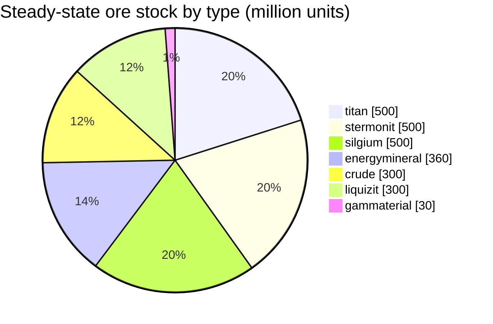

<!-- Generated by tools/generate from the live database (source: zones, mineralconfigs, plantrules, teleportdescriptions, strongholdexitconfig).
     Do not edit by hand; regenerate instead. -->
# zone_gamma_z107

An open-PvP, terraformable (gamma) frontier belt island — the ground can be reshaped by players. It maintains 7 ore types.

| Fact | Value |
|---|---|
| Zone id | 107 |
| Type | PvP |
| Protection | [Gamma](/zones/protection/) — open PvP, terraformable |
| Size | 2048×2048 tiles |
| Tier | T3 (server-recorded) |
| Fertility | 15 |
| Plant species | 16 (rule set 33) |
| Ore types | 7 |
| Total ore nodes | 34 |
| PBS tech limit | 3 |
| Max docking bases | 2 |

## Ore configuration

The node generation this zone maintains. Per-ore yields and the generation formulas are in [Ores](/content/ores/) (this zone's section is linked below).

| Material | Nodes | Max tiles/node | Total per node | Min threshold |
|---|---|---|---|---|
| [titan](/content/ores/titan/) | 5 | 600 | 100M | 0.5 |
| [crude](/content/ores/crude/) | 3 | 600 | 100M | 0.5 |
| [stermonit](/content/ores/stermonit/) | 5 | 600 | 100M | 0.5 |
| [liquizit](/content/ores/liquizit/) | 3 | 600 | 100M | 0.5 |
| [silgium](/content/ores/silgium/) | 5 | 600 | 100M | 0.5 |
| [gammaterial](/content/ores/gammaterial/) | 3 | 100 | 10M | 0.5 |
| [energymineral](/content/ores/energymineral/) | 10 | 300 | 36M | 0.5 |

## Connections

**Teleports out** (TP columns from this zone):

- → [zone_gamma_z106](/zones/zone-gamma-z106/) (1 TP point)
- → [zone_gamma_z108](/zones/zone-gamma-z108/) (1 TP point)

**Teleports in** (other zones with a TP column to this one):

- ← [zone_gamma_z106](/zones/zone-gamma-z106/) (1 TP point)
- ← [zone_gamma_z108](/zones/zone-gamma-z108/) (1 TP point)

## Teleport map

Where this zone's teleport columns stand (dots, labelled with the destination — dimmed where the column is currently switched off), the landing spots of teleports arriving from other zones (dashed circles), and the exit gates (diamonds) where one exists. Positions are the tile coordinates the server records.

[Zone index](/zones/zone-index/) · [World map](/zones/map/#t3) · [Protection levels](/zones/protection/)
